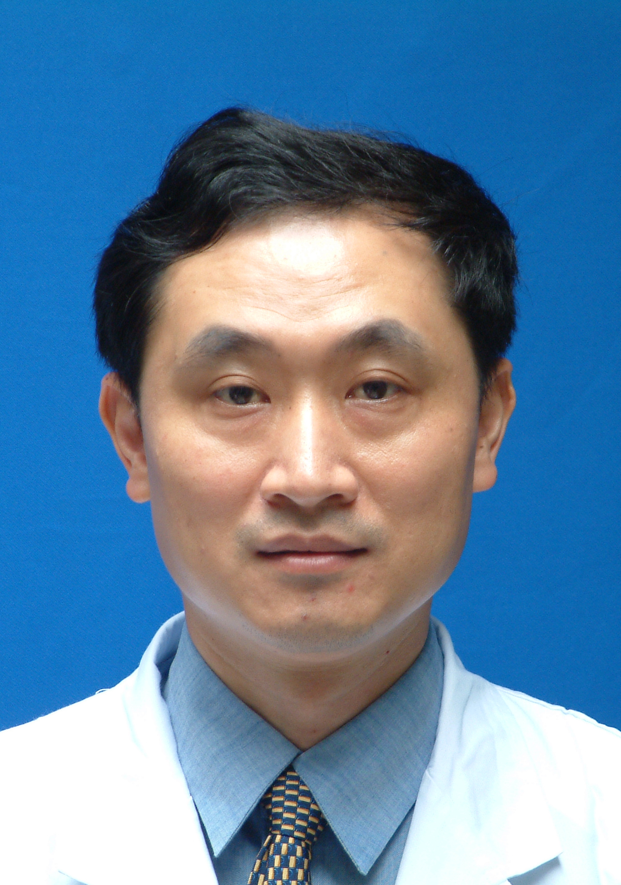

<!-- AUTO-GENERATED-BY: work/generate_obsidian_profiles.py -->

<!-- TEMPLATE: D:\workspace\信息收集整理\医生画像仓库\模板\医生画像模板.md -->

# 黄东生

## 基础信息

| 字段 | 内容 |
|---|---|
| 姓名 | 黄东生 |
| 医院 | 中山大学孙逸仙纪念医院 |
| 科室 | 骨外科 |
| 职称/身份 | 教授, 主任医师 |
| 来源链接 | [官网原文](https://www.gzsys.org.cn/node/14524) |
| 采集日期 | 2026-08-13 |

## 简介/擅长

## 教育与进修经历

- 国际内固定学会AO脊柱培训中心主任，“第九届吴阶平医学研究奖既保罗•杨森药学研究奖”获得者。

## 科研项目与成果

- 以第一完成人获广东省自然科学奖二等奖1项，广东省科技进步二等奖1项，共承担国家自然科学基金6项，发表SCI论文30多篇，其中IF 10以上5篇。

## 论文与学术产出

- 以第一完成人获广东省自然科学奖二等奖1项，广东省科技进步二等奖1项，共承担国家自然科学基金6项，发表SCI论文30多篇，其中IF 10以上5篇。

## 可包装亮点

- 教授，主任医师，博士生导师。
- 国际内固定学会AO脊柱培训中心主任，“第九届吴阶平医学研究奖既保罗•杨森药学研究奖”获得者。
- 广东省医学会脊柱外科学分会第二届主任委员 中华医学会运动骨科学分会第七、八、九届脊柱学组委员 中华医学会运动骨科学分会第七、八、九届创伤学组委员 中华医学会运动医学分会脊柱损伤学组委员。
- 以第一完成人获广东省自然科学奖二等奖1项，广东省科技进步二等奖1项，共承担国家自然科学基金6项，发表SCI论文30多篇，其中IF 10以上5篇。

## 重点疾病/人群标签

- 慢性病：
- 肿瘤：肿瘤
- 生殖疾病：
- 免疫/风湿：
- 术后恢复/康复：
- 疑难重症：

## 证据摘录

> 只摘录官网公开信息中的短句或关键字段，不复制大段原文。

- 官网身份字段：教授, 主任医师
- 官网亮眼经历线索：教授，主任医师，博士生导师。 国际内固定学会AO脊柱培训中心主任，“第九届吴阶平医学研究奖既保罗•杨森药学研究奖”获得者。 广东省医学会脊柱外科学分会第二届主任委员 中华医学会运动骨科学分会第七、八、九届脊柱学组委员 中华医学会运动骨科学分会第七、八、九届创伤学组委员 中华医学会运动医学分会脊柱损伤学组委员。 以第一完成人获广东省自然科学奖二等奖1项，广东省科技进步二等奖1项，共承担国家自然科学基金6项，发表SCI论文30多篇，其中I…
- 来源链接：https://www.gzsys.org.cn/node/14524

## BD 画像摘要

黄东生医生可作为肿瘤方向的基础画像候选。后续 BD 使用应继续以官网来源和人工复核为准，不添加疗效承诺或无来源包装。

## 合规边界

- 仅使用医院官网、官方公众号、官方小程序等公开渠道。
- 不采集私人电话、私人微信、家庭住址、患者隐私或非公开排班信息。
- 不写“保证治愈”“疗效第一”“包治疑难杂症”等无法由官网证明的表述。
