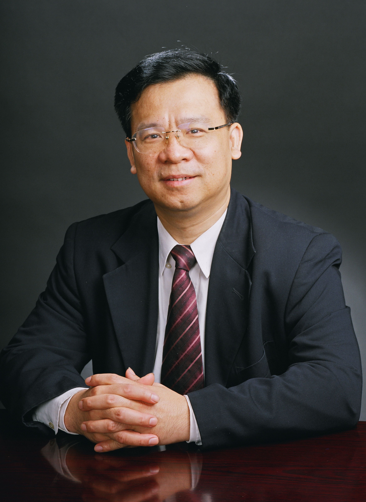

<!-- AUTO-GENERATED-BY: work/generate_obsidian_profiles.py -->

<!-- TEMPLATE: D:\workspace\信息收集整理\医生画像仓库\模板\医生画像模板.md -->

# 黄健

## 基础信息

| 字段 | 内容 |
|---|---|
| 姓名 | 黄健 |
| 医院 | 中山大学孙逸仙纪念医院 |
| 科室 | 泌尿外科 |
| 职称/身份 | 教授, 主任医师 |
| 来源链接 | [官网原文](https://www.gzsys.org.cn/node/15255) |
| 采集日期 | 2026-08-13 |

## 简介/擅长

## 科研项目与成果

- 曾获教育部高等学校科学研究优秀成果奖一等奖、广东省科学技术进步奖一等奖、获卫计委“全国卫生计生系统先进工作者”称号、“国之名医-卓越建树奖、 “吴阶平泌尿外科医学奖”、中华医学会泌尿外科分会肿瘤学组“华佗奖”，泌尿外科微创领域最高奖项“金膀胱镜奖”。
- 先后主持国家级、省部级等各级科研项目20余项，在国外知名杂志及国内核心杂志发表论著130余篇。
- 参编专著20余部，申请获得国家实用新型专利7。

## 论文与学术产出

- 兼中华医学会泌尿外科学分会主任委员、中国医师协会泌尿外科专科医师分会副会长、中国医疗保健国际交流促进会加速康复外科分会副主任委员、中华医学会泌尿外科学分会肿瘤学组组长、中国医疗器械行业协会泌尿外科与男科器械专业委员会副会长、中国医师协会医学机器人医师分会常委、《中国泌尿外科和男科疾病诊断治疗指南》主编。
- 先后主持国家级、省部级等各级科研项目20余项，在国外知名杂志及国内核心杂志发表论著130余篇。
- 参编专著20余部，申请获得国家实用新型专利7。

## 可包装亮点

- 泌尿外科主任、学科带头人. 黄健教授是中山大学名医，是我国著名泌尿系肿瘤微创治疗专家，擅长膀胱癌、前列腺癌、肾癌、肾盂癌、睾丸癌等各种泌尿系肿瘤的机器人辅助腹腔镜、腹腔镜、3D腹腔镜下的微创手术治疗。
- 兼中华医学会泌尿外科学分会主任委员、中国医师协会泌尿外科专科医师分会副会长、中国医疗保健国际交流促进会加速康复外科分会副主任委员、中华医学会泌尿外科学分会肿瘤学组组长、中国医疗器械行业协会泌尿外科与男科器械专业委员会副会长、中国医师协会医学机器人医师分会常委、《中国泌尿外科和男科疾病诊断治疗指南》主编。
- 曾获教育部高等学校科学研究优秀成果奖一等奖、广东省科学技术进步奖一等奖、获卫计委“全国卫生计生系统先进工作者”称号、“国之名医-卓越建树奖、 “吴阶平泌尿外科医学奖”、中华医学会泌尿外科分会肿瘤学组“华佗奖”，泌尿外科微创领域最高奖项“金膀胱镜奖”。
- 先后主持国家级、省部级等各级科研项目20余项，在国外知名杂志及国内核心杂志...

## 重点疾病/人群标签

- 慢性病：
- 肿瘤：肿瘤、癌、康复
- 生殖疾病：
- 免疫/风湿：
- 术后恢复/康复：肿瘤、癌、康复
- 疑难重症：

## 证据摘录

> 只摘录官网公开信息中的短句或关键字段，不复制大段原文。

- 官网身份字段：教授, 主任医师
- 官网亮眼经历线索：泌尿外科主任、学科带头人. 黄健教授是中山大学名医，是我国著名泌尿系肿瘤微创治疗专家，擅长膀胱癌、前列腺癌、肾癌、肾盂癌、睾丸癌等各种泌尿系肿瘤的机器人辅助腹腔镜、腹腔镜、3D腹腔镜下的微创手术治疗。 兼中华医学会泌尿外科学分会主任委员、中国医师协会泌尿外科专科医师分会副会长、中国医疗保健国际交流促进会加速康复外科分会副主任委员、中华医学会泌尿外科学分会肿瘤学组组长、中国医疗器械行业协会泌尿外科与男科器械专业委员会副会长、中国医师协会…
- 来源链接：https://www.gzsys.org.cn/node/15255

## BD 画像摘要

黄健医生可作为肿瘤、术后恢复/康复方向的基础画像候选。后续 BD 使用应继续以官网来源和人工复核为准，不添加疗效承诺或无来源包装。

## 合规边界

- 仅使用医院官网、官方公众号、官方小程序等公开渠道。
- 不采集私人电话、私人微信、家庭住址、患者隐私或非公开排班信息。
- 不写“保证治愈”“疗效第一”“包治疑难杂症”等无法由官网证明的表述。
