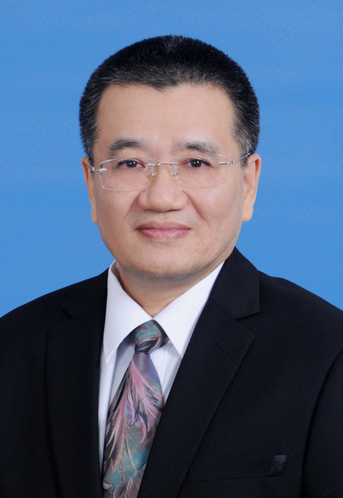

<!-- AUTO-GENERATED-BY: work/generate_obsidian_profiles.py -->

<!-- TEMPLATE: D:\workspace\信息收集整理\医生画像仓库\模板\医生画像模板.md -->

# 黄开红

## 基础信息

| 字段 | 内容 |
|---|---|
| 姓名 | 黄开红 |
| 医院 | 中山大学孙逸仙纪念医院 |
| 科室 | 消化内科 |
| 职称/身份 | 教授, 主任医师 |
| 来源链接 | [官网原文](https://www.gzsys.org.cn/node/14803) |
| 采集日期 | 2026-08-13 |

## 简介/擅长

## 教育与进修经历

- 1980年毕业于阳江一中，同年考入中山医科大学，并在本校取得硕士博士学位，博士生导师，曾任南院副院长。

## 科研项目与成果

- 主持国家自然科学基金4项、省部级科研基金6项。
- 在国内外发表研究论文100余篇，获得国家级专利4项，曾获广东省科学技术奖三等奖。

## 论文与学术产出

- 在国内外发表研究论文100余篇，获得国家级专利4项，曾获广东省科学技术奖三等奖。

## 可包装亮点

- 黄开红，教授、主任医师。
- 1980年毕业于阳江一中，同年考入中山医科大学，并在本校取得硕士博士学位，博士生导师，曾任南院副院长。
- 社会兼职：广东省医学会消化病学分会副主任委员、广州市消化医师协会副主任委员等。
- 主持国家自然科学基金4项、省部级科研基金6项。

## 重点疾病/人群标签

- 慢性病：
- 肿瘤：肿瘤、靶向
- 生殖疾病：
- 免疫/风湿：
- 术后恢复/康复：
- 疑难重症：

## 证据摘录

> 只摘录官网公开信息中的短句或关键字段，不复制大段原文。

- 官网身份字段：教授, 主任医师
- 官网亮眼经历线索：黄开红，教授、主任医师。 1980年毕业于阳江一中，同年考入中山医科大学，并在本校取得硕士博士学位，博士生导师，曾任南院副院长。 社会兼职：广东省医学会消化病学分会副主任委员、广州市消化医师协会副主任委员等。 主持国家自然科学基金4项、省部级科研基金6项。
- 来源链接：https://www.gzsys.org.cn/node/14803

## BD 画像摘要

黄开红医生可作为肿瘤方向的基础画像候选。后续 BD 使用应继续以官网来源和人工复核为准，不添加疗效承诺或无来源包装。

## 合规边界

- 仅使用医院官网、官方公众号、官方小程序等公开渠道。
- 不采集私人电话、私人微信、家庭住址、患者隐私或非公开排班信息。
- 不写“保证治愈”“疗效第一”“包治疑难杂症”等无法由官网证明的表述。
