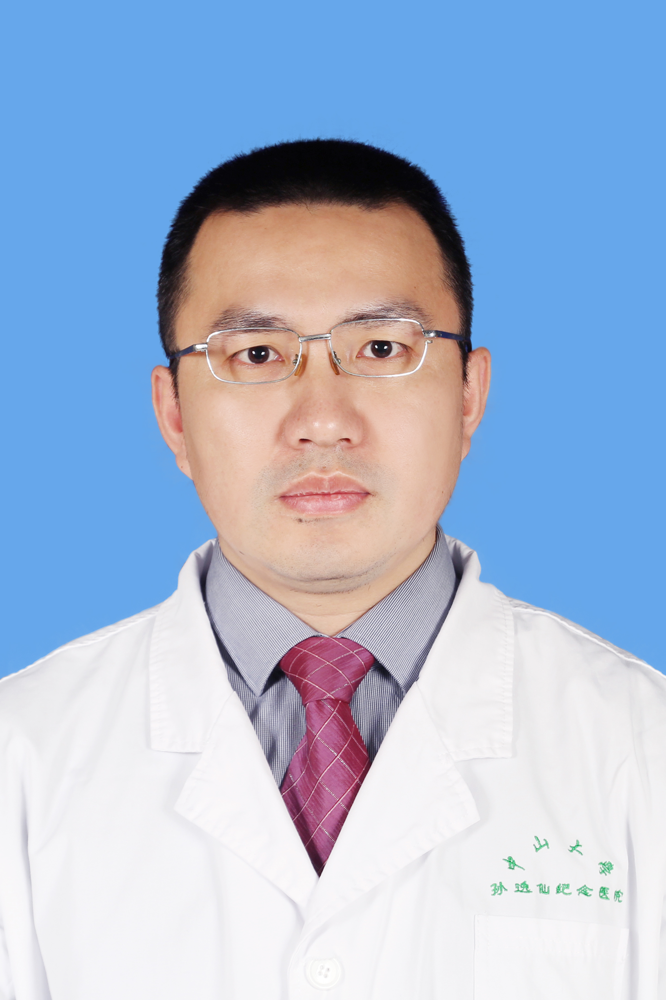

<!-- AUTO-GENERATED-BY: work/generate_obsidian_profiles.py -->

<!-- TEMPLATE: D:\workspace\信息收集整理\医生画像仓库\模板\医生画像模板.md -->

# 黄志权

## 基础信息

| 字段 | 内容 |
|---|---|
| 姓名 | 黄志权 |
| 医院 | 中山大学孙逸仙纪念医院 |
| 科室 | 口腔科 |
| 职称/身份 | 教授, 主任医师 |
| 来源链接 | [官网原文](https://www.gzsys.org.cn/doctor/14685) |
| 采集日期 | 2026-08-13 |

## 简介/擅长

## 科研项目与成果

- 主持国家自然科学基金2项、广东省自然科学基金以及中央高校科研项目7项，发表学术论文50余篇，其中以第一作者和通讯作者被SCI 收录36篇。
- 担任国家自然科学基金和广东省自然科学基金评审专家。

## 论文与学术产出

- 主持国家自然科学基金2项、广东省自然科学基金以及中央高校科研项目7项，发表学术论文50余篇，其中以第一作者和通讯作者被SCI 收录36篇。

## 可包装亮点

- 每年完成头颈部恶性肿瘤和放射性骨坏死病例切除同期显微游离皮瓣修复等高难度手术百余例，其中近70%为疑难危重病例。
- 主持国家自然科学基金2项、广东省自然科学基金以及中央高校科研项目7项，发表学术论文50余篇，其中以第一作者和通讯作者被SCI 收录36篇。
- 担任国家自然科学基金和广东省自然科学基金评审专家。

## 重点疾病/人群标签

- 慢性病：
- 肿瘤：肿瘤、瘤、疑难、危重
- 生殖疾病：
- 免疫/风湿：
- 术后恢复/康复：
- 疑难重症：肿瘤、瘤、疑难、危重

## 证据摘录

> 只摘录官网公开信息中的短句或关键字段，不复制大段原文。

- 官网身份字段：教授, 主任医师
- 官网亮眼经历线索：每年完成头颈部恶性肿瘤和放射性骨坏死病例切除同期显微游离皮瓣修复等高难度手术百余例，其中近70%为疑难危重病例。 主持国家自然科学基金2项、广东省自然科学基金以及中央高校科研项目7项，发表学术论文50余篇，其中以第一作者和通讯作者被SCI 收录36篇。 担任国家自然科学基金和广东省自然科学基金评审专家。
- 来源链接：https://www.gzsys.org.cn/doctor/14685

## BD 画像摘要

黄志权医生可作为肿瘤、疑难重症方向的基础画像候选。后续 BD 使用应继续以官网来源和人工复核为准，不添加疗效承诺或无来源包装。

## 合规边界

- 仅使用医院官网、官方公众号、官方小程序等公开渠道。
- 不采集私人电话、私人微信、家庭住址、患者隐私或非公开排班信息。
- 不写“保证治愈”“疗效第一”“包治疑难杂症”等无法由官网证明的表述。
