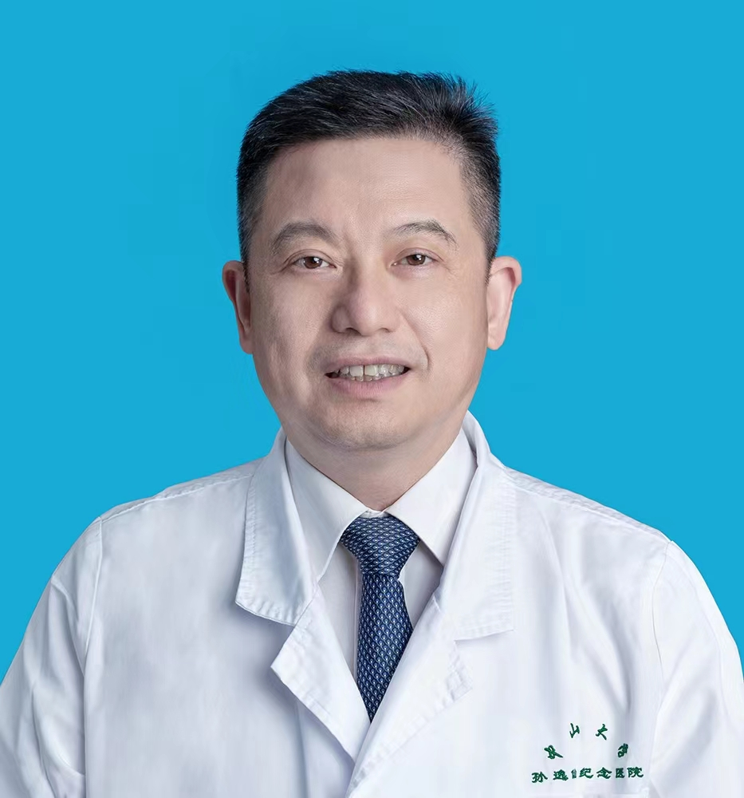

<!-- AUTO-GENERATED-BY: work/generate_obsidian_profiles.py -->

<!-- TEMPLATE: D:\workspace\信息收集整理\医生画像仓库\模板\医生画像模板.md -->

# 黄晓明

## 基础信息

| 字段 | 内容 |
|---|---|
| 姓名 | 黄晓明 |
| 医院 | 中山大学孙逸仙纪念医院 |
| 科室 | 耳鼻喉科 |
| 职称/身份 | 教授, 主任医师 |
| 来源链接 | [官网原文](https://www.gzsys.org.cn/node/15284) |
| 采集日期 | 2026-08-13 |

## 简介/擅长

## 科研项目与成果

- 主持国家自然科学基金、国家临床重点专科建设项目等国家级、省部级课题10余项，负责 30项临床药物试验。
- 成果被8项国内外专家共识引用。
- 主编《颈部内镜外科学》（获广东省优秀科技专著基金资助）、《机器人头颈外科手术学》（获国家科学技术学术著作出版基金资助）。

## 论文与学术产出

- 以第一/通讯作者发表SCI论文72篇，中华系列杂志论著30余篇；
- 主编《颈部内镜外科学》（获广东省优秀科技专著基金资助）、《机器人头颈外科手术学》（获国家科学技术学术著作出版基金资助）。

## 可包装亮点

- 任 中华医学会耳鼻咽喉头颈外科学分会委员，广东省医学会耳鼻咽喉科学会主任委员，广东省耳鼻咽喉科专业质控中心主任，中国抗癌协会甲状腺癌专业委员会、头颈肿瘤专业委员会常委，《中华耳鼻咽喉头颈外科杂志》和《世界耳鼻咽喉头颈外科杂志》编委等。
- 国内率先构建经胸前、锁骨下等入路的个体化免注气腔镜及机器人甲状腺癌及颈部肿瘤微创术式体系，推动颈部无痕手术理念发展。
- 主持国家自然科学基金、国家临床重点专科建设项目等国家级、省部级课题10余项，负责 30项临床药物试验。
- 牵头制定中华医学会头颈外科机器人手术专家共识2项。

## 重点疾病/人群标签

- 慢性病：
- 肿瘤：肿瘤、癌
- 生殖疾病：
- 免疫/风湿：
- 术后恢复/康复：
- 疑难重症：

## 证据摘录

> 只摘录官网公开信息中的短句或关键字段，不复制大段原文。

- 官网身份字段：教授, 主任医师
- 官网亮眼经历线索：任 中华医学会耳鼻咽喉头颈外科学分会委员，广东省医学会耳鼻咽喉科学会主任委员，广东省耳鼻咽喉科专业质控中心主任，中国抗癌协会甲状腺癌专业委员会、头颈肿瘤专业委员会常委，《中华耳鼻咽喉头颈外科杂志》和《世界耳鼻咽喉头颈外科杂志》编委等。 国内率先构建经胸前、锁骨下等入路的个体化免注气腔镜及机器人甲状腺癌及颈部肿瘤微创术式体系，推动颈部无痕手术理念发展。 主持国家自然科学基金、国家临床重点专科建设项目等国家级、省部级课题10余项，负责 3…
- 来源链接：https://www.gzsys.org.cn/node/15284

## BD 画像摘要

黄晓明医生可作为肿瘤方向的基础画像候选。后续 BD 使用应继续以官网来源和人工复核为准，不添加疗效承诺或无来源包装。

## 合规边界

- 仅使用医院官网、官方公众号、官方小程序等公开渠道。
- 不采集私人电话、私人微信、家庭住址、患者隐私或非公开排班信息。
- 不写“保证治愈”“疗效第一”“包治疑难杂症”等无法由官网证明的表述。
