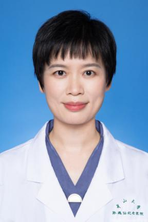

<!-- AUTO-GENERATED-BY: work/generate_obsidian_profiles.py -->

<!-- TEMPLATE: D:\workspace\信息收集整理\医生画像仓库\模板\医生画像模板.md -->

# 黄松音

## 基础信息

| 字段 | 内容 |
|---|---|
| 姓名 | 黄松音 |
| 医院 | 中山大学孙逸仙纪念医院 |
| 科室 | 检验科、生物治疗技术中心 |
| 职称/身份 | 主任技师 |
| 来源链接 | [官网原文](https://www.gzsys.org.cn/node/14656) |
| 采集日期 | 2026-08-13 |

## 简介/擅长

## 科研项目与成果

- 主持国家自然科学基金等省部级科研基金 10多项，发表第一/通讯作者SCI 论文20多篇，参编专著 2 部，参与获得广东省自然科学奖二等奖 1 项。

## 论文与学术产出

- 主持国家自然科学基金等省部级科研基金 10多项，发表第一/通讯作者SCI 论文20多篇，参编专著 2 部，参与获得广东省自然科学奖二等奖 1 项。

## 可包装亮点

- 兼任广东省健康科普促进会肿瘤免疫治疗分会副主任委员、广东省保健协会免疫细胞与干细胞治疗分会常务委员。
- 主持国家自然科学基金等省部级科研基金 10多项，发表第一/通讯作者SCI 论文20多篇，参编专著 2 部，参与获得广东省自然科学奖二等奖 1 项。

## 重点疾病/人群标签

- 慢性病：
- 肿瘤：
- 生殖疾病：
- 免疫/风湿：
- 术后恢复/康复：
- 疑难重症：

## 证据摘录

> 只摘录官网公开信息中的短句或关键字段，不复制大段原文。

- 官网身份字段：主任技师
- 官网亮眼经历线索：兼任广东省健康科普促进会肿瘤免疫治疗分会副主任委员、广东省保健协会免疫细胞与干细胞治疗分会常务委员。 主持国家自然科学基金等省部级科研基金 10多项，发表第一/通讯作者SCI 论文20多篇，参编专著 2 部，参与获得广东省自然科学奖二等奖 1 项。
- 异常提示：职称/身份需人工复核
- 来源链接：https://www.gzsys.org.cn/node/14656

## BD 画像摘要

黄松音医生可作为中山大学孙逸仙纪念医院检验科、生物治疗技术中心的基础医生资料入库。当前重点方向以总底表标签为准，官网未展示的信息保持空白。

## 合规边界

- 仅使用医院官网、官方公众号、官方小程序等公开渠道。
- 不采集私人电话、私人微信、家庭住址、患者隐私或非公开排班信息。
- 不写“保证治愈”“疗效第一”“包治疑难杂症”等无法由官网证明的表述。
