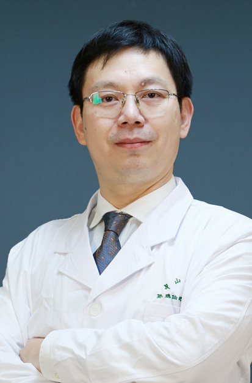

<!-- AUTO-GENERATED-BY: work/generate_obsidian_profiles.py -->

<!-- TEMPLATE: D:\workspace\信息收集整理\医生画像仓库\模板\医生画像模板.md -->

# 黄海

## 基础信息

| 字段 | 内容 |
|---|---|
| 姓名 | 黄海 |
| 医院 | 中山大学孙逸仙纪念医院 |
| 科室 | 泌尿外科 |
| 职称/身份 | 教授, 主任医师 |
| 来源链接 | [官网原文](https://www.gzsys.org.cn/node/15263) |
| 采集日期 | 2026-08-13 |

## 简介/擅长

前列腺增生、前列腺癌、前列腺炎、尿失禁、神经源性膀胱及各类膀胱炎等下尿路疾病的诊治。

## 教育与进修经历

- 2015年1月~2016年1月在国家留学基金委资助下，于美国德克萨斯医学中心生物技术学院进行博士后学习与研究，主要从事肿瘤自噬、炎-癌转化、肿瘤微环境在前列腺癌CRPC发病中机制的研究。
- 在“蓝丝带”中心培训获得TVT等相关尿失禁手术资格，在美国奥斯丁尿控中心培训获得骶神经刺激器手术资格。

## 科研项目与成果

- 2015年1月~2016年1月在国家留学基金委资助下，于美国德克萨斯医学中心生物技术学院进行博士后学习与研究，主要从事肿瘤自噬、炎-癌转化、肿瘤微环境在前列腺癌CRPC发病中机制的研究。
- 已主持3项国家自然科学基金，9项省部级科研基金，参与30余项国家重大计划、十二五、十三五计划项目、省部级项目。

## 论文与学术产出

- 以第一、共同第一作者或通讯、共同通讯作者发表SCI论文16篇，其中IF>5.0以上4篇，JCR分区一区1篇，二区3篇;
- 主编专著1本，参编人卫本科教材2本，参编其他论著3本。

## 可包装亮点

- 博士生导师，主任医师，中山大学孙逸仙纪念医院副院长，中华医学会泌尿外科分会尿控学组副组长。
- 2012年获得中华医学会临床技能大赛二等奖，2013年在中华医学会资助下先后在比利时鲁文大学泌尿外科中心、奥地利萨尔斯堡大学泌尿外科、芬兰坦佩雷大学泌尿外科中心学习。
- 2015年1月~2016年1月在国家留学基金委资助下，于美国德克萨斯医学中心生物技术学院进行博士后学习与研究，主要从事肿瘤自噬、炎-癌转化、肿瘤微环境在前列腺癌CRPC发病中机制的研究。
- 已主持3项国家自然科学基金，9项省部级科研基金，参与30余项国家重大计划、十二五、十三五计划项目、省部级项目。

## 重点疾病/人群标签

- 慢性病：
- 肿瘤：肿瘤、癌
- 生殖疾病：
- 免疫/风湿：
- 术后恢复/康复：
- 疑难重症：

## 证据摘录

> 只摘录官网公开信息中的短句或关键字段，不复制大段原文。

- 官网身份字段：教授, 主任医师
- 官网简介/擅长：前列腺增生、前列腺癌、前列腺炎、尿失禁、神经源性膀胱及各类膀胱炎等下尿路疾病的诊治。
- 官网亮眼经历线索：博士生导师，主任医师，中山大学孙逸仙纪念医院副院长，中华医学会泌尿外科分会尿控学组副组长。 2012年获得中华医学会临床技能大赛二等奖，2013年在中华医学会资助下先后在比利时鲁文大学泌尿外科中心、奥地利萨尔斯堡大学泌尿外科、芬兰坦佩雷大学泌尿外科中心学习。 2015年1月~2016年1月在国家留学基金委资助下，于美国德克萨斯医学中心生物技术学院进行博士后学习与研究，主要从事肿瘤自噬、炎-癌转化、肿瘤微环境在前列腺癌CRPC发病中机制…
- 来源链接：https://www.gzsys.org.cn/node/15263

## BD 画像摘要

黄海医生可作为肿瘤方向的基础画像候选。后续 BD 使用应继续以官网来源和人工复核为准，不添加疗效承诺或无来源包装。

## 合规边界

- 仅使用医院官网、官方公众号、官方小程序等公开渠道。
- 不采集私人电话、私人微信、家庭住址、患者隐私或非公开排班信息。
- 不写“保证治愈”“疗效第一”“包治疑难杂症”等无法由官网证明的表述。
