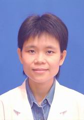

<!-- AUTO-GENERATED-BY: work/generate_obsidian_profiles.py -->

<!-- TEMPLATE: D:\workspace\信息收集整理\医生画像仓库\模板\医生画像模板.md -->

# 黄科

## 基础信息

| 字段 | 内容 |
|---|---|
| 姓名 | 黄科 |
| 医院 | 中山大学孙逸仙纪念医院 |
| 科室 | 儿科血液专科 |
| 职称/身份 | 主任医师 |
| 来源链接 | [官网原文](https://www.gzsys.org.cn/node/14585) |
| 采集日期 | 2026-08-13 |

## 简介/擅长

## 教育与进修经历

- 作为导师辅导多名研究生毕业。

## 科研项目与成果

- 承担了多项省级研究课题；
- 并作为课题组主要成员参与了两项国家自然科学基金及多项省科技计划项目研究。

## 论文与学术产出

- 至今已发表及合作发表论著30余篇；

## 可包装亮点

- 儿童造血干细胞移植专科主任，主任医师，中山大学孙逸仙纪念医院儿科临床博士，硕士生导师；
- 至今已发表及合作发表论著30余篇；
- 并作为课题组主要成员参与了两项国家自然科学基金及多项省科技计划项目研究。

## 重点疾病/人群标签

- 慢性病：
- 肿瘤：肿瘤、白血病、免疫、难治
- 生殖疾病：
- 免疫/风湿：肿瘤、白血病、免疫、难治
- 术后恢复/康复：
- 疑难重症：肿瘤、白血病、免疫、难治

## 证据摘录

> 只摘录官网公开信息中的短句或关键字段，不复制大段原文。

- 官网身份字段：主任医师
- 官网亮眼经历线索：儿童造血干细胞移植专科主任，主任医师，中山大学孙逸仙纪念医院儿科临床博士，硕士生导师； 至今已发表及合作发表论著30余篇； 并作为课题组主要成员参与了两项国家自然科学基金及多项省科技计划项目研究。
- 来源链接：https://www.gzsys.org.cn/node/14585

## BD 画像摘要

黄科医生可作为肿瘤、免疫/风湿/感染、疑难重症方向的基础画像候选。后续 BD 使用应继续以官网来源和人工复核为准，不添加疗效承诺或无来源包装。

## 合规边界

- 仅使用医院官网、官方公众号、官方小程序等公开渠道。
- 不采集私人电话、私人微信、家庭住址、患者隐私或非公开排班信息。
- 不写“保证治愈”“疗效第一”“包治疑难杂症”等无法由官网证明的表述。
