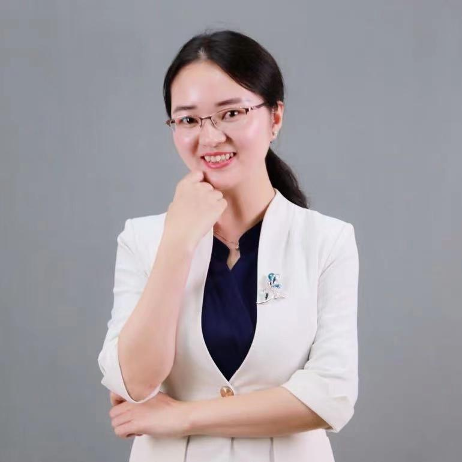

<!-- AUTO-GENERATED-BY: work/generate_obsidian_profiles.py -->

<!-- TEMPLATE: D:\workspace\信息收集整理\医生画像仓库\模板\医生画像模板.md -->

# 龙腾飞

## 基础信息

| 字段 | 内容 |
|---|---|
| 姓名 | 龙腾飞 |
| 医院 | 中山大学孙逸仙纪念医院 |
| 科室 | 普通妇科专科 |
| 职称/身份 | 副主任医师 |
| 来源链接 | [官网原文](https://www.gzsys.org.cn/doctor/15430) |
| 采集日期 | 2026-08-13 |

## 简介/擅长

## 教育与进修经历

- 首都医科大学妇产科学硕士研究生毕业，中山大学孙逸仙纪念医院妇产科博士在读。

## 科研项目与成果

- 主持多项省级及横向课题的研究，为多项国家级及省级科研项目组骨干成员。

## 论文与学术产出

- 以第一作者发表SCI及中文论文数篇，参与专业书籍翻译及编写2部，科普类书籍编写1部。

## 可包装亮点

- 已获得盆底康复专业内各项证书并取得中华预防医学会盆底康复先进个人称号， 获中山大学孙逸仙纪念医院博济人才交流计划于法国访问学习盆底康复综合管理3个月。
- 以第一作者发表SCI及中文论文数篇，参与专业书籍翻译及编写2部，科普类书籍编写1部。
- 现任法中妇女协会会员；
- 老年医学妇产科分会第一届委员会委员；

## 重点疾病/人群标签

- 慢性病：
- 肿瘤：癌、瘤、生殖、月经、康复、功能障碍
- 生殖疾病：癌、瘤、生殖、月经、康复、功能障碍
- 免疫/风湿：
- 术后恢复/康复：癌、瘤、生殖、月经、康复、功能障碍
- 疑难重症：

## 证据摘录

> 只摘录官网公开信息中的短句或关键字段，不复制大段原文。

- 官网身份字段：副主任医师
- 官网亮眼经历线索：已获得盆底康复专业内各项证书并取得中华预防医学会盆底康复先进个人称号， 获中山大学孙逸仙纪念医院博济人才交流计划于法国访问学习盆底康复综合管理3个月。 以第一作者发表SCI及中文论文数篇，参与专业书籍翻译及编写2部，科普类书籍编写1部。 现任法中妇女协会会员； 老年医学妇产科分会第一届委员会委员；
- 来源链接：https://www.gzsys.org.cn/doctor/15430

## BD 画像摘要

龙腾飞医生可作为肿瘤、生殖疾病、术后恢复/康复方向的基础画像候选。后续 BD 使用应继续以官网来源和人工复核为准，不添加疗效承诺或无来源包装。

## 合规边界

- 仅使用医院官网、官方公众号、官方小程序等公开渠道。
- 不采集私人电话、私人微信、家庭住址、患者隐私或非公开排班信息。
- 不写“保证治愈”“疗效第一”“包治疑难杂症”等无法由官网证明的表述。
