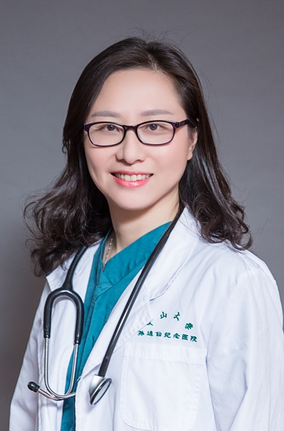

<!-- AUTO-GENERATED-BY: work/generate_obsidian_profiles.py -->

<!-- TEMPLATE: D:\workspace\信息收集整理\医生画像仓库\模板\医生画像模板.md -->

# 龚畅

## 基础信息

| 字段 | 内容 |
|---|---|
| 姓名 | 龚畅 |
| 医院 | 中山大学孙逸仙纪念医院 |
| 科室 | 乳腺外科、乳腺诊断专科 |
| 职称/身份 | 教授, 主任医师 |
| 来源链接 | [官网原文](https://www.gzsys.org.cn/node/14898) |
| 采集日期 | 2026-08-13 |

## 简介/擅长

## 教育与进修经历

- 逸仙乳腺肿瘤医院乳腺外科主任医师、教授，乳腺诊断专科主任，法国博士后，英国访问学者。

## 科研项目与成果

- 先后主持科技部国家重点研发计划（课题组长）1项、主持国家自然科学基金项目6项，省部级基金6项。
- 入选教育部新世纪优秀人才、科技部中法杰出青年科研人员交流计划，广东省杰青、广东省杰出青年医学人才、广东特支计划青年拔尖人才，珠江科技新星。

## 论文与学术产出

- 以第一/通讯作者在肿瘤和外科领域的专业期刊Cancer Cell，Molecular Cancer, Nature Communications, Autophagy, Cancer Research，Oncogene, Oncologist等杂志发表论文23篇,单篇最高他引用377次，入选ESI高被引论文。

## 可包装亮点

- 逸仙乳腺肿瘤医院乳腺外科主任医师、教授，乳腺诊断专科主任，法国博士后，英国访问学者。
- 以第一/通讯作者在肿瘤和外科领域的专业期刊Cancer Cell，Molecular Cancer, Nature Communications, Autophagy, Cancer Research，Oncogene, Oncologist等杂志发表论文23篇,单篇最高他引用377次，入选ESI高被引论文。
- 先后主持科技部国家重点研发计划（课题组长）1项、主持国家自然科学基金项目6项，省部级基金6项。
- 入选教育部新世纪优秀人才、科技部中法杰出青年科研人员交流计划，广东省杰青、广东省杰出青年医学人才、广东特支计划青年拔尖人才，珠江科技新星。

## 重点疾病/人群标签

- 慢性病：
- 肿瘤：肿瘤、靶向、乳腺癌
- 生殖疾病：
- 免疫/风湿：
- 术后恢复/康复：
- 疑难重症：

## 证据摘录

> 只摘录官网公开信息中的短句或关键字段，不复制大段原文。

- 官网身份字段：教授, 主任医师
- 官网亮眼经历线索：逸仙乳腺肿瘤医院乳腺外科主任医师、教授，乳腺诊断专科主任，法国博士后，英国访问学者。 以第一/通讯作者在肿瘤和外科领域的专业期刊Cancer Cell，Molecular Cancer, Nature Communications, Autophagy, Cancer Research，Oncogene, Oncologist等杂志发表论文23篇,单篇最高他引用377次，入选ESI高被引论文。 先后主持科技部国家重点研发计划（课题组长…
- 来源链接：https://www.gzsys.org.cn/node/14898

## BD 画像摘要

龚畅医生可作为肿瘤方向的基础画像候选。后续 BD 使用应继续以官网来源和人工复核为准，不添加疗效承诺或无来源包装。

## 合规边界

- 仅使用医院官网、官方公众号、官方小程序等公开渠道。
- 不采集私人电话、私人微信、家庭住址、患者隐私或非公开排班信息。
- 不写“保证治愈”“疗效第一”“包治疑难杂症”等无法由官网证明的表述。
