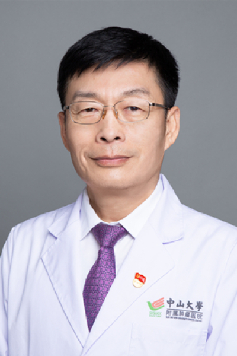

<!-- AUTO-GENERATED-BY: work/generate_obsidian_profiles.py -->

<!-- TEMPLATE: D:\workspace\信息收集整理\医生画像仓库\模板\医生画像模板.md -->

# miRNA-...

## 基础信息

| 字段 | 内容 |
|---|---|
| 姓名 | miRNA-... |
| 医院 | 中山大学肿瘤防治中心 |
| 科室 | 放疗科 |
| 职称/身份 | 后装放疗组长 职称：主任医师、主诊教授、临床大PI、硕士研究生导师、博士后合作导师 |
| 来源链接 | [官网原文](https://www.sysucc.org.cn/node/1683) |
| 采集日期 | 2026-08-10 |

## 简介/擅长

妇科肿瘤放射治疗和近距离（后装）放射治疗

## 教育与进修经历

- 临床专家 面包屑 首页 / 临床科室 / 放疗系列 / 放疗科 / 临床专家 曹新平 职务：后装放疗组长 职称：主任医师、主诊教授、临床大PI、硕士研究生导师、博士后合作导师 专长 妇科肿瘤放射治疗和近距离（后装）放射治疗 一、基本情况 职务：后装放疗组长 专家门诊时间：周一上午、 周二上午，周三上午（黄埔院区），周四上午 专业特长：肿瘤放射治疗临床工作及研究。

## 论文与学术产出

- 下图是2000年-2004年柳叶刀发表的中美恶性肿瘤疗效对比，宫颈癌的疗效是为数不多的中国的疗效好于美国的疗效，我院引领国内的宫颈癌三维插植后装放疗技术是其中的一个重要因素。
- 主要著作、论文 1. 中华肿瘤杂志,563鼻咽癌残留病灶后装放疗的近期和远期疗效,1998.03 2. 亚洲医药，中药PR－II减少食管癌后装放疗副作用的追踪研究 ,1997.05 3. 中国新药杂志，路盖克对癌痛镇痛作用的临床分析,1999.06 4. 癌症，近距离放疗在前列腺癌综合治疗中的作用,1999.07 5. 癌症，舌癌外照射联合高剂量率组织插植后装放疗的疗效分析,1999.07 6. 癌症，鼻咽癌近距离个体化施源器的制作技术,1999.10 7. 广东医学，中药灌肠预防放射性肠炎（附500例临床疗效分…

## 可包装亮点

- 后装放疗组长 职称：主任医师、主诊教授、临床大PI、硕士研究生导师、博士后合作导师 曹新平 职务：后装放疗组长 职称：主任医师、主诊教授、临床大PI、硕士研究生导师、博士后合作导师 专长 妇科肿瘤放射治疗和近距离（后装）放射治疗 一、基本情况 职务：后装放疗组长 专家门诊时间：周一上午、 周二上午，周三上午（黄埔院区），周四上午 专业特长：肿瘤放射治疗临床…
- 二、学习及工作经历 1980年—1986年：中山医科大学就读医疗系 1986年至今：中山大学附属肿瘤医院放疗科工作 1995年—1998年：中山医科大学就读硕士生 1998年—2001年：中山医科大学就读博士生 三、行业兼职 中国抗癌协会：理事 中国抗癌协会近距离放疗专业委员会：主任委员 中华医学会肿瘤放射治疗学近距离放疗学组：副组长 中国医师协会近距离放…

## 重点疾病/人群标签

- 慢性病：
- 肿瘤：肿瘤、癌、瘤、放疗、化疗、鼻咽癌、乳腺癌、术后、MDT
- 生殖疾病：
- 免疫/风湿：
- 术后恢复/康复：肿瘤、癌、瘤、放疗、化疗、鼻咽癌、乳腺癌、术后、MDT
- 疑难重症：肿瘤、癌、瘤、放疗、化疗、鼻咽癌、乳腺癌、术后、MDT

## 证据摘录

> 只摘录官网公开信息中的短句或关键字段，不复制大段原文。

- 官网身份字段：后装放疗组长 职称：主任医师、主诊教授、临床大PI、硕士研究生导师、博士后合作导师
- 官网简介/擅长：妇科肿瘤放射治疗和近距离（后装）放射治疗
- 官网亮眼经历线索：后装放疗组长 职称：主任医师、主诊教授、临床大PI、硕士研究生导师、博士后合作导师 曹新平 职务：后装放疗组长 职称：主任医师、主诊教授、临床大PI、硕士研究生导师、博士后合作导师 专长 妇科肿瘤放射治疗和近距离（后装）放射治疗 一、基本情况 职务：后装放疗组长 专家门诊时间：周一上午、 周二上午，周三上午（黄埔院区），周四上午 专业特长：肿瘤放射治疗临床工作及研究。 二、学习及工作经历 1980年—1986年：中山医科大学就读医疗系…
- 异常提示：亮眼经历含导航文本，已清洗
- 来源链接：https://www.sysucc.org.cn/node/1683

## BD 画像摘要

miRNA-...医生可作为肿瘤、术后恢复/康复、疑难重症方向的基础画像候选。后续 BD 使用应继续以官网来源和人工复核为准，不添加疗效承诺或无来源包装。

## 合规边界

- 仅使用医院官网、官方公众号、官方小程序等公开渠道。
- 不采集私人电话、私人微信、家庭住址、患者隐私或非公开排班信息。
- 不写“保证治愈”“疗效第一”“包治疑难杂症”等无法由官网证明的表述。
