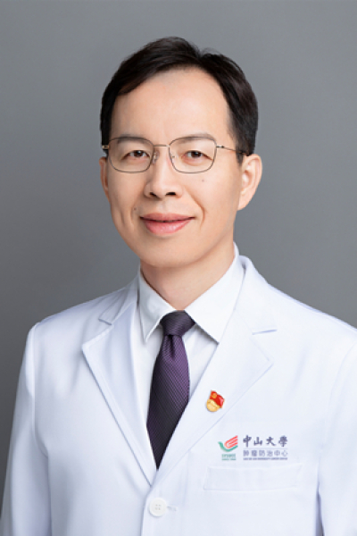

<!-- AUTO-GENERATED-BY: work/generate_obsidian_profiles.py -->

<!-- TEMPLATE: D:\workspace\信息收集整理\医生画像仓库\模板\医生画像模板.md -->

# 丁培荣

## 基础信息

| 字段 | 内容 |
|---|---|
| 姓名 | 丁培荣 |
| 医院 | 中山大学肿瘤防治中心 |
| 科室 | 结直肠科 |
| 职称/身份 | 科主任 职称：主任医师、教授、博士生导师 |
| 来源链接 | [官网原文](https://www.sysucc.org.cn/node/3680) |
| 采集日期 | 2026-08-10 |

## 简介/擅长

结直肠癌、胃肠道间质瘤和消化道神经内分泌肿瘤的综合治疗

## 教育与进修经历

- 二、学习及工作经历 1997.09--2002.07 中山大学临床医学专业本科，获得学士学位 2002.07--2007.12 中山大学肿瘤防治中心腹科住院医生 2008.01--2010.12 中山大学肿瘤防治中心腹科（结直肠科）讲师 期间 2005.09--2010.06 中山大学肿瘤防治中心硕士及博士研究生，获得博士学位 2009.06-2010.06 美国斯隆凯特琳纪念癌症中心访问学者（国家公派） 2011.1-2015.12 中山大学肿瘤防治中心结直肠科副主任医师 2016.1至今 中山大学肿瘤防治中心…

## 科研项目与成果

- 是中华慈善总会格列卫患者援助项目注册医师。

## 可包装亮点

- 科主任 职称：主任医师、教授、博士生导师 丁培荣 职务：科主任 职称：主任医师、教授、博士生导师 专长 结直肠癌、胃肠道间质瘤和消化道神经内分泌肿瘤的综合治疗 一、基本情况 职 务： 结直肠科主任 职 称： 主任医师、教授、博士生导师 专家门诊时间： 周一上午专家门诊；
- 周一下午及周二上午特需门诊 专业特长： 结直肠癌、胃肠道间质瘤和消化道神经内分泌肿瘤的综合治疗，特别是腹腔镜直肠癌低位保肛手术、腹腔镜结肠癌根治手术、早期直肠癌的经肛门内镜显微手术、以及多学科协作治疗结直肠癌肝转移；
- 美国外科学院fellow（FACS）。

## 重点疾病/人群标签

- 慢性病：
- 肿瘤：肿瘤、癌、瘤、肠癌、多学科、MDT
- 生殖疾病：
- 免疫/风湿：
- 术后恢复/康复：
- 疑难重症：肿瘤、癌、瘤、肠癌、多学科、MDT

## 证据摘录

> 只摘录官网公开信息中的短句或关键字段，不复制大段原文。

- 官网身份字段：科主任 职称：主任医师、教授、博士生导师
- 官网简介/擅长：结直肠癌、胃肠道间质瘤和消化道神经内分泌肿瘤的综合治疗
- 官网亮眼经历线索：科主任 职称：主任医师、教授、博士生导师 丁培荣 职务：科主任 职称：主任医师、教授、博士生导师 专长 结直肠癌、胃肠道间质瘤和消化道神经内分泌肿瘤的综合治疗 一、基本情况 职 务： 结直肠科主任 职 称： 主任医师、教授、博士生导师 专家门诊时间： 周一上午专家门诊； 周一下午及周二上午特需门诊 专业特长： 结直肠癌、胃肠道间质瘤和消化道神经内分泌肿瘤的综合治疗，特别是腹腔镜直肠癌低位保肛手术、腹腔镜结肠癌根治手术、早期直肠癌的经肛…
- 异常提示：亮眼经历含导航文本，已清洗
- 来源链接：https://www.sysucc.org.cn/node/3680

## BD 画像摘要

丁培荣医生可作为肿瘤、疑难重症方向的基础画像候选。后续 BD 使用应继续以官网来源和人工复核为准，不添加疗效承诺或无来源包装。

## 合规边界

- 仅使用医院官网、官方公众号、官方小程序等公开渠道。
- 不采集私人电话、私人微信、家庭住址、患者隐私或非公开排班信息。
- 不写“保证治愈”“疗效第一”“包治疑难杂症”等无法由官网证明的表述。
