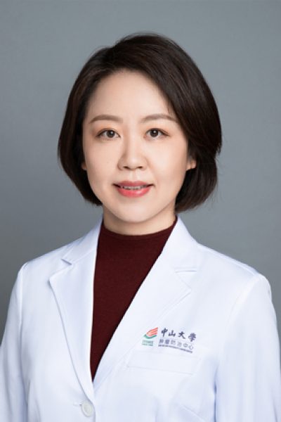

<!-- AUTO-GENERATED-BY: work/generate_obsidian_profiles.py -->

# 丁娅

## 基础信息

| 字段 | 内容 |
|---|---|
| 医院 | 中山大学肿瘤防治中心 |
| 姓名 | 丁娅 |
| 科室 | 生物治疗中心 |
| 职称/身份 | 医学博士，副主任医师，硕士生导师 |
| 重点优先级 | 高 |
| 来源类型 | 医院官网 |
| 来源链接 | [官网原文](https://www.sysucc.org.cn/node/3787) |
| 采集日期 | 2026-08-10 |
| 复核状态 | 待人工复核 |
| 异常提示 |  |

## 简介/擅长

恶性黑色素瘤与软组织肉瘤的内科治疗，对实体肿瘤的综合治疗以及肿瘤生物治疗、免疫治疗有较丰富经验 丁娅，医学博士，副主任医师，硕士生导师。广东省抗癌协会黑色素瘤专业委员会常委，广东省健康管理协会肿瘤防治专委会常委，广东省医院协会肿瘤生物治疗专委会秘书，CSCO黑色素瘤专家委员会青委会委员，中国抗癌协会肿瘤临床化疗专业委员会委员，中国肿瘤防治联盟皮肤与软组织肿瘤专委会委员，广东省抗癌协会生物治疗专委会委员，广东省临床医学学会肿瘤学专业委员会委员。熟悉恶性黑色素瘤与软组织肉瘤的内科治疗，对实体肿瘤的综合治疗以及肿瘤生物治疗、免疫治疗有较丰富经验。 加载更多 丁娅，医学博士，副主任医师，硕士生导师。广东省抗癌协会黑色素瘤专业委员会常委，广东省健康管理协会肿瘤防治专委会常委，广东省医院协会肿瘤生物治疗专委会秘书，CSCO黑色素瘤专家委员会青委会委员，中国抗癌协会肿瘤临床化疗专业委员会委员，中国肿瘤防治联盟皮肤与软组织肿瘤专委会委员，广东省抗癌协会生物治疗专委会委员，广东省临床医学学会肿瘤学专业委员会委员。熟悉恶性黑色素瘤与软组织肉瘤的内科治疗，对实体肿瘤的综合治疗以及肿瘤生物治疗、免疫治疗有较丰富经验。

## 详情正文摘录

职称：医学博士，副主任医师，硕士生导师 专长 恶性黑色素瘤与软组织肉瘤的内科治疗，对实体肿瘤的综合治疗以及肿瘤生物治疗、免疫治疗有较丰富经验 丁娅，医学博士，副主任医师，硕士生导师。广东省抗癌协会黑色素瘤专业委员会常委，广东省健康管理协会肿瘤防治专委会常委，广东省医院协会肿瘤生物治疗专委会秘书，CSCO黑色素瘤专家委员会青委会委员，中国抗癌协会肿瘤临床化疗专业委员会委员，中国肿瘤防治联盟皮肤与软组织肿瘤专委会委员，广东省抗癌协会生物治疗专委会委员，广东省临床医学学会肿瘤学专业委员会委员。熟悉恶性黑色素瘤与软组织肉瘤的内科治疗，对实体肿瘤的综合治疗以及肿瘤生物治疗、免疫治疗有较丰富经验。 加载更多 丁娅，医学博士，副主任医师，硕士生导师。广东省抗癌协会黑色素瘤专业委员会常委，广东省健康管理协会肿瘤防治专委会常委，广东省医院协会肿瘤生物治疗专委会秘书，CSCO黑色素瘤专家委员会青委会委员，中国抗癌协会肿瘤临床化疗专业委员会委员，中国肿瘤防治联盟皮肤与软组织肿瘤专委会委员，广东省抗癌协会生物治疗专委会委员，广东省临床医学学会肿瘤学专业委员会委员。熟悉恶性黑色素瘤与软组织肉瘤的内科治疗，对实体肿瘤的综合治疗以及肿瘤生物治疗、免疫治疗有较丰富经验。

## 重点关注范围

- 肿瘤
- 免疫/风湿/感染

## 重点疾病标签

- 肿瘤
- 癌
- 瘤
- 化疗
- 免疫

## 亮眼经历线索

- 医学博士，副主任医师，硕士生导师 恶性黑色素瘤与软组织肉瘤的内科治疗，对实体肿瘤的综合治疗以及肿瘤生物治疗、免疫治疗有较丰富经验 丁娅，医学博士，副主任医师，硕士生导师。
- 广东省抗癌协会黑色素瘤专业委员会常委，广东省健康管理协会肿瘤防治专委会常委，广东省医院协会肿瘤生物治疗专委会秘书，CSCO黑色素瘤专家委员会青委会委员，中国抗癌协会肿瘤临床化疗专业委员会委员，中国肿瘤防治联盟皮肤与软组织肿瘤专委会委员，广东省抗癌协会生物治疗专委会委员，广东省临床医学学会肿瘤学专业委员会委员。
- 加载更多 丁娅，医学博士，副主任医师，硕士生导师。

## 异常提示

## 合规边界

- 本画像仅整理统一总底表中的医院官网公开字段。
- 不包含患者评价、排名、第三方来源内容或疗效承诺。
- 官网未展示的信息保持空白，后续如需补充须回到底表官方来源字段。
