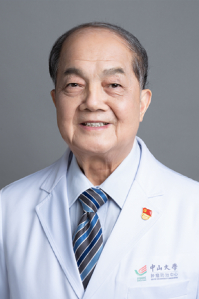

<!-- AUTO-GENERATED-BY: work/generate_obsidian_profiles.py -->

<!-- TEMPLATE: D:\workspace\信息收集整理\医生画像仓库\模板\医生画像模板.md -->

# 万德森

## 基础信息

| 字段 | 内容 |
|---|---|
| 姓名 | 万德森 |
| 医院 | 中山大学肿瘤防治中心 |
| 科室 | 结直肠科 |
| 职称/身份 | 教授、主任医师、博士生导师、结直肠癌资深首席专家 |
| 来源链接 | [官网原文](https://www.sysucc.org.cn/node/3679) |
| 采集日期 | 2026-08-10 |

## 简介/擅长

大肠癌以手术为主的综合治疗

## 教育与进修经历

- 二、学习及工作经历： 1965年毕业于中山医学院医疗系本科（六年制），留校肿瘤医院从事医教研工作，历任住院医师、主治医师、副主任医师、副教授 1989年底获WHO奖学金赴美国专修胃肠肿瘤基础理论和临床诊治，1991年按期回国后承担国家攻关课题、国家自然科学基金课题和省部委课题七项 1991年晋升教授，1997年任博士导师 1991年—1993年任中山医科大学肿瘤中心副主任兼肿瘤医院常务副院长、党委副书记 1993年—1997年任中山医科大学肿瘤中心主任、兼肿瘤医院院长、肿瘤研究所所长 1993年—2006年任中山…
- 万德森教授1965年毕业于中山医学院医疗系本科（六年制），毕业后一直在中山医学院肿瘤医院（现为中山大学肿瘤医院）从事肿瘤外科工作。

## 科研项目与成果

- 二、学习及工作经历： 1965年毕业于中山医学院医疗系本科（六年制），留校肿瘤医院从事医教研工作，历任住院医师、主治医师、副主任医师、副教授 1989年底获WHO奖学金赴美国专修胃肠肿瘤基础理论和临床诊治，1991年按期回国后承担国家攻关课题、国家自然科学基金课题和省部委课题七项 1991年晋升教授，1997年任博士导师 1991年—1993年任中山医科大学肿瘤中心副主任兼肿瘤医院常务副院长、党委副书记 1993年—1997年任中山医科大学肿瘤中心主任、兼肿瘤医院院长、肿瘤研究所所长 1993年—2006年任中山…
- 万教授从医从教近50年来，在各方面均取得丰硕的成果。
- 在总结多年基础研究成果和临床经验基础上，他提出了提高结直肠癌疗效的综合措施，获得广东省科技进步奖；
- 曾主持国家“九·五”攻关课题和省部级课题7项，获省科委科研成果3项和校级科研成果和医疗成果多项。

## 论文与学术产出

- 曾任中山医科大学肿瘤防治中心主任、肿瘤医院院长、肿瘤研究所所长、肿瘤防治中心党委副书记和腹科主任，曾兼任世界卫生组织癌症研究合作中心主任、中国抗癌协会常务理事兼科普部部长、中华医学会肿瘤学会副主任、中国抗癌协会结直肠癌专业委员会主任、广东省抗癌协会结直肠癌专业委员会主任、广东省抗癌协会副理事长兼秘书长、《防癌报》主编。
- 现任中国抗癌协会结直肠癌专业委员会名誉主任、广东省结直肠癌专业委员会名誉主任，广东省抗癌协会荣誉理事长、中山大学造口治疗师学校荣誉校长，《中华肿瘤杂志》、《实用肿瘤杂志》、《结直肠肛门外科》副主编和《癌症》等10种余杂志的编委。
- 致力于社区肿瘤防治，在广州市越秀区建立社区肿瘤防治网络，推动社区肿瘤登记报告制度的建立和运作，并主编《社区肿瘤学》，首次提出社区肿瘤学概念；
- 发表医学论文200余篇，主编专著6部，参编专著10余部。

## 可包装亮点

- 教授、主任医师、博士生导师、结直肠癌资深首席专家 万德森 职称：教授、主任医师、博士生导师、结直肠癌资深首席专家 专长 大肠癌以手术为主的综合治疗 一、基本情况 职称：教授、主任医师、博士生导师 职务：主任导师、结直肠癌资深首席专家 专家门诊时间：周三上午 专业特长：从事肿瘤外科近50年，特长是肠道肿瘤以手术为主的综合治疗，包括结肠癌、直肠癌、胃肠道间质瘤…
- 二、学习及工作经历： 1965年毕业于中山医学院医疗系本科（六年制），留校肿瘤医院从事医教研工作，历任住院医师、主治医师、副主任医师、副教授 1989年底获WHO奖学金赴美国专修胃肠肿瘤基础理论和临床诊治，1991年按期回国后承担国家攻关课题、国家自然科学基金课题和省部委课题七项 1991年晋升教授，1997年任博士导师 1991年—1993年任中山医科大…

## 重点疾病/人群标签

- 慢性病：
- 肿瘤：肿瘤、癌、瘤、放疗、化疗、肝癌、肠癌、乳腺癌、术后、康复
- 生殖疾病：
- 免疫/风湿：
- 术后恢复/康复：肿瘤、癌、瘤、放疗、化疗、肝癌、肠癌、乳腺癌、术后、康复
- 疑难重症：

## 证据摘录

> 只摘录官网公开信息中的短句或关键字段，不复制大段原文。

- 官网身份字段：教授、主任医师、博士生导师、结直肠癌资深首席专家
- 官网简介/擅长：大肠癌以手术为主的综合治疗
- 官网亮眼经历线索：教授、主任医师、博士生导师、结直肠癌资深首席专家 万德森 职称：教授、主任医师、博士生导师、结直肠癌资深首席专家 专长 大肠癌以手术为主的综合治疗 一、基本情况 职称：教授、主任医师、博士生导师 职务：主任导师、结直肠癌资深首席专家 专家门诊时间：周三上午 专业特长：从事肿瘤外科近50年，特长是肠道肿瘤以手术为主的综合治疗，包括结肠癌、直肠癌、胃肠道间质瘤、神经内分泌肿瘤以及肠癌肝转移。 二、学习及工作经历： 1965年毕业于中山医学…
- 异常提示：亮眼经历含导航文本，已清洗
- 来源链接：https://www.sysucc.org.cn/node/3679

## BD 画像摘要

万德森医生可作为肿瘤、术后恢复/康复方向的基础画像候选。后续 BD 使用应继续以官网来源和人工复核为准，不添加疗效承诺或无来源包装。

## 合规边界

- 仅使用医院官网、官方公众号、官方小程序等公开渠道。
- 不采集私人电话、私人微信、家庭住址、患者隐私或非公开排班信息。
- 不写“保证治愈”“疗效第一”“包治疑难杂症”等无法由官网证明的表述。
