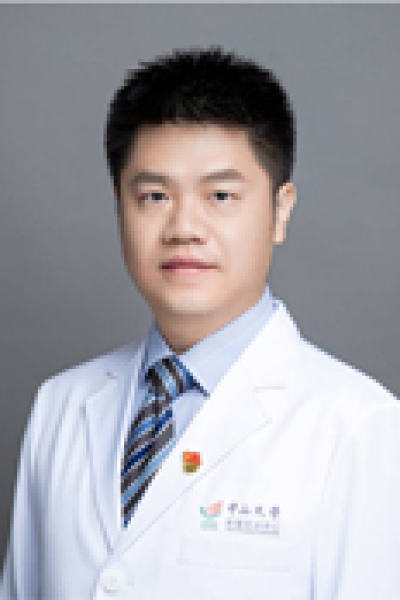

<!-- AUTO-GENERATED-BY: work/generate_obsidian_profiles.py -->

# 万挺

## 基础信息

| 字段 | 内容 |
|---|---|
| 医院 | 中山大学肿瘤防治中心 |
| 姓名 | 万挺 |
| 科室 | 妇科 |
| 职称/身份 | 妇科副主任 职称：副主任医师、肿瘤学博士 |
| 重点优先级 | 高 |
| 来源类型 | 医院官网 |
| 来源链接 | [官网原文](https://www.sysucc.org.cn/node/3704) |
| 采集日期 | 2026-08-10 |
| 复核状态 | 待人工复核 |
| 异常提示 |  |

## 简介/擅长

妇科恶性肿瘤的规范化诊疗、早期患者的无瘤微创治疗、复发患者的个体化治疗等；手术特长为保留盆腔自主神经的宫颈癌根治术及晚期卵巢癌减灭术，多次在国内高水准平台进行手术直播演示；长期致力于妇科恶性肿瘤的临床研究，发表高影响因子SCI论文多篇。 加载更多 职称：副主任医师 专业方向：妇科恶性肿瘤规范化诊疗、微创治疗、个体化综合治疗

## 详情正文摘录

妇科肿瘤博士，副主任医师，腔镜中心培训导师，住培医师培训全程导师；社会任职：广东省医学会妇产科分会青年委员，广东省中医药学会妇科肿瘤专委会委员，广东省基层医药学会妇科肿瘤专业委员会委员，南方肿瘤临床研究协会妇科肿瘤分子诊疗专业委员会委员，国际妇瘤协会IGCS会员等。

## 重点关注范围

- 肿瘤
- 生殖疾病

## 重点疾病标签

- 肿瘤
- 癌
- 瘤
- 卵巢

## 亮眼经历线索

- 妇科副主任 职称：副主任医师、肿瘤学博士 长期致力于妇科恶性肿瘤的临床研究，发表高影响因子SCI论文多篇。
- 加载更多 职称：副主任医师 专业方向：妇科恶性肿瘤规范化诊疗、微创治疗、个体化综合治疗 妇科肿瘤博士，副主任医师，腔镜中心培训导师，住培医师培训全程导师；

## 异常提示

## 合规边界

- 本画像仅整理统一总底表中的医院官网公开字段。
- 不包含患者评价、排名、第三方来源内容或疗效承诺。
- 官网未展示的信息保持空白，后续如需补充须回到底表官方来源字段。
