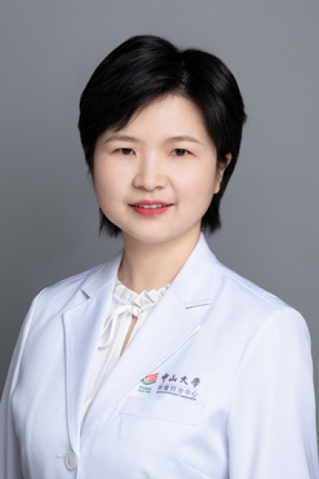

<!-- AUTO-GENERATED-BY: work/generate_obsidian_profiles.py -->

<!-- TEMPLATE: D:\workspace\信息收集整理\医生画像仓库\模板\医生画像模板.md -->

# 习勉

## 基础信息

| 字段 | 内容 |
|---|---|
| 姓名 | 习勉 |
| 医院 | 中山大学肿瘤防治中心 |
| 科室 | 放疗科 |
| 职称/身份 | 广东省食管癌研究所副所长 职称：主任医师、教授、博士生导师、食管癌首席专家 |
| 来源链接 | [官网原文](https://www.sysucc.org.cn/node/1681) |
| 采集日期 | 2026-08-10 |

## 简介/擅长

1、食管癌的放化综合治疗；2、肝癌的精准放疗。 二、

## 教育与进修经历

- 三、工作经历 2007.08-2010.12 中山大学肿瘤防治中心放疗科，住院医师 2010.12-2015.12 中山大学肿瘤防治中心放疗科，主治医师 2015.12-2020.12 中山大学肿瘤防治中心放疗科，副主任医师 2016-2017 美国M.D. Anderson肿瘤中心，访问学者 2020.12-至今 中山大学肿瘤防治中心放疗科，主任医师 2023.12-至今 中山大学肿瘤防治中心放疗科，教授 四、学术任职 中国医药教育协会肿瘤放疗专委会常委；

## 科研项目与成果

- 主持及参与食管癌、肝癌、肺癌多项临床试验，作为第一或通讯作者发表SCI论著50余篇，承担国家自然科学基金、广东省自然科学基金、广州市科技计划等多项课题。

## 论文与学术产出

- 主持及参与食管癌、肝癌、肺癌多项临床试验，作为第一或通讯作者发表SCI论著50余篇，承担国家自然科学基金、广东省自然科学基金、广州市科技计划等多项课题。
- 五、近年已发表代表性第一/通讯作者论文 1. Chen B # , Liu S # , Zhu Y # , Wang R # , Cheng X, Chen B, Dragomir MP, Zhang Y, Hu Y, Liu M, Li Q*, Yang H*, Xi M* . Predictive role of ctDNA in esophageal squamous cell carcinoma receiving definitive chemoradiotherapy combined with to…

## 可包装亮点

- 广东省食管癌研究所副所长 职称：主任医师、教授、博士生导师、食管癌首席专家 2、肝癌的精准放疗。
- 习勉 职务：广东省食管癌研究所副所长 职称：主任医师、教授、博士生导师、食管癌首席专家 专长 食管癌、肝癌等胸腹部肿瘤的放射治疗 一、基本情况 职称： 主任医师、教授、博士生导师 职务： 广东省食管癌研究所副所长 专业特长： 食管癌、肝癌等胸腹部肿瘤的放射治疗 门诊时间： 周二上午、下午（越秀院区），周四上午（黄埔院区） 主要研究方向： 1、食管癌的放化综…
- 2、肝癌的精准放疗。

## 重点疾病/人群标签

- 慢性病：
- 肿瘤：肿瘤、癌、放疗、肺癌、肝癌、多学科、MDT
- 生殖疾病：
- 免疫/风湿：
- 术后恢复/康复：
- 疑难重症：肿瘤、癌、放疗、肺癌、肝癌、多学科、MDT

## 证据摘录

> 只摘录官网公开信息中的短句或关键字段，不复制大段原文。

- 官网身份字段：广东省食管癌研究所副所长 职称：主任医师、教授、博士生导师、食管癌首席专家
- 官网简介/擅长：1、食管癌的放化综合治疗；2、肝癌的精准放疗。 二、
- 官网亮眼经历线索：广东省食管癌研究所副所长 职称：主任医师、教授、博士生导师、食管癌首席专家 2、肝癌的精准放疗。 习勉 职务：广东省食管癌研究所副所长 职称：主任医师、教授、博士生导师、食管癌首席专家 专长 食管癌、肝癌等胸腹部肿瘤的放射治疗 一、基本情况 职称： 主任医师、教授、博士生导师 职务： 广东省食管癌研究所副所长 专业特长： 食管癌、肝癌等胸腹部肿瘤的放射治疗 门诊时间： 周二上午、下午（越秀院区），周四上午（黄埔院区） 主要研究方向：…
- 异常提示：亮眼经历含导航文本，已清洗
- 来源链接：https://www.sysucc.org.cn/node/1681

## BD 画像摘要

习勉医生可作为肿瘤、疑难重症方向的基础画像候选。后续 BD 使用应继续以官网来源和人工复核为准，不添加疗效承诺或无来源包装。

## 合规边界

- 仅使用医院官网、官方公众号、官方小程序等公开渠道。
- 不采集私人电话、私人微信、家庭住址、患者隐私或非公开排班信息。
- 不写“保证治愈”“疗效第一”“包治疑难杂症”等无法由官网证明的表述。
