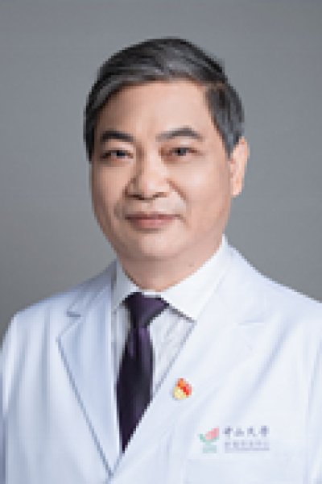

<!-- AUTO-GENERATED-BY: work/generate_obsidian_profiles.py -->

# 云径平

## 基础信息

| 字段 | 内容 |
|---|---|
| 医院 | 中山大学肿瘤防治中心 |
| 姓名 | 云径平 |
| 科室 | 病理科 |
| 职称/身份 | 病理科主任，广东省临床重点专科学科带头人。 职称：教授/主任医师，博士生导师 |
| 重点优先级 | 高 |
| 来源类型 | 医院官网 |
| 来源链接 | [官网原文](https://www.sysucc.org.cn/node/3855) |
| 采集日期 | 2026-08-10 |
| 复核状态 | 待人工复核 |
| 异常提示 |  |

## 简介/擅长

肿瘤生物学和肿瘤分子病理学 博士（中国香港），教授/主任医师，博士生导师，病理科主任。 学习简历： 1980.9-1985.6：湖南医科大学，医学本科. 1988.9-1991．6中山医科大学病理教研室，硕士 1997.1-7 香港中文大学病理学系 外科病理进修 1998.3-2001.3 香港中文大学病理学系 博士 工作简历： 1985．7-1988.8 湖南医科大学病理教研室任职助教 1991．7-1998.3 中山大学肿瘤防治中心病理科任医师和主治医师 2001.3-至今 中山大学肿瘤防治中心病理科任主治医师、副教授及教授/主任医师。 临床工作： 专长于肿瘤病理诊断。 加载更多 1985年本科毕业于湖南医科大学（现中南大学湘雅医学院），毕业后一直从事病理学的医教研工作，先后在中山医科大学病理教研室和香港中文大学病理学系获得硕士和博士学位。1991年入职于中山大学肿瘤医院病理科担任病理医生，1997年在香港威尔斯亲王医院进修临床病理诊断。临床医疗擅长于肿瘤病理诊断，教学主讲本科生和研究生的《肿瘤病理学》课程，科研上主要研究肿瘤发生发展的分子机制及分子分型，已获得包括5项国家自然基金在内的省部级科研项目16项。发表文...

## 详情正文摘录

职务：病理科主任，广东省临床重点专科学科带头人。 职称：教授/主任医师，博士生导师 专长 肿瘤生物学和肿瘤分子病理学 博士（中国香港），教授/主任医师，博士生导师，病理科主任。 学习简历： 1980.9-1985.6：湖南医科大学，医学本科. 1988.9-1991．6中山医科大学病理教研室，硕士 1997.1-7 香港中文大学病理学系 外科病理进修 1998.3-2001.3 香港中文大学病理学系 博士 工作简历： 1985．7-1988.8 湖南医科大学病理教研室任职助教 1991．7-1998.3 中山大学肿瘤防治中心病理科任医师和主治医师 2001.3-至今 中山大学肿瘤防治中心病理科任主治医师、副教授及教授/主任医师。 临床工作： 专长于肿瘤病理诊断。 加载更多 1985年本科毕业于湖南医科大学（现中南大学湘雅医学院），毕业后一直从事病理学的医教研工作，先后在中山医科大学病理教研室和香港中文大学病理学系获得硕士和博士学位。1991年入职于中山大学肿瘤医院病理科担任病理医生，1997年在香港威尔斯亲王医院进修临床病理诊断。临床医疗擅长于肿瘤病理诊断，教学主讲本科生和研究生的《肿瘤病理学》课程，科研上主要研究肿瘤发生发展的分子机制及分子分型，已获得包括5项国家自然基金在内的省部级科研项目16项。发表文章近70篇，其中以第一作者或通讯作者发表高水平文章近30篇。 目前担任中国抗癌协会肿瘤专业委员会常委，广东省抗癌协会肿瘤病理专业委员会主任委员，广东省医师病理分会副主任委员、广东省医学会病理专业委员会常务委员以及广东省抗癌协会小儿肿瘤专业委员会常务委员，并担任三本专业杂志编委：《癌症》、《中华肿瘤防治杂志》、《肿瘤防治研究》。 近年主持的研究课题: (1) 国家自然基金(81372572)：P2-HNF4α促进肝癌细胞增殖的分子机制；2014.1-2017.12。 (2) 国家自然基金：81172345／H1617；miR-663在肝癌细胞增殖中的作用及分子机制研究。2012.01…

## 重点关注范围

- 肿瘤

## 重点疾病标签

- 肿瘤
- 癌
- 靶向
- 鼻咽癌
- 肝癌

## 亮眼经历线索

- 病理科主任，广东省临床重点专科学科带头人。
- 职称：教授/主任医师，博士生导师 肿瘤生物学和肿瘤分子病理学 博士（中国香港），教授/主任医师，博士生导师，病理科主任。
- 学习简历： 1980.9-1985.6：湖南医科大学，医学本科. 1988.9-1991．6中山医科大学病理教研室，硕士 1997.1-7 香港中文大学病理学系 外科病理进修 1998.3-2001.3 香港中文大学病理学系 博士 工作简历： 1985．7-1988.8 湖南医科大学病理教研室任职助教 1991．7-1998.3 中山大学肿瘤防治中心病理科…

## 异常提示

## 合规边界

- 本画像仅整理统一总底表中的医院官网公开字段。
- 不包含患者评价、排名、第三方来源内容或疗效承诺。
- 官网未展示的信息保持空白，后续如需补充须回到底表官方来源字段。
