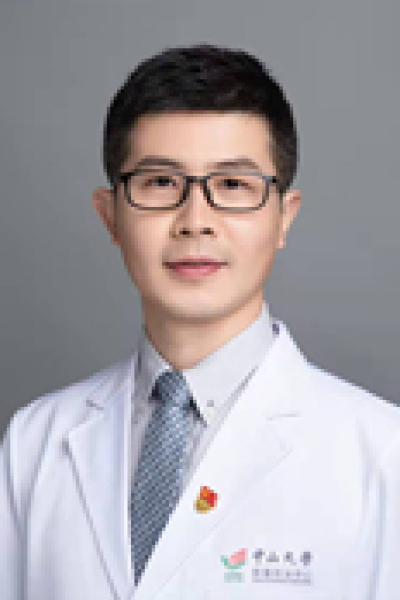

<!-- AUTO-GENERATED-BY: work/generate_obsidian_profiles.py -->

# 何伟

## 基础信息

| 字段 | 内容 |
|---|---|
| 医院 | 中山大学肿瘤防治中心 |
| 姓名 | 何伟 |
| 科室 | 肝脏外科 |
| 职称/身份 | 副主任医师 |
| 重点优先级 | 高 |
| 来源类型 | 医院官网 |
| 来源链接 | [官网原文](https://www.sysucc.org.cn/node/3647) |
| 采集日期 | 2026-08-10 |
| 复核状态 | 待人工复核 |
| 异常提示 |  |

## 简介/擅长

肝癌、肝内胆管癌和肠癌肝转移的手术切除、微波消融、血管介入和靶向联合免疫药物治疗。 原发性肝癌多学科综合治疗：早期肝癌根治性手术切除、经皮微波消融与腹腔镜肝切除微创治疗、不可切除肝癌的转化治疗（TACE-HAIC血管介入联合系统治疗）和中晚期肝癌靶向联合免疫药物的系统性治疗。 肠癌肝转移根治性治疗：术前磁共振联合术中超声造影引导的肝转移瘤手术切除联合微波消融治疗。 毕业于中山大学中山医学院，全国医学院校大学生临床技能竞赛特等奖获得者，兼任中山大学临床技能中心训练教官。广东省7大肝癌/结直肠癌专业委员会委员。以第一作者在肿瘤学领域著名期刊发表多篇论文（6篇影响因子＞10分），如Clin Gastroenterol Hepatol, J Exp Clin Cancer Res, Cancer Commun, Int J Surg, Ann Surg Oncol等。获全国35位35岁以下最具潜力优秀青年肿瘤医师奖（2019年）。中国临床肿瘤结直肠癌MDT总冠军（2019年），中华结直肠癌MDT大赛一等奖（2020年），中山大学临床医学专业优秀中青年教师（2021年），全国肝癌规范联盟免疫治疗临床思维挑战赛冠军（2023年）。

## 详情正文摘录

临床专家 面包屑 首页 / 临床科室 / 外科系列 / 肝脏外科 / 临床专家 何伟 职称：副主任医师 专长 肝癌、肝内胆管癌和肠癌肝转移的手术切除、微波消融、血管介入和靶向联合免疫药物治疗。 原发性肝癌多学科综合治疗：早期肝癌根治性手术切除、经皮微波消融与腹腔镜肝切除微创治疗、不可切除肝癌的转化治疗（TACE-HAIC血管介入联合系统治疗）和中晚期肝癌靶向联合免疫药物的系统性治疗。 肠癌肝转移根治性治疗：术前磁共振联合术中超声造影引导的肝转移瘤手术切除联合微波消融治疗。 毕业于中山大学中山医学院，全国医学院校大学生临床技能竞赛特等奖获得者，兼任中山大学临床技能中心训练教官。广东省7大肝癌/结直肠癌专业委员会委员。以第一作者在肿瘤学领域著名期刊发表多篇论文（6篇影响因子＞10分），如Clin Gastroenterol Hepatol, J Exp Clin Cancer Res, Cancer Commun, Int J Surg, Ann Surg Oncol等。获全国35位35岁以下最具潜力优秀青年肿瘤医师奖（2019年）。中国临床肿瘤结直肠癌MDT总冠军（2019年），中华结直肠癌MDT大赛一等奖（2020年），中山大学临床医学专业优秀中青年教师（2021年），全国肝癌规范联盟免疫治疗临床思维挑战赛冠军（2023年）。 更新时间：2025.4.15

## 重点关注范围

- 肿瘤
- 免疫/风湿/感染
- 疑难重症

## 重点疾病标签

- 肿瘤
- 癌
- 瘤
- 靶向
- 肝癌
- 肠癌
- 免疫
- 多学科
- MDT
- 转化治疗

## 亮眼经历线索

- 副主任医师 原发性肝癌多学科综合治疗：早期肝癌根治性手术切除、经皮微波消融与腹腔镜肝切除微创治疗、不可切除肝癌的转化治疗（TACE-HAIC血管介入联合系统治疗）和中晚期肝癌靶向联合免疫药物的系统性治疗。
- 毕业于中山大学中山医学院，全国医学院校大学生临床技能竞赛特等奖获得者，兼任中山大学临床技能中心训练教官。
- 广东省7大肝癌/结直肠癌专业委员会委员。

## 异常提示

## 合规边界

- 本画像仅整理统一总底表中的医院官网公开字段。
- 不包含患者评价、排名、第三方来源内容或疗效承诺。
- 官网未展示的信息保持空白，后续如需补充须回到底表官方来源字段。
