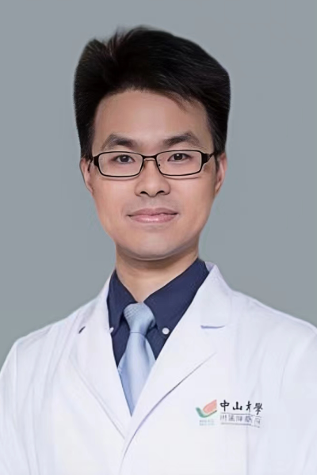

<!-- AUTO-GENERATED-BY: work/generate_obsidian_profiles.py -->

<!-- TEMPLATE: D:\workspace\信息收集整理\医生画像仓库\模板\医生画像模板.md -->

# 何振强

## 基础信息

| 字段 | 内容 |
|---|---|
| 姓名 | 何振强 |
| 医院 | 中山大学肿瘤防治中心 |
| 科室 | 神经外科 |
| 职称/身份 | 副主任医师 |
| 来源链接 | [官网原文](https://www.sysucc.org.cn/node/3718) |
| 采集日期 | 2026-08-10 |

## 简介/擅长

常见神经系统肿瘤（脑胶质瘤、脑转移瘤等）的手术治疗。

## 教育与进修经历

- 一、基本情况 读于中山大学肿瘤防治中心神经外科，获临床医学（肿瘤学）博士学位。
- 获国家留学基金委资助在美国宾夕法尼亚大学Smilow 转化医学中心开展脑肿瘤免疫微环境研究。
- 201:106428. （共同通讯作者） 六、获奖及荣誉 2021年，第一届全国博士后创新创业大赛 创新赛铜奖 2021年，第一届全国博士后创新创业大赛 全国创新创业优秀博士后 2018年，中国医师协会第二届中国脑胶质瘤学术大会 优秀论文奖 更新时...

## 科研项目与成果

- 获国家留学基金委资助在美国宾夕法尼亚大学Smilow 转化医学中心开展脑肿瘤免疫微环境研究。
- 二、教育及工作经历 教育经历： 2014/09 - 2019/07, 中山大学 肿瘤防治中心, 临床医学（肿瘤学）, 博士 2012/09 - 2014/07, 中山大学 肿瘤防治中心, 临床医学（肿瘤学）, 硕士 2007/09 - 2012/07, 中山大学 中山医学院，临床医学，学士 科研及医疗工作经历： 2024/01-至今， 中山大学 肿瘤防治中心，神经外科，副主任医师 2021/12 – 2023/12, 中山大学 肿瘤防治中心，神经外科，主治医师 2019/07 - 2021/11, 中山大学 肿瘤…
- 2、国家自然科学基金委青年项目，胶质瘤微环境IL-6通过IL-6R/Stat3/HIF-1α促进巨噬细胞表达CD40调控免疫的机制研究，30万元，在研，主持；
- 3、广东省自然科学基金-面上项目，胶质瘤微环境巨噬细胞通过S100A10/Cyr61促血管内皮细胞间质化的机制研究，在研, 主持。

## 论文与学术产出

- 201:106428. （共同通讯作者） 六、获奖及荣誉 2021年，第一届全国博士后创新创业大赛 创新赛铜奖 2021年，第一届全国博士后创新创业大赛 全国创新创业优秀博士后 2018年，中国医师协会第二届中国脑胶质瘤学术大会 优秀论文奖 更新时...

## 可包装亮点

- 副主任医师 何振强 职称：副主任医师 专长 常见神经系统肿瘤（脑胶质瘤、脑转移瘤等）的手术治疗。
- 获国家留学基金委资助在美国宾夕法尼亚大学Smilow 转化医学中心开展脑肿瘤免疫微环境研究。
- 二、教育及工作经历 教育经历： 2014/09 - 2019/07, 中山大学 肿瘤防治中心, 临床医学（肿瘤学）, 博士 2012/09 - 2014/07, 中山大学 肿瘤防治中心, 临床医学（肿瘤学）, 硕士 2007/09 - 2012/07, 中山大学 中山医学院，临床医学，学士 科研及医疗工作经历： 2024/01-至今， 中山大学 肿瘤防治中…

## 重点疾病/人群标签

- 慢性病：
- 肿瘤：肿瘤、癌、瘤、放疗、靶向、免疫
- 生殖疾病：
- 免疫/风湿：肿瘤、癌、瘤、放疗、靶向、免疫
- 术后恢复/康复：
- 疑难重症：

## 证据摘录

> 只摘录官网公开信息中的短句或关键字段，不复制大段原文。

- 官网身份字段：副主任医师
- 官网简介/擅长：常见神经系统肿瘤（脑胶质瘤、脑转移瘤等）的手术治疗。
- 官网亮眼经历线索：副主任医师 何振强 职称：副主任医师 专长 常见神经系统肿瘤（脑胶质瘤、脑转移瘤等）的手术治疗。 获国家留学基金委资助在美国宾夕法尼亚大学Smilow 转化医学中心开展脑肿瘤免疫微环境研究。 二、教育及工作经历 教育经历： 2014/09 - 2019/07, 中山大学 肿瘤防治中心, 临床医学（肿瘤学）, 博士 2012/09 - 2014/07, 中山大学 肿瘤防治中心, 临床医学（肿瘤学）, 硕士 2007/09 - 2012/…
- 异常提示：亮眼经历含导航文本，已清洗
- 来源链接：https://www.sysucc.org.cn/node/3718

## BD 画像摘要

何振强医生可作为肿瘤、免疫/风湿/感染方向的基础画像候选。后续 BD 使用应继续以官网来源和人工复核为准，不添加疗效承诺或无来源包装。

## 合规边界

- 仅使用医院官网、官方公众号、官方小程序等公开渠道。
- 不采集私人电话、私人微信、家庭住址、患者隐私或非公开排班信息。
- 不写“保证治愈”“疗效第一”“包治疑难杂症”等无法由官网证明的表述。
