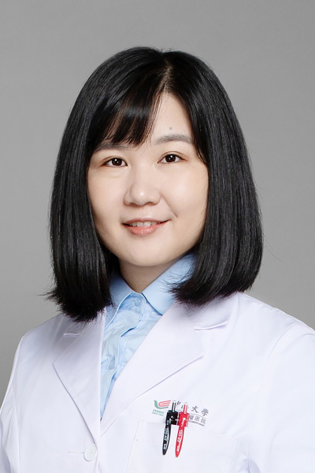

<!-- AUTO-GENERATED-BY: work/generate_obsidian_profiles.py -->

<!-- TEMPLATE: D:\workspace\信息收集整理\医生画像仓库\模板\医生画像模板.md -->

# 何明明

## 基础信息

| 字段 | 内容 |
|---|---|
| 姓名 | 何明明 |
| 医院 | 中山大学肿瘤防治中心 |
| 科室 | 内科 |
| 职称/身份 | 副主任医师，学术型、专业型硕士生导师 |
| 来源链接 | [官网原文](https://www.sysucc.org.cn/node/1519) |
| 采集日期 | 2026-08-10 |

## 简介/擅长

结直肠癌、胃癌、食管癌等消化道肿瘤的化疗、靶向、免疫治疗和全程管理。

## 教育与进修经历

- 二、教育及工作经历 中山大学临床医学8年制博士，哈佛大学博士后 三、学术兼职 中国抗癌协会青年理事会理事 广东省医学会消化道肿瘤学分会MDT学组顾问 广东省抗癌协会靶向与个体化治疗专业委员会青委会委员 四、主持科研项目 主持国家自然科学基金面上项目、青年项目2项，参与国家重点研发计划2项。

## 科研项目与成果

- 二、教育及工作经历 中山大学临床医学8年制博士，哈佛大学博士后 三、学术兼职 中国抗癌协会青年理事会理事 广东省医学会消化道肿瘤学分会MDT学组顾问 广东省抗癌协会靶向与个体化治疗专业委员会青委会委员 四、主持科研项目 主持国家自然科学基金面上项目、青年项目2项，参与国家重点研发计划2项。
- 获邀在ASCO，ESMO，ASCO-GI，ESMO-WCGIC，DDW，ESMO-Asia等国际大会壁报展示或口头报告多项研究成果。

## 论文与学术产出

- 五、代表性论著 以第一/通讯作者在JAMA Oncology，American Journal of Respiratory and Critical Care Medicine，Nature Communications，Med，Cell Reports Medicine，Clinical Cancer Research，Journal of the National Comprehensive Cancer Network，Experimental & Molecular Medicine 等国际高影响力期刊…

## 可包装亮点

- 副主任医师，学术型、专业型硕士生导师 何明明 职称：副主任医师，学术型、专业型硕士生导师 专长 结直肠癌、胃癌、食管癌等消化道肿瘤的化疗、靶向、免疫治疗和全程管理。
- 二、教育及工作经历 中山大学临床医学8年制博士，哈佛大学博士后 三、学术兼职 中国抗癌协会青年理事会理事 广东省医学会消化道肿瘤学分会MDT学组顾问 广东省抗癌协会靶向与个体化治疗专业委员会青委会委员 四、主持科研项目 主持国家自然科学基金面上项目、青年项目2项，参与国家重点研发计划2项。

## 重点疾病/人群标签

- 慢性病：
- 肿瘤：肿瘤、癌、化疗、靶向、胃癌、肠癌、免疫、MDT
- 生殖疾病：
- 免疫/风湿：肿瘤、癌、化疗、靶向、胃癌、肠癌、免疫、MDT
- 术后恢复/康复：
- 疑难重症：肿瘤、癌、化疗、靶向、胃癌、肠癌、免疫、MDT

## 证据摘录

> 只摘录官网公开信息中的短句或关键字段，不复制大段原文。

- 官网身份字段：副主任医师，学术型、专业型硕士生导师
- 官网简介/擅长：结直肠癌、胃癌、食管癌等消化道肿瘤的化疗、靶向、免疫治疗和全程管理。
- 官网亮眼经历线索：副主任医师，学术型、专业型硕士生导师 何明明 职称：副主任医师，学术型、专业型硕士生导师 专长 结直肠癌、胃癌、食管癌等消化道肿瘤的化疗、靶向、免疫治疗和全程管理。 二、教育及工作经历 中山大学临床医学8年制博士，哈佛大学博士后 三、学术兼职 中国抗癌协会青年理事会理事 广东省医学会消化道肿瘤学分会MDT学组顾问 广东省抗癌协会靶向与个体化治疗专业委员会青委会委员 四、主持科研项目 主持国家自然科学基金面上项目、青年项目2项，参与国家…
- 异常提示：亮眼经历含导航文本，已清洗
- 来源链接：https://www.sysucc.org.cn/node/1519

## BD 画像摘要

何明明医生可作为肿瘤、免疫/风湿/感染、疑难重症方向的基础画像候选。后续 BD 使用应继续以官网来源和人工复核为准，不添加疗效承诺或无来源包装。

## 合规边界

- 仅使用医院官网、官方公众号、官方小程序等公开渠道。
- 不采集私人电话、私人微信、家庭住址、患者隐私或非公开排班信息。
- 不写“保证治愈”“疗效第一”“包治疑难杂症”等无法由官网证明的表述。
