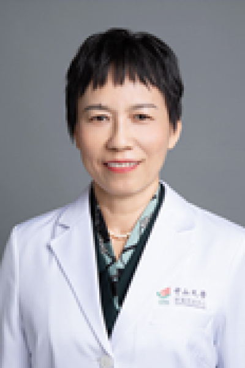

<!-- AUTO-GENERATED-BY: work/generate_obsidian_profiles.py -->

<!-- TEMPLATE: D:\workspace\信息收集整理\医生画像仓库\模板\医生画像模板.md -->

# 何洁华

## 基础信息

| 字段 | 内容 |
|---|---|
| 姓名 | 何洁华 |
| 医院 | 中山大学肿瘤防治中心 |
| 科室 | 病理科 |
| 职称/身份 | 主任医师 |
| 来源链接 | [官网原文](https://www.sysucc.org.cn/node/3858) |
| 采集日期 | 2026-08-10 |

## 简介/擅长

肿瘤病理诊断 学历：医学硕士 职称：主任医师 学习和工作经历: 1990年毕业于中山医科大学临床医学系，2002年12月取得医学硕士学位，从事临床肿瘤诊断工作近30年，擅长肿瘤病理及细胞病理诊断和疑难病例诊断，尤其擅长乳腺肿瘤、女性生殖系统肿瘤及肿瘤细胞学诊断。 加载更多 学历：医学硕士 职称：主任医师 学习和工作经历: 1990年毕业于中山医科大学临床医学系，2002年12月取得医学硕士学位，从事临床肿瘤诊断工作近30年，擅长肿瘤病理及细胞病理诊断和疑难病例诊断，尤其擅长乳腺肿瘤、女性生殖系统肿瘤及肿瘤细胞学诊断。

## 教育与进修经历

- 职称：主任医师 专长 肿瘤病理诊断 学历：医学硕士 职称：主任医师 学习和工作经历: 1990年毕业于中山医科大学临床医学系，2002年12月取得医学硕士学位，从事临床肿瘤诊断工作近30年，擅长肿瘤病理及细胞病理诊断和疑难病例诊断，尤其擅长乳腺肿瘤、女性生殖系统肿瘤及肿瘤细胞学诊断。
- 加载更多 学历：医学硕士 职称：主任医师 学习和工作经历: 1990年毕业于中山医科大学临床医学系，2002年12月取得医学硕士学位，从事临床肿瘤诊断工作近30年，擅长肿瘤病理及细胞病理诊断和疑难病例诊断，尤其擅长乳腺肿瘤、女性生殖系统肿瘤及肿瘤细胞学诊断。

## 可包装亮点

- 主任医师 肿瘤病理诊断 学历：医学硕士 职称：主任医师 学习和工作经历: 1990年毕业于中山医科大学临床医学系，2002年12月取得医学硕士学位，从事临床肿瘤诊断工作近30年，擅长肿瘤病理及细胞病理诊断和疑难病例诊断，尤其擅长乳腺肿瘤、女性生殖系统肿瘤及肿瘤细胞学诊断。
- 学历：医学硕士 职称：主任医师 学习和工作经历: 1990年毕业于中山医科大学临床医学系，2002年12月取得医学硕士学位，从事临床肿瘤诊断工作近30年，擅长肿瘤病理及细胞病理诊断和疑难病例诊断，尤其擅长乳腺肿瘤、女性生殖系统肿瘤及肿瘤细胞学诊断。
- 何洁华 职称：主任医师 专长 肿瘤病理诊断 学历：医学硕士 职称：主任医师 学习和工作经历: 1990年毕业于中山医科大学临床医学系，2002年12月取得医学硕士学位，从事临床肿瘤诊断工作近30年，擅长肿瘤病理及细胞病理诊...

## 重点疾病/人群标签

- 慢性病：
- 肿瘤：肿瘤、生殖、疑难
- 生殖疾病：肿瘤、生殖、疑难
- 免疫/风湿：
- 术后恢复/康复：
- 疑难重症：肿瘤、生殖、疑难

## 证据摘录

> 只摘录官网公开信息中的短句或关键字段，不复制大段原文。

- 官网身份字段：主任医师
- 官网简介/擅长：肿瘤病理诊断 学历：医学硕士 职称：主任医师 学习和工作经历: 1990年毕业于中山医科大学临床医学系，2002年12月取得医学硕士学位，从事临床肿瘤诊断工作近30年，擅长肿瘤病理及细胞病理诊断和疑难病例诊断，尤其擅长乳腺肿瘤、女性生殖系统肿瘤及肿瘤细胞学诊断。 加载更多 学历：医学硕士 职称：主任医师 学习和工作经历: 1990年毕业于中山医科大学临床医学系，2002年12月取得医学硕士学位，从事临床肿瘤诊断工作近30年，擅长肿瘤病…
- 官网亮眼经历线索：主任医师 肿瘤病理诊断 学历：医学硕士 职称：主任医师 学习和工作经历: 1990年毕业于中山医科大学临床医学系，2002年12月取得医学硕士学位，从事临床肿瘤诊断工作近30年，擅长肿瘤病理及细胞病理诊断和疑难病例诊断，尤其擅长乳腺肿瘤、女性生殖系统肿瘤及肿瘤细胞学诊断。 学历：医学硕士 职称：主任医师 学习和工作经历: 1990年毕业于中山医科大学临床医学系，2002年12月取得医学硕士学位，从事临床肿瘤诊断工作近30年，擅长肿瘤病…
- 异常提示：亮眼经历含导航文本，已清洗
- 来源链接：https://www.sysucc.org.cn/node/3858

## BD 画像摘要

何洁华医生可作为肿瘤、生殖疾病、疑难重症方向的基础画像候选。后续 BD 使用应继续以官网来源和人工复核为准，不添加疗效承诺或无来源包装。

## 合规边界

- 仅使用医院官网、官方公众号、官方小程序等公开渠道。
- 不采集私人电话、私人微信、家庭住址、患者隐私或非公开排班信息。
- 不写“保证治愈”“疗效第一”“包治疑难杂症”等无法由官网证明的表述。
