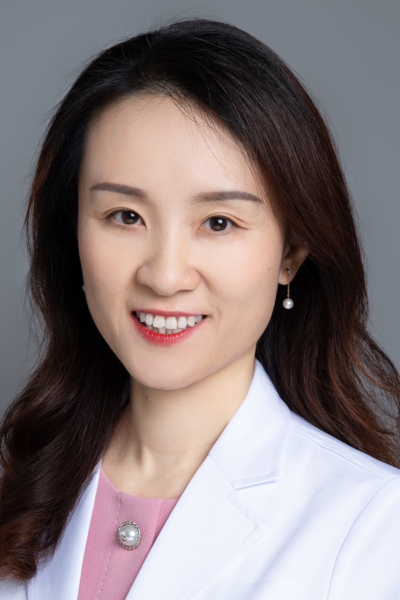

<!-- AUTO-GENERATED-BY: work/generate_obsidian_profiles.py -->

<!-- TEMPLATE: D:\workspace\信息收集整理\医生画像仓库\模板\医生画像模板.md -->

# 侯雪

## 基础信息

| 字段 | 内容 |
|---|---|
| 姓名 | 侯雪 |
| 医院 | 中山大学肿瘤防治中心 |
| 科室 | 内科 |
| 职称/身份 | 主任医师，博士生导师 |
| 来源链接 | [官网原文](https://www.sysucc.org.cn/node/1501) |
| 采集日期 | 2026-08-10 |

## 简介/擅长

胸部肿瘤（肺癌、胸腺肿瘤、胸膜间皮瘤）的化疗、靶向、免疫治疗及临床研究。

## 教育与进修经历

- 一、基本情况 学位：肿瘤学博士 职 称：主任医师，博士生导师 专家门诊时间：周一上午（越秀院区特需门诊）；
- 二、学习及工作经历 1999年 ~ 2004年：中山大学中山医学院临床医学专业 本科 2004年 ~ 2007年：中山大学附属肿瘤医院内科 肿瘤学硕士 2007年 ~ 2011年：上海交通大学附属上海胸科医院肺部肿瘤临床医学中心，住院医师 2011年 ~ 2017年：中山大学附属肿瘤医院内科，住院医师，主治医师 2013年 ~ 2017年：中山大学附属肿瘤医院内科 肿瘤学博士 2014年 ~ 2015年：美国纽约Memorial Sloan Kettering Cancer Center胸部肿瘤内科访问学者 20…

## 科研项目与成果

- 四、主要学术成果 近年来主持国家自然科学基金、广东省自然科学基金、广东省科技计划项目、广东省医学科研基金、广州市科技计划项目等多项各级科研项目；

## 论文与学术产出

- 以第一作者或通讯作者在SCI杂志发表论文50余篇；

## 可包装亮点

- 主任医师，博士生导师 侯雪 职称：主任医师，博士生导师 专长 胸部肿瘤（肺癌、胸腺肿瘤、胸膜间皮瘤）的化疗、靶向、免疫治疗及临床研究。
- 一、基本情况 学位：肿瘤学博士 职 称：主任医师，博士生导师 专家门诊时间：周一上午（越秀院区特需门诊）；
- 二、学习及工作经历 1999年 ~ 2004年：中山大学中山医学院临床医学专业 本科 2004年 ~ 2007年：中山大学附属肿瘤医院内科 肿瘤学硕士 2007年 ~ 2011年：上海交通大学附属上海胸科医院肺部肿瘤临床医学中心，住院医师 2011年 ~ 2017年：中山大学附属肿瘤医院内科，住院医师，主治医师 2013年 ~ 2017年：中山大学附属肿瘤…

## 重点疾病/人群标签

- 慢性病：
- 肿瘤：肿瘤、癌、瘤、化疗、靶向、肺癌、免疫
- 生殖疾病：
- 免疫/风湿：肿瘤、癌、瘤、化疗、靶向、肺癌、免疫
- 术后恢复/康复：
- 疑难重症：

## 证据摘录

> 只摘录官网公开信息中的短句或关键字段，不复制大段原文。

- 官网身份字段：主任医师，博士生导师
- 官网简介/擅长：胸部肿瘤（肺癌、胸腺肿瘤、胸膜间皮瘤）的化疗、靶向、免疫治疗及临床研究。
- 官网亮眼经历线索：主任医师，博士生导师 侯雪 职称：主任医师，博士生导师 专长 胸部肿瘤（肺癌、胸腺肿瘤、胸膜间皮瘤）的化疗、靶向、免疫治疗及临床研究。 一、基本情况 学位：肿瘤学博士 职 称：主任医师，博士生导师 专家门诊时间：周一上午（越秀院区特需门诊）； 二、学习及工作经历 1999年 ~ 2004年：中山大学中山医学院临床医学专业 本科 2004年 ~ 2007年：中山大学附属肿瘤医院内科 肿瘤学硕士 2007年 ~ 2011年：上海交通大学附…
- 异常提示：亮眼经历含导航文本，已清洗
- 来源链接：https://www.sysucc.org.cn/node/1501

## BD 画像摘要

侯雪医生可作为肿瘤、免疫/风湿/感染方向的基础画像候选。后续 BD 使用应继续以官网来源和人工复核为准，不添加疗效承诺或无来源包装。

## 合规边界

- 仅使用医院官网、官方公众号、官方小程序等公开渠道。
- 不采集私人电话、私人微信、家庭住址、患者隐私或非公开排班信息。
- 不写“保证治愈”“疗效第一”“包治疑难杂症”等无法由官网证明的表述。
