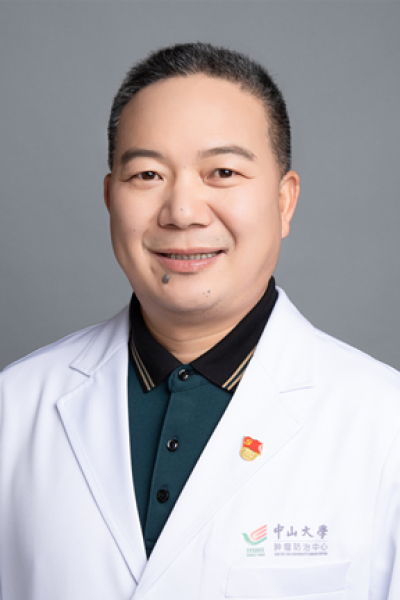

<!-- AUTO-GENERATED-BY: work/generate_obsidian_profiles.py -->

<!-- TEMPLATE: D:\workspace\信息收集整理\医生画像仓库\模板\医生画像模板.md -->

# 傅剑华

## 基础信息

| 字段 | 内容 |
|---|---|
| 姓名 | 傅剑华 |
| 医院 | 中山大学肿瘤防治中心 |
| 科室 | 胸科 |
| 职称/身份 | 广东省食管癌研究所所长 职称：肿瘤学博士、高级工商管理学硕士、教授、主任医师、博士生导师、食管癌首席专家 |
| 来源链接 | [官网原文](https://www.sysucc.org.cn/node/3611) |
| 采集日期 | 2026-08-10 |

## 简介/擅长

1.食管癌的综合治疗的临床研究及相关基础研究 2.食管癌的临床分期及分子分期 3.记忆金属食管良性支架及人工食管的研制及产业化 4.肺癌的分期、外科治疗、以手术为主的综合治疗 文章及著作：近三年发表代表性论文（第一作者或通讯作者） 1、 HuangQ,Su X,Bella AE, Luo K, Jin J, Zhang S, Luo G, Rong T, Fu J(*). Clinicopathological features and outcome of gastric metastases from primary lung cancer: A case report and systematic review. Oncology Letters,2015,Mar;9(3):1373-1379. 2、 Huang Q, Zhong J, Yang T, Li J, Luo K, Zheng Y, Yang H, Fu J(*). Impacts ofanastomotic complications on the health-related quality of life afteresophagectomy....

## 教育与进修经历

- 傅剑华教授，1981年毕业于中山医科大学医学系，一直从事胸部肿瘤包括：食管癌、肺癌、纵隔肿瘤等的外科诊治及综合治疗，擅长于食管癌、肺癌及胸部肿瘤复杂的外科手术治疗及胸部肿瘤的微创治疗，对食管癌/肺癌的综合治疗、胸部肿瘤非血管介入手术、早期食管癌内镜微创手术等有深人的研究。
- 加载更多 傅剑华教授，1981年毕业于中山医科大学医学系，一直从事胸部肿瘤包括：食管癌、肺癌、纵隔肿瘤等的外科诊治及综合治疗，擅长于食管癌、肺癌及胸部肿瘤复杂的外科手术治疗及胸部肿瘤的微创治疗，对食管癌/肺癌的综合治疗、胸部肿瘤非血管介入手术、早期食管癌内镜微创手术等有深人的研究。

## 科研项目与成果

- 曾主持或参与研究与食管癌、肺癌有关的国家“973”、“11.5”、“863”计划攻关课题和多项省、部级课题。
- 主持粤港关键领域重点突破项目“记忆合金人工食管开发及产业化”，广东省科委”治疗食管良性狭窄支架的研制及临床应用” ,“沉默IAPs基因，增加肿瘤化疗敏感性作用及其机理”等多项课题；
- 现主持的卫生部临床重点项目“术前放化疗并手术治疗局部晚期食管鳞癌的多中心临床试验及其mRNA和miRNA基因组学研究”及国家自然科学基金项目，并取得可喜进展，中期分析结果提示：术前放化疗并手术可提高食管癌的治疗效果。
- 研究成果曾获广东省科学技术研究成果二等奖和三等奖；

## 论文与学术产出

- 迄今已在国内外有影响力的杂志上发表论文100余篇，参编专著作6本，多次在国际会议上作特邀报告，多篇论文在国际会议上交流。

## 可包装亮点

- 广东省食管癌研究所所长 职称：肿瘤学博士、高级工商管理学硕士、教授、主任医师、博士生导师、食管癌首席专家 1.食管癌的综合治疗的临床研究及相关基础研究 2.食管癌的临床分期及分子分期 3.记忆金属食管良性支架及人工食管的研制及产业化 4.肺癌的分期、外科治疗、以手术为主的综合治疗 文章及著作：近三年发表代表性论文（第一作者或通讯作者） 1、 HuangQ,…

## 重点疾病/人群标签

- 慢性病：
- 肿瘤：肿瘤、癌、化疗、肺癌、术后、难治、复杂
- 生殖疾病：
- 免疫/风湿：
- 术后恢复/康复：肿瘤、癌、化疗、肺癌、术后、难治、复杂
- 疑难重症：肿瘤、癌、化疗、肺癌、术后、难治、复杂

## 证据摘录

> 只摘录官网公开信息中的短句或关键字段，不复制大段原文。

- 官网身份字段：广东省食管癌研究所所长 职称：肿瘤学博士、高级工商管理学硕士、教授、主任医师、博士生导师、食管癌首席专家
- 官网简介/擅长：1.食管癌的综合治疗的临床研究及相关基础研究 2.食管癌的临床分期及分子分期 3.记忆金属食管良性支架及人工食管的研制及产业化 4.肺癌的分期、外科治疗、以手术为主的综合治疗 文章及著作：近三年发表代表性论文（第一作者或通讯作者） 1、 HuangQ,Su X,Bella AE, Luo K, Jin J, Zhang S, Luo G, Rong T, Fu J(*). Clinicopathological features an…
- 官网亮眼经历线索：广东省食管癌研究所所长 职称：肿瘤学博士、高级工商管理学硕士、教授、主任医师、博士生导师、食管癌首席专家 1.食管癌的综合治疗的临床研究及相关基础研究 2.食管癌的临床分期及分子分期 3.记忆金属食管良性支架及人工食管的研制及产业化 4.肺癌的分期、外科治疗、以手术为主的综合治疗 文章及著作：近三年发表代表性论文（第一作者或通讯作者） 1、 HuangQ,Su X,Bella AE, Luo K, Jin J, Zhang S, Lu…
- 异常提示：亮眼经历含导航文本，已清洗
- 来源链接：https://www.sysucc.org.cn/node/3611

## BD 画像摘要

傅剑华医生可作为肿瘤、术后恢复/康复、疑难重症方向的基础画像候选。后续 BD 使用应继续以官网来源和人工复核为准，不添加疗效承诺或无来源包装。

## 合规边界

- 仅使用医院官网、官方公众号、官方小程序等公开渠道。
- 不采集私人电话、私人微信、家庭住址、患者隐私或非公开排班信息。
- 不写“保证治愈”“疗效第一”“包治疑难杂症”等无法由官网证明的表述。
