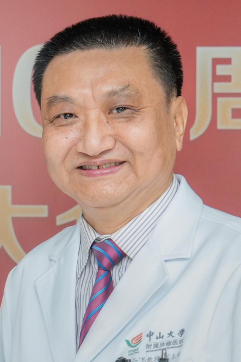

<!-- AUTO-GENERATED-BY: work/generate_obsidian_profiles.py -->

<!-- TEMPLATE: D:\workspace\信息收集整理\医生画像仓库\模板\医生画像模板.md -->

# 元云飞

## 基础信息

| 字段 | 内容 |
|---|---|
| 姓名 | 元云飞 |
| 医院 | 中山大学肿瘤防治中心 |
| 科室 | 肝脏外科 |
| 职称/身份 | 二级教授、一级主任医师、博士生导师 |
| 来源链接 | [官网原文](https://www.sysucc.org.cn/node/3633) |
| 采集日期 | 2026-08-10 |

## 简介/擅长

原发性肝癌的外科治疗、介入治疗、靶向免疫治疗；结直肠癌肝转移的外科治疗和局部治疗。

## 教育与进修经历

- 二、学习及工作经历 1978年—1983年：中山医学院医学系，获学士学位 1983年—1986年：中国医学科学院血液学研究所工作 1986年—1989年：中山医科大学外科学硕士研究生，获医学硕士学位 1989年—1998年：中山大学附属肿瘤医院工作 1998年—2000年：Baylor医学院进修学习 2000年—2001年：美国MD Anderson癌症中心进修学习 2001年至今：中山大学附属肿瘤医院肝脏外科工作 华南恶性肿瘤防治全国重点实验室PI 《Cancer Communications》杂志(原癌症杂志…
- 1986年9月回母校读研究生，师从著名外科学家王吉甫教授（已故），1989年8月毕业，获医学硕士学位。
- 1989年9月起在中山（医科）大学肿瘤医院腹科或肝胆科或肝脏外科工作，其中1998.8-2001.8在美国进修学习。

## 科研项目与成果

- 二、学习及工作经历 1978年—1983年：中山医学院医学系，获学士学位 1983年—1986年：中国医学科学院血液学研究所工作 1986年—1989年：中山医科大学外科学硕士研究生，获医学硕士学位 1989年—1998年：中山大学附属肿瘤医院工作 1998年—2000年：Baylor医学院进修学习 2000年—2001年：美国MD Anderson癌症中心进修学习 2001年至今：中山大学附属肿瘤医院肝脏外科工作 华南恶性肿瘤防治全国重点实验室PI 《Cancer Communications》杂志(原癌症杂志…

## 可包装亮点

- 二级教授、一级主任医师、博士生导师 元云飞 职称：二级教授、一级主任医师、博士生导师 专长 原发性肝癌的外科治疗、介入治疗、靶向免疫治疗；
- 一、基本情况 职务：无 职称：二级教授、一级主任医师、博士生导师 专家门诊时间： 周一上午，周四上午，周五上午 专业特长：主要从事原发性肝癌的外科治疗、介入治疗、靶向免疫治疗和结直肠癌肝转移的外科治疗、局部治疗。
- 在中国率先应用ICGR15评估肝储备功能，熟练掌握各种复杂的肝脏恶性肿瘤切除手术。

## 重点疾病/人群标签

- 慢性病：代谢、肿瘤、癌、瘤、化疗、靶向、肝癌、肠癌、免疫、术后、复杂、转化治疗
- 肿瘤：代谢、肿瘤、癌、瘤、化疗、靶向、肝癌、肠癌、免疫、术后、复杂、转化治疗
- 生殖疾病：
- 免疫/风湿：代谢、肿瘤、癌、瘤、化疗、靶向、肝癌、肠癌、免疫、术后、复杂、转化治疗
- 术后恢复/康复：代谢、肿瘤、癌、瘤、化疗、靶向、肝癌、肠癌、免疫、术后、复杂、转化治疗
- 疑难重症：代谢、肿瘤、癌、瘤、化疗、靶向、肝癌、肠癌、免疫、术后、复杂、转化治疗

## 证据摘录

> 只摘录官网公开信息中的短句或关键字段，不复制大段原文。

- 官网身份字段：二级教授、一级主任医师、博士生导师
- 官网简介/擅长：原发性肝癌的外科治疗、介入治疗、靶向免疫治疗；结直肠癌肝转移的外科治疗和局部治疗。
- 官网亮眼经历线索：二级教授、一级主任医师、博士生导师 元云飞 职称：二级教授、一级主任医师、博士生导师 专长 原发性肝癌的外科治疗、介入治疗、靶向免疫治疗； 一、基本情况 职务：无 职称：二级教授、一级主任医师、博士生导师 专家门诊时间： 周一上午，周四上午，周五上午 专业特长：主要从事原发性肝癌的外科治疗、介入治疗、靶向免疫治疗和结直肠癌肝转移的外科治疗、局部治疗。 在中国率先应用ICGR15评估肝储备功能，熟练掌握各种复杂的肝脏恶性肿瘤切除手术。
- 异常提示：亮眼经历含导航文本，已清洗
- 来源链接：https://www.sysucc.org.cn/node/3633

## BD 画像摘要

元云飞医生可作为慢性病、肿瘤、免疫/风湿/感染、术后恢复/康复、疑难重症方向的基础画像候选。后续 BD 使用应继续以官网来源和人工复核为准，不添加疗效承诺或无来源包装。

## 合规边界

- 仅使用医院官网、官方公众号、官方小程序等公开渠道。
- 不采集私人电话、私人微信、家庭住址、患者隐私或非公开排班信息。
- 不写“保证治愈”“疗效第一”“包治疑难杂症”等无法由官网证明的表述。
