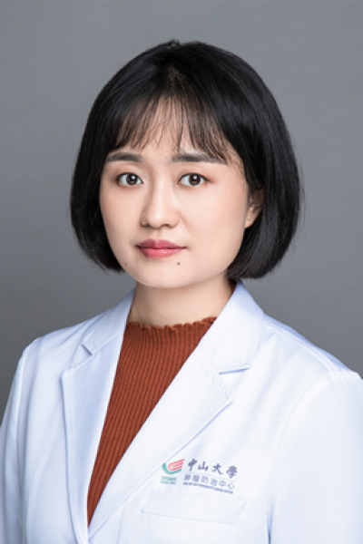

<!-- AUTO-GENERATED-BY: work/generate_obsidian_profiles.py -->

# 刘丽婷

## 基础信息

| 字段 | 内容 |
|---|---|
| 医院 | 中山大学肿瘤防治中心 |
| 姓名 | 刘丽婷 |
| 科室 | 鼻咽科 |
| 职称/身份 | 主任医师，硕士生导师 |
| 重点优先级 | 高 |
| 来源类型 | 医院官网 |
| 来源链接 | [官网原文](https://www.sysucc.org.cn/node/1646) |
| 采集日期 | 2026-08-10 |
| 复核状态 | 待人工复核 |
| 异常提示 |  |

## 简介/擅长

鼻咽癌的个体化综合治疗（放疗、化疗、免疫及靶向治疗）及预后标志物研究 职称：主任医师，硕士生导师 专业方向：鼻咽癌的个体化综合治疗（放疗、化疗、免疫及靶向治疗）及预后标志物研究。 工作经历： 2022-2025，中山大学，肿瘤防治中心，副主任医师 2020-2021，中山大学，肿瘤防治中心，主治医师 2018-2019，中山大学，肿瘤防治中心，医师 教育经历： 2013-2018，中山大学，肿瘤学，博士 2008-2013 天津医科大学，临床医学，学士 学术兼职： 广东省临床医学会鼻咽癌精准治疗专业委员会秘书 广东省精准医学应用协会头颈肿瘤分会委员 研究方向 鼻咽癌的个体化综合治疗（放疗、化疗、免疫及靶向治疗）及分子标志物研究。以第一（共一）或共同通讯作者在Radiology、JAMA Network open、Eur J Cancer、J Natl Compr Canc Netw、Int J Radiat oncol Biol Phys、Ther Adv Med Oncol 等国际权威杂志上发表多篇SCI论著，并参与多项临床研究项目。 加载更多 职称：主任医师，硕士生导师 专业方向：鼻咽癌的个体化综合治疗（放疗、化疗...

## 详情正文摘录

临床专家 面包屑 首页 / 临床科室 / 放疗系列 / 鼻咽科 / 临床专家 刘丽婷 职称：主任医师，硕士生导师 专长 鼻咽癌的个体化综合治疗（放疗、化疗、免疫及靶向治疗）及预后标志物研究 职称：主任医师，硕士生导师 专业方向：鼻咽癌的个体化综合治疗（放疗、化疗、免疫及靶向治疗）及预后标志物研究。 工作经历： 2022-2025，中山大学，肿瘤防治中心，副主任医师 2020-2021，中山大学，肿瘤防治中心，主治医师 2018-2019，中山大学，肿瘤防治中心，医师 教育经历： 2013-2018，中山大学，肿瘤学，博士 2008-2013 天津医科大学，临床医学，学士 学术兼职： 广东省临床医学会鼻咽癌精准治疗专业委员会秘书 广东省精准医学应用协会头颈肿瘤分会委员 研究方向 鼻咽癌的个体化综合治疗（放疗、化疗、免疫及靶向治疗）及分子标志物研究。以第一（共一）或共同通讯作者在Radiology、JAMA Network open、Eur J Cancer、J Natl Compr Canc Netw、Int J Radiat oncol Biol Phys、Ther Adv Med Oncol 等国际权威杂志上发表多篇SCI论著，并参与多项临床研究项目。 加载更多 职称：主任医师，硕士生导师 专业方向：鼻咽癌的个体化综合治疗（放疗、化疗、免疫及靶向治疗）及预后标志物研究。 工作经历： 2022-2025，中山大学，肿瘤防治中心，主任医师 2020-2021，中山大学，肿瘤防治中心，主治医师 2018-2019，中山大学，肿瘤防治中心，医师 教育经历： 2013-2018，中山大学，肿瘤学，博士 2008-2013 天津医科大学，临床医学，学士 学术兼职： 广东省临床医学会鼻咽癌精准治疗专业委员会秘书 广东省精准医学应用协会头颈肿瘤分会委员 研究方向 鼻咽癌的个体化综合治疗（放疗、化疗、免疫及靶向治疗）及分子标志物研究。以第一（共一）或共同通讯作者在Radiology、JAMA Network open、Eur J Cancer、J Natl Compr Canc Ne…

## 重点关注范围

- 肿瘤
- 免疫/风湿/感染

## 重点疾病标签

- 肿瘤
- 放疗
- 化疗
- 靶向
- 鼻咽癌
- 免疫

## 亮眼经历线索

- 主任医师，硕士生导师 鼻咽癌的个体化综合治疗（放疗、化疗、免疫及靶向治疗）及预后标志物研究 职称：主任医师，硕士生导师 专业方向：鼻咽癌的个体化综合治疗（放疗、化疗、免疫及靶向治疗）及预后标志物研究。
- 工作经历： 2022-2025，中山大学，肿瘤防治中心，副主任医师 2020-2021，中山大学，肿瘤防治中心，主治医师 2018-2019，中山大学，肿瘤防治中心，医师 教育经历： 2013-2018，中山大学，肿瘤学，博士 2008-2013 天津医科大学，临床医学，学士 学术兼职： 广东省临床医学会鼻咽癌精准治疗专业委员会秘书 广东省精准医学应用协会…
- 以第一（共一）或共同通讯作者在Radiology、JAMA Network open、Eur J Cancer、J Natl Compr Canc Netw、Int J Ra...

## 异常提示

## 合规边界

- 本画像仅整理统一总底表中的医院官网公开字段。
- 不包含患者评价、排名、第三方来源内容或疗效承诺。
- 官网未展示的信息保持空白，后续如需补充须回到底表官方来源字段。
