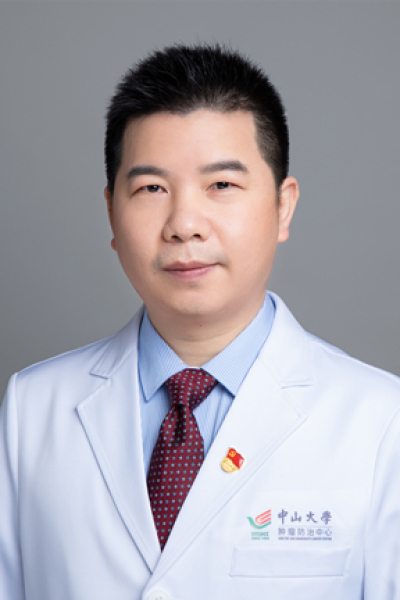

<!-- AUTO-GENERATED-BY: work/generate_obsidian_profiles.py -->

# 刘乾文

## 基础信息

| 字段 | 内容 |
|---|---|
| 医院 | 中山大学肿瘤防治中心 |
| 姓名 | 刘乾文 |
| 科室 | 胸科 |
| 职称/身份 | 主任医师、主诊教授、硕士生导师、肿瘤学博士 |
| 重点优先级 | 高 |
| 来源类型 | 医院官网 |
| 来源链接 | [官网原文](https://www.sysucc.org.cn/node/3626) |
| 采集日期 | 2026-08-10 |
| 复核状态 | 待人工复核 |
| 异常提示 |  |

## 简介/擅长

擅长肺结节、肺癌、食管癌和纵隔肿瘤的诊断、微创手术和综合治疗；擅长胸腔镜、腹腔镜、电视纵隔镜和纵隔腔镜等微创手术。 刘乾文，主任医师，主诊教授，硕士生导师，肿瘤学博士。2009年北京大学毕业后一直在中山大学肿瘤医院胸科工作。2017年获得第18届世界肺癌大会旅行学者奖。2022年获得大中华区胸腔镜比赛南中国赛区（食管组）一等奖、全国总决赛三等奖。 对胸部肿瘤包括肺癌、食管癌和纵隔肿瘤的诊断、微创手术治疗和综合治疗具有较深的造诣。外科技能全面，熟练掌握胸腔镜、腹腔镜、电视纵隔镜和纵隔腔镜等胸部肿瘤微创外科技术。非常重视胸部肿瘤病人外科治疗的规范化切除，重视根治切除、功能保护和围术期管理。综合运用各种微创技术不断探索和提升患者的近期和远期疗效。在肺癌方面，开展了电视纵隔镜下双侧纵隔淋巴结清扫（VAMLA）联合胸腔镜肺叶切除，提高了III期肺癌纵隔分期的准确度；在食管癌方面，开展了纵隔腔镜联合腹腔镜不开胸食管癌根治术，减少了围术期并发症；提出腔镜下“拨吸法”左侧喉返神经旁淋巴结清扫术，大幅减少喉返神经损伤，从而降低食管癌患者肺部并发症，提高术后生活质量。 研究成果多次在WCLC、ISDE和OESO等国际会议口头报道。以第一/...

## 详情正文摘录

临床专家 面包屑 首页 / 临床科室 / 外科系列 / 胸科 / 临床专家 刘乾文 职称：主任医师、主诊教授、硕士生导师、肿瘤学博士 专长 擅长肺结节、肺癌、食管癌和纵隔肿瘤的诊断、微创手术和综合治疗；擅长胸腔镜、腹腔镜、电视纵隔镜和纵隔腔镜等微创手术。 刘乾文，主任医师，主诊教授，硕士生导师，肿瘤学博士。2009年北京大学毕业后一直在中山大学肿瘤医院胸科工作。2017年获得第18届世界肺癌大会旅行学者奖。2022年获得大中华区胸腔镜比赛南中国赛区（食管组）一等奖、全国总决赛三等奖。 对胸部肿瘤包括肺癌、食管癌和纵隔肿瘤的诊断、微创手术治疗和综合治疗具有较深的造诣。外科技能全面，熟练掌握胸腔镜、腹腔镜、电视纵隔镜和纵隔腔镜等胸部肿瘤微创外科技术。非常重视胸部肿瘤病人外科治疗的规范化切除，重视根治切除、功能保护和围术期管理。综合运用各种微创技术不断探索和提升患者的近期和远期疗效。在肺癌方面，开展了电视纵隔镜下双侧纵隔淋巴结清扫（VAMLA）联合胸腔镜肺叶切除，提高了III期肺癌纵隔分期的准确度；在食管癌方面，开展了纵隔腔镜联合腹腔镜不开胸食管癌根治术，减少了围术期并发症；提出腔镜下“拨吸法”左侧喉返神经旁淋巴结清扫术，大幅减少喉返神经损伤，从而降低食管癌患者肺部并发症，提高术后生活质量。 研究成果多次在WCLC、ISDE和OESO等国际会议口头报道。以第一/通讯（含共同）作者发表SCI论文20余篇（影响因子10分以上6篇）。主持广东省自然科学基金、广东省医学科学研究基金和中山大学5010培育项目各一项。 出诊时间： 周三全天（黄埔院区）、周五上午（越秀院区） 一、工作经历： 2023 年1月至今 中山大学肿瘤医院胸科 主任医师 2019 年1月—2022年12月： 中山大学肿瘤医院胸科 副主任医师 2018 年7月—2019年1月： 开平市中心医院院长助理（挂职） 2014 年1月—2018年12月： 中山大学肿瘤医院胸科 主治医师 2009 年7月—2013年12月： 中山大学肿瘤医院胸科 住院医师 二、学习经历 2012年9月—2016年6月：中山大学肿瘤医院 肿瘤…

## 重点关注范围

- 肿瘤
- 术后恢复/康复

## 重点疾病标签

- 肿瘤
- 癌
- 肺癌
- 术后

## 亮眼经历线索

- 主任医师、主诊教授、硕士生导师、肿瘤学博士 刘乾文，主任医师，主诊教授，硕士生导师，肿瘤学博士。
- 2017年获得第18届世界肺癌大会旅行学者奖。
- 2022年获得大中华区胸腔镜比赛南中国赛区（食管组）一等奖、全国总决赛三等奖。

## 异常提示

## 合规边界

- 本画像仅整理统一总底表中的医院官网公开字段。
- 不包含患者评价、排名、第三方来源内容或疗效承诺。
- 官网未展示的信息保持空白，后续如需补充须回到底表官方来源字段。
