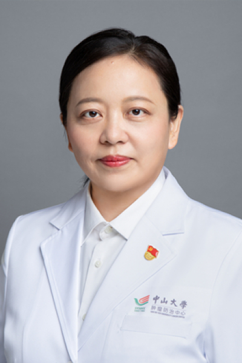

<!-- AUTO-GENERATED-BY: work/generate_obsidian_profiles.py -->

<!-- TEMPLATE: D:\workspace\信息收集整理\医生画像仓库\模板\医生画像模板.md -->

# 刘俊玲

## 基础信息

| 字段 | 内容 |
|---|---|
| 姓名 | 刘俊玲 |
| 医院 | 中山大学肿瘤防治中心 |
| 科室 | 内科 |
| 职称/身份 | 副主任医师、博士 |
| 来源链接 | [官网原文](https://www.sysucc.org.cn/node/1495) |
| 采集日期 | 2026-08-10 |

## 简介/擅长

肿瘤内科治疗（化学治疗、靶向治疗）的临床工作，主攻方向胸部肿瘤的内科治疗及研究。

## 教育与进修经历

- 2007年—2008年：日本国立癌症中心癌症中心访问学者 2008年至今：中山大学附属肿瘤医院工作，期间攻读在职博士生 加载更多 一、基本情况 主专科门诊时间： 周一下午；
- 2007年—2008年：日本国立癌症中心癌症中心访问学者 2008年至今：中山大学附属肿瘤医院工作，期间攻读在职博士生 三、学术兼职： 1. 日本癌学会会员 2. 中国抗癌协会会员 3. 广东省抗癌协会会员 更新时间：2016.3.1

## 可包装亮点

- 副主任医师、博士 刘俊玲 职称：副主任医师、博士 专长 肿瘤内科治疗（化学治疗、靶向治疗）的临床工作，主攻方向胸部肿瘤的内科治疗及研究。
- 2007年—2008年：日本国立癌症中心癌症中心访问学者 2008年至今：中山大学附属肿瘤医院工作，期间攻读在职博士生 一、基本情况 主专科门诊时间： 周一下午；
- 2007年—2008年：日本国立癌症中心癌症中心访问学者 2008年至今：中山大学附属肿瘤医院工作，期间攻读在职博士生 三、学术兼职： 1. 日本癌学会会员 2. 中国抗癌协会会员 3. 广东省抗癌协会会员 更新时间：2016.3.1

## 重点疾病/人群标签

- 慢性病：
- 肿瘤：肿瘤、癌、靶向
- 生殖疾病：
- 免疫/风湿：
- 术后恢复/康复：
- 疑难重症：

## 证据摘录

> 只摘录官网公开信息中的短句或关键字段，不复制大段原文。

- 官网身份字段：副主任医师、博士
- 官网简介/擅长：肿瘤内科治疗（化学治疗、靶向治疗）的临床工作，主攻方向胸部肿瘤的内科治疗及研究。
- 官网亮眼经历线索：副主任医师、博士 刘俊玲 职称：副主任医师、博士 专长 肿瘤内科治疗（化学治疗、靶向治疗）的临床工作，主攻方向胸部肿瘤的内科治疗及研究。 2007年—2008年：日本国立癌症中心癌症中心访问学者 2008年至今：中山大学附属肿瘤医院工作，期间攻读在职博士生 一、基本情况 主专科门诊时间： 周一下午； 2007年—2008年：日本国立癌症中心癌症中心访问学者 2008年至今：中山大学附属肿瘤医院工作，期间攻读在职博士生 三、学术兼职：…
- 异常提示：亮眼经历含导航文本，已清洗
- 来源链接：https://www.sysucc.org.cn/node/1495

## BD 画像摘要

刘俊玲医生可作为肿瘤方向的基础画像候选。后续 BD 使用应继续以官网来源和人工复核为准，不添加疗效承诺或无来源包装。

## 合规边界

- 仅使用医院官网、官方公众号、官方小程序等公开渠道。
- 不采集私人电话、私人微信、家庭住址、患者隐私或非公开排班信息。
- 不写“保证治愈”“疗效第一”“包治疑难杂症”等无法由官网证明的表述。
