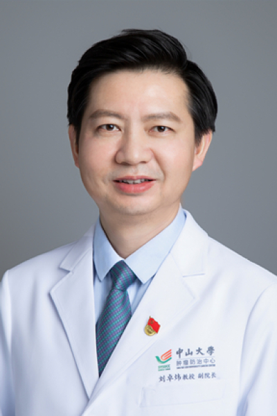

<!-- AUTO-GENERATED-BY: work/generate_obsidian_profiles.py -->

<!-- TEMPLATE: D:\workspace\信息收集整理\医生画像仓库\模板\医生画像模板.md -->

# 刘卓炜

## 基础信息

| 字段 | 内容 |
|---|---|
| 姓名 | 刘卓炜 |
| 医院 | 中山大学肿瘤防治中心 |
| 科室 | 泌尿外科 |
| 职称/身份 | 中心副主任、副院长 职称：二级教授、一级主任医师、博士生导师，美国西南医学中心泌尿外科VisitingAssistantProfessor、尿路上皮癌（膀胱癌）首席专家 |
| 来源链接 | [官网原文](https://www.sysucc.org.cn/node/3720) |
| 采集日期 | 2026-08-10 |

## 简介/擅长

擅长膀胱癌、肾盂癌、输尿管癌、睾丸癌及小儿泌尿系肿瘤等泌尿系肿瘤的外科治疗及多学科综合治疗

## 教育与进修经历

- 现任中山大学肿瘤防治中心副主任、副院长，二级教授、一级主任医师，国家住培基地中肿外科基地主任，华南首家达芬奇手术机器人国际培训中心专家委员会主任，中山大学附属肿瘤医院甘肃医院（国家区域医疗中心建设项目）执行院长、广东省科普教育（中山大学肿瘤防治中心）基地负责人。

## 科研项目与成果

- 现任中山大学肿瘤防治中心副主任、副院长，二级教授、一级主任医师，国家住培基地中肿外科基地主任，华南首家达芬奇手术机器人国际培训中心专家委员会主任，中山大学附属肿瘤医院甘肃医院（国家区域医疗中心建设项目）执行院长、广东省科普教育（中山大学肿瘤防治中心）基地负责人。
- 2015年以来主持国家自然科学基金面上项目5项，作为课题负责人主持国家科技重大专项，主持膀胱癌/尿路上皮癌临床研究11项。

## 论文与学术产出

- 2018年以来以通讯作者或第一作者在国际肿瘤及泌尿外科杂志Cancer cell（所发论文被Cell 出版社评选为2022年度中国论文奖），Nature communications，International journal of surgery（2），Nature Chemical Biology，Cell Reports Medicine, Redox Biology, Cancer Research，Cell reports，Oncogene（2），Cancer Communication，Cell de…
- 担任《膀胱癌》副主编，参编学术论著6本。

## 可包装亮点

- 中心副主任、副院长 职称：二级教授、一级主任医师、博士生导师，美国西南医学中心泌尿外科VisitingAssistantProfessor、尿路上皮癌（膀胱癌）首席专家 擅长膀胱癌、肾盂癌、输尿管癌、睾丸癌及小儿泌尿系肿瘤等泌尿系肿瘤的外科治疗及多学科综合治疗 刘卓炜 职务：中心副主任、副院长 职称：二级教授、一级主任医师、博士生导师，美国西南医学中心泌尿…

## 重点疾病/人群标签

- 慢性病：
- 肿瘤：肿瘤、癌、瘤、生殖、多学科
- 生殖疾病：肿瘤、癌、瘤、生殖、多学科
- 免疫/风湿：
- 术后恢复/康复：
- 疑难重症：肿瘤、癌、瘤、生殖、多学科

## 证据摘录

> 只摘录官网公开信息中的短句或关键字段，不复制大段原文。

- 官网身份字段：中心副主任、副院长 职称：二级教授、一级主任医师、博士生导师，美国西南医学中心泌尿外科VisitingAssistantProfessor、尿路上皮癌（膀胱癌）首席专家
- 官网简介/擅长：擅长膀胱癌、肾盂癌、输尿管癌、睾丸癌及小儿泌尿系肿瘤等泌尿系肿瘤的外科治疗及多学科综合治疗
- 官网亮眼经历线索：中心副主任、副院长 职称：二级教授、一级主任医师、博士生导师，美国西南医学中心泌尿外科VisitingAssistantProfessor、尿路上皮癌（膀胱癌）首席专家 擅长膀胱癌、肾盂癌、输尿管癌、睾丸癌及小儿泌尿系肿瘤等泌尿系肿瘤的外科治疗及多学科综合治疗 刘卓炜 职务：中心副主任、副院长 职称：二级教授、一级主任医师、博士生导师，美国西南医学中心泌尿外科VisitingAssistantProfessor、尿路上皮癌（膀胱癌）首…
- 异常提示：亮眼经历含导航文本，已清洗
- 来源链接：https://www.sysucc.org.cn/node/3720

## BD 画像摘要

刘卓炜医生可作为肿瘤、生殖疾病、疑难重症方向的基础画像候选。后续 BD 使用应继续以官网来源和人工复核为准，不添加疗效承诺或无来源包装。

## 合规边界

- 仅使用医院官网、官方公众号、官方小程序等公开渠道。
- 不采集私人电话、私人微信、家庭住址、患者隐私或非公开排班信息。
- 不写“保证治愈”“疗效第一”“包治疑难杂症”等无法由官网证明的表述。
