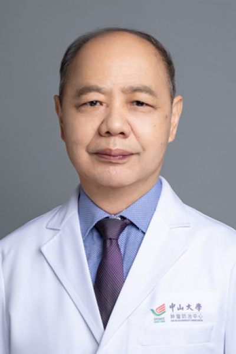

<!-- AUTO-GENERATED-BY: work/generate_obsidian_profiles.py -->

# 刘孟忠

## 基础信息

| 字段 | 内容 |
|---|---|
| 医院 | 中山大学肿瘤防治中心 |
| 姓名 | 刘孟忠 |
| 科室 | 放疗科 |
| 职称/身份 | 放疗科主任导师 职称：教授二级岗、主任医师、博士导师、食管癌资深首席专家 |
| 重点优先级 | 高 |
| 来源类型 | 医院官网 |
| 来源链接 | [官网原文](https://www.sysucc.org.cn/node/1662) |
| 采集日期 | 2026-08-10 |
| 复核状态 | 待人工复核 |
| 异常提示 |  |

## 简介/擅长

胸腹部肿瘤、鼻咽癌及前列腺肿瘤的放化综合治疗，具有丰富的临床经验。主要学术成绩包括：食管癌的术前放化疗已开展多中心临床试验，取得很好的进展；在食管癌同期放化疗方案的探索方面，已有论文被NCCN指南采用；在胸腹部肿瘤采用先进的4D-CT\IGRT等放射治疗技术方面处于国内领先水平。承担国家自然基金、省部级课题十余项，并以第一或通讯作者发表论文80余篇，其中有30余篇被高水平收录。并主持参加新药甘氨双唑钠的II、III期临床试验，获得国家新药一类证书。 主要学习工作经历 1983年中山医科大学临床医学系毕业，获学士学位； 1983年开始工作于中山大学附属肿瘤医院，住院医师 1988年中山医科大学肿瘤学研究生毕业，获硕士学位； 1990年获聘中山大学附属肿瘤医院主治医师； 1996年获聘中山大学附属肿瘤医院副主任医师； 2001年获聘中山大学肿瘤防治中心主任医师、教授； 2006年～2015年中山大学肿瘤防治中心放疗科科主任； 2015年至今中山大学肿瘤防治中心放疗科主任导师 主要研究方向： 1. 胸腹部肿瘤的放射治疗及放射增敏剂的临床研究 2. 食管癌同期放化疗 3. 肝癌立体定向放射治疗 4. 前列腺癌的精确放射治疗及综...

## 详情正文摘录

职务：放疗科主任导师 职称：教授二级岗、主任医师、博士导师、食管癌资深首席专家 专长 恶性肿瘤的综合放射治疗 刘孟忠教授，1955年出生。1983年毕业于中山医科大学临床医学系（本科），1988年取得中山医科大学临床肿瘤学硕士学位。医疗业务专长：胸腹部肿瘤、鼻咽癌及前列腺肿瘤的放化综合治疗，具有丰富的临床经验。主要学术成绩包括：食管癌的术前放化疗已开展多中心临床试验，取得很好的进展；在食管癌同期放化疗方案的探索方面，已有论文被NCCN指南采用；在胸腹部肿瘤采用先进的4D-CT\IGRT等放射治疗技术方面处于国内领先水平。承担国家自然基金、省部级课题十余项，并以第一或通讯作者发表论文80余篇，其中有30余篇被高水平收录。并主持参加新药甘氨双唑钠的II、III期临床试验，获得国家新药一类证书。 主要学习工作经历 1983年中山医科大学临床医学系毕业，获学士学位； 1983年开始工作于中山大学附属肿瘤医院，住院医师 1988年中山医科大学肿瘤学研究生毕业，获硕士学位； 1990年获聘中山大学附属肿瘤医院主治医师； 1996年获聘中山大学附属肿瘤医院副主任医师； 2001年获聘中山大学肿瘤防治中心主任医师、教授； 2006年～2015年中山大学肿瘤防治中心放疗科科主任； 2015年至今中山大学肿瘤防治中心放疗科主任导师 主要研究方向： 1. 胸腹部肿瘤的放射治疗及放射增敏剂的临床研究 2. 食管癌同期放化疗 3. 肝癌立体定向放射治疗 4. 前列腺癌的精确放射治疗及综合治疗 5. 肺癌放化综合治疗 专家门诊时间：周二上午；周三下午 加载更多 刘孟忠教授，1955年出生。1983年毕业于中山医科大学临床医学系（本科），1988年取得中山医科大学临床肿瘤学硕士学位。医疗业务专长：胸腹部肿瘤、鼻咽癌及前列腺肿瘤的放化综合治疗，具有丰富的临床经验。主要学术成绩包括：食管癌的术前放化疗已开展多中心临床试验，取得很好的进展；在食管癌同期放化疗方案的探索方面，已有论文被NCCN指南采用；在胸腹部肿瘤采用先…

## 重点关注范围

- 肿瘤

## 重点疾病标签

- 肿瘤
- 癌
- 放疗
- 化疗
- 鼻咽癌
- 肺癌
- 肝癌

## 亮眼经历线索

- 放疗科主任导师 职称：教授二级岗、主任医师、博士导师、食管癌资深首席专家 在食管癌同期放化疗方案的探索方面，已有论文被NCCN指南采用；
- 承担国家自然基金、省部级课题十余项，并以第一或通讯作者发表论文80余篇，其中有30余篇被高水平收录。
- 1996年获聘中山大学附属肿瘤医院副主任医师；

## 异常提示

## 合规边界

- 本画像仅整理统一总底表中的医院官网公开字段。
- 不包含患者评价、排名、第三方来源内容或疗效承诺。
- 官网未展示的信息保持空白，后续如需补充须回到底表官方来源字段。
