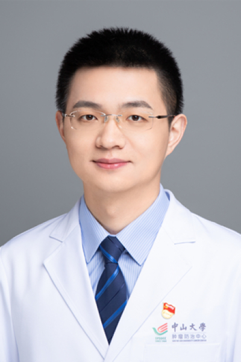

<!-- AUTO-GENERATED-BY: work/generate_obsidian_profiles.py -->

# 刘寿生

## 基础信息

| 字段 | 内容 |
|---|---|
| 医院 | 中山大学肿瘤防治中心 |
| 姓名 | 刘寿生 |
| 科室 | 综合科 |
| 职称/身份 | 副主任医师，硕士生导师，内科学博士 |
| 重点优先级 | 高 |
| 来源类型 | 医院官网 |
| 来源链接 | [官网原文](https://www.sysucc.org.cn/node/3771) |
| 采集日期 | 2026-08-10 |
| 复核状态 | 待人工复核 |
| 异常提示 |  |

## 简介/擅长

肺癌、消化系统肿瘤（胃癌、肠癌、食管癌、胰腺癌、肝癌、胆管癌）、鼻咽癌等常见肿瘤的内科及综合治疗。 职称： 副主任医师，硕士生导师，内科学博士。 专业特长： 从事临床工作10余年，擅长肺癌、消化系统肿瘤（胃癌、肠癌、食管癌、胰腺癌、肝癌、胆管癌）、鼻咽癌等常见肿瘤的内科治疗（化疗、靶向、免疫等），并在肿瘤相关并发症的诊治方面具有丰富的经验。曾接受三年的医师规范化培训，考核成绩为优秀，具有扎实的临床基本功。医德医风良好，连续多次被评为医院优秀员工。 科研成果： 主持国家自然科学基金、广东省自然科学基金、广东省医学科学基金等科研基金项目；以临床热点问题为导向，发表相关的第一作者SCI论文十余篇。 社会兼职： 广东省精准医学应用学会肿瘤综合治疗分会 秘书 广东省保健协会免疫治疗分会 常委 广东省健康管理学会肿瘤防治专业委员会 委员 广州市抗癌协会肿瘤微环境专业委员会 委员 加载更多 职称： 副主任医师，硕士生导师，内科学博士。 专业特长： 从事临床工作10余年，擅长肺癌、消化系统肿瘤（胃癌、肠癌、食管癌、胰腺癌、肝癌、胆管癌）、鼻咽癌等常见肿瘤的内科治疗（化疗、靶向、免疫等），并在肿瘤相关并发症的诊治方面具有丰富的经验。曾接...

## 详情正文摘录

临床专家 面包屑 首页 / 临床科室 / 内科系列 / 综合科 / 临床专家 刘寿生 职称：副主任医师，硕士生导师，内科学博士 专长 肺癌、消化系统肿瘤（胃癌、肠癌、食管癌、胰腺癌、肝癌、胆管癌）、鼻咽癌等常见肿瘤的内科及综合治疗。 职称： 副主任医师，硕士生导师，内科学博士。 专业特长： 从事临床工作10余年，擅长肺癌、消化系统肿瘤（胃癌、肠癌、食管癌、胰腺癌、肝癌、胆管癌）、鼻咽癌等常见肿瘤的内科治疗（化疗、靶向、免疫等），并在肿瘤相关并发症的诊治方面具有丰富的经验。曾接受三年的医师规范化培训，考核成绩为优秀，具有扎实的临床基本功。医德医风良好，连续多次被评为医院优秀员工。 科研成果： 主持国家自然科学基金、广东省自然科学基金、广东省医学科学基金等科研基金项目；以临床热点问题为导向，发表相关的第一作者SCI论文十余篇。 社会兼职： 广东省精准医学应用学会肿瘤综合治疗分会 秘书 广东省保健协会免疫治疗分会 常委 广东省健康管理学会肿瘤防治专业委员会 委员 广州市抗癌协会肿瘤微环境专业委员会 委员 加载更多 职称： 副主任医师，硕士生导师，内科学博士。 专业特长： 从事临床工作10余年，擅长肺癌、消化系统肿瘤（胃癌、肠癌、食管癌、胰腺癌、肝癌、胆管癌）、鼻咽癌等常见肿瘤的内科治疗（化疗、靶向、免疫等），并在肿瘤相关并发症的诊治方面具有丰富的经验。曾接受三年的医师规范化培训，考核成绩为优秀，具有扎实的临床基本功。医德医风良好，连续多次被评为医院优秀员工。 科研成果： 主持国家自然科学基金、广东省自然科学基金、广东省医学科学基金等科研基金项目；以临床热点问题为导向，发表相关的第一作者SCI论文十余篇。 社会兼职： 广东省精准医学应用学会肿瘤综合治疗分会 秘书 广东省保健协会免疫治疗分会 常委 广东省健康管理学会肿瘤防治专业委员会 委员 广州市抗癌协会肿瘤微环境专业委员会 委员 更新时间：2023年5月29日

## 重点关注范围

- 肿瘤
- 免疫/风湿/感染

## 重点疾病标签

- 肿瘤
- 癌
- 化疗
- 靶向
- 鼻咽癌
- 肺癌
- 肝癌
- 胃癌
- 肠癌
- 免疫

## 亮眼经历线索

- 副主任医师，硕士生导师，内科学博士 职称： 副主任医师，硕士生导师，内科学博士。
- 科研成果： 主持国家自然科学基金、广东省自然科学基金、广东省医学科学基金等科研基金项目；
- 以临床热点问题为导向，发表相关的第一作者SCI论文十余篇。

## 异常提示

## 合规边界

- 本画像仅整理统一总底表中的医院官网公开字段。
- 不包含患者评价、排名、第三方来源内容或疗效承诺。
- 官网未展示的信息保持空白，后续如需补充须回到底表官方来源字段。
