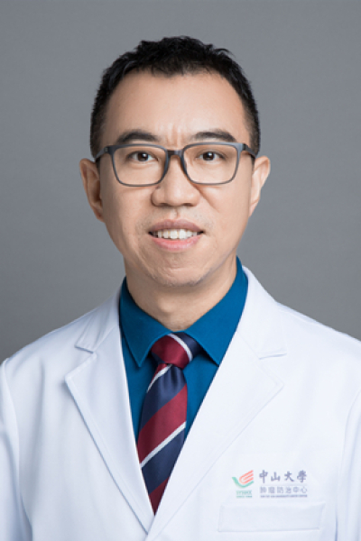

<!-- AUTO-GENERATED-BY: work/generate_obsidian_profiles.py -->

<!-- TEMPLATE: D:\workspace\信息收集整理\医生画像仓库\模板\医生画像模板.md -->

# 刘巍巍

## 基础信息

| 字段 | 内容 |
|---|---|
| 姓名 | 刘巍巍 |
| 医院 | 中山大学肿瘤防治中心 |
| 科室 | 头颈科 |
| 职称/身份 | 主任医师、硕士导师 |
| 来源链接 | [官网原文](https://www.sysucc.org.cn/node/3601) |
| 采集日期 | 2026-08-10 |

## 简介/擅长

从事耳鼻咽喉头颈外科工作多年，对头颈部肿瘤的诊断和综合治疗有丰富的经验。主要进行甲状腺癌、口腔癌、喉癌及下咽癌、涎腺恶性肿瘤、鼻腔及副鼻窦癌的外科治疗。近来开展了游离皮瓣技术修复重建头颈部组织缺损。

## 教育与进修经历

- 1994年毕业于河北省张家口医学院，获临床医学学士学位。
- 2002年毕业于中山大学医学院，获临床肿瘤学博士学位。
- 2004和2006年做为访问学者于香港中文大学外科学系威尔斯亲王医院耳鼻咽喉头颈外科访问学习。

## 论文与学术产出

- drliuww@gmail.com 发表的论文： 1、Guo ZM, Liu WW, He JH. A retrospective cohort study of nasopharyngeal adenocarcinoma: a rare histological type of nasopharyngeal cancer. Clin Otolaryngol. 2009, 34, 322–327. 2、Wei-wei LIU，Zong-yuan ZENG，Qiu-liang WU，et al. Overexpre…

## 可包装亮点

- 主任医师、硕士导师 刘巍巍 职称：主任医师、硕士导师 专长 从事耳鼻咽喉头颈外科工作多年，对头颈部肿瘤的诊断和综合治疗有丰富的经验。
- 一、基本情况 职称: 主任医师 专家门诊时间:周四上午；
- 二、学习及工作经历： 1989年—1994年：河北张家口医学院就读医学本科 1994年—1997年：中山大学医学院肿瘤防治中心就读临床肿瘤学硕士 1997年—1999年：广州市红十字会医院耳鼻咽喉头颈外科工作 1999年—2002年：中山大学附属肿瘤医院就读临床肿瘤学博士 2002年—2006年：中山大学附属肿瘤医院综合科工作 2006年—2007年：香港…

## 重点疾病/人群标签

- 慢性病：
- 肿瘤：肿瘤、癌、瘤、放疗、鼻咽癌、免疫、术后
- 生殖疾病：
- 免疫/风湿：肿瘤、癌、瘤、放疗、鼻咽癌、免疫、术后
- 术后恢复/康复：肿瘤、癌、瘤、放疗、鼻咽癌、免疫、术后
- 疑难重症：

## 证据摘录

> 只摘录官网公开信息中的短句或关键字段，不复制大段原文。

- 官网身份字段：主任医师、硕士导师
- 官网简介/擅长：从事耳鼻咽喉头颈外科工作多年，对头颈部肿瘤的诊断和综合治疗有丰富的经验。主要进行甲状腺癌、口腔癌、喉癌及下咽癌、涎腺恶性肿瘤、鼻腔及副鼻窦癌的外科治疗。近来开展了游离皮瓣技术修复重建头颈部组织缺损。
- 官网亮眼经历线索：主任医师、硕士导师 刘巍巍 职称：主任医师、硕士导师 专长 从事耳鼻咽喉头颈外科工作多年，对头颈部肿瘤的诊断和综合治疗有丰富的经验。 一、基本情况 职称: 主任医师 专家门诊时间:周四上午； 二、学习及工作经历： 1989年—1994年：河北张家口医学院就读医学本科 1994年—1997年：中山大学医学院肿瘤防治中心就读临床肿瘤学硕士 1997年—1999年：广州市红十字会医院耳鼻咽喉头颈外科工作 1999年—2002年：中山大学附属…
- 异常提示：亮眼经历含导航文本，已清洗
- 来源链接：https://www.sysucc.org.cn/node/3601

## BD 画像摘要

刘巍巍医生可作为肿瘤、免疫/风湿/感染、术后恢复/康复方向的基础画像候选。后续 BD 使用应继续以官网来源和人工复核为准，不添加疗效承诺或无来源包装。

## 合规边界

- 仅使用医院官网、官方公众号、官方小程序等公开渠道。
- 不采集私人电话、私人微信、家庭住址、患者隐私或非公开排班信息。
- 不写“保证治愈”“疗效第一”“包治疑难杂症”等无法由官网证明的表述。
