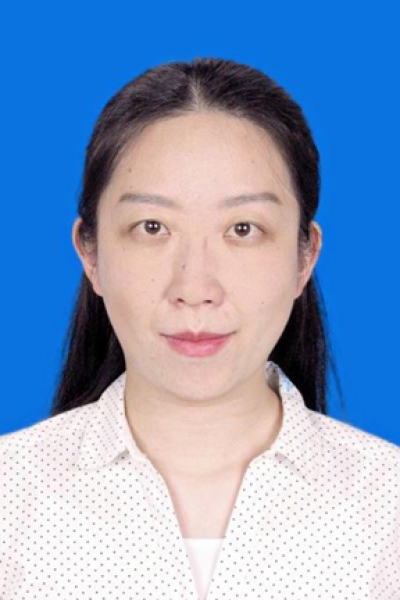

<!-- AUTO-GENERATED-BY: work/generate_obsidian_profiles.py -->

# 刘澍

## 基础信息

| 字段 | 内容 |
|---|---|
| 医院 | 中山大学肿瘤防治中心 |
| 姓名 | 刘澍 |
| 科室 | 药学部 |
| 职称/身份 | 副主任药师、药理学博士 |
| 重点优先级 | 高 |
| 来源类型 | 医院官网 |
| 来源链接 | [官网原文](https://www.sysucc.org.cn/node/6423) |
| 采集日期 | 2026-08-10 |
| 复核状态 | 待人工复核 |
| 异常提示 |  |

## 简介/擅长

淋巴瘤的个体化用药管理、新型抗肿瘤药物血药浓度监测、复杂联合用药管理、不良反应判断及防治 中山大学药理学博士，副主任药师，美国临床药学会 ACCP —肿瘤药物治疗临床实践与技能应用培训认证药师。长期致力于靶向药物血药浓度监测、药物基因组学、个体化用药方案设计的研究。在淋巴瘤的全程药学监护、复杂联合用药管理、不良反应鉴定有丰富经验。以一作发表论文 13 篇于 Acta Pharmacol Sin 、 Front Pharmacol 、 CTS-Clin Transl Sci 等业内权威杂志。主持国家自然科学基金、广州市科技计划项目、广东省医学科学基金、 中华医学会吴阶平基金 等科研项目十余项。参编《超药品说明书用药诉讼案例分析》、《药师处方审核培训教材》、《防癌抗癌药知道》等书籍。目前在多个学术团体担任社会兼职，包括广东省医院协会医院药事管理专委会青委会副主委、广东省药学会药物治疗学专委会青委会秘书、广东省药学会肿瘤用药专委会委员、广东省精准医学应用学会精准用药分会委员等。先后获广东省“最美医院药师”，南区五省临床药师英文文献分享赛一等奖，“健康护航者”药师临床用药建议案例点评大赛一等奖及多次获全国学术年会优秀论文奖。 ...

## 详情正文摘录

临床专家 面包屑 首页 / 临床科室 / 平台科室 / 药学部 / 临床专家 刘澍 职称：副主任药师、药理学博士 专长 淋巴瘤的个体化用药管理、新型抗肿瘤药物血药浓度监测、复杂联合用药管理、不良反应判断及防治 中山大学药理学博士，副主任药师，美国临床药学会 ACCP —肿瘤药物治疗临床实践与技能应用培训认证药师。长期致力于靶向药物血药浓度监测、药物基因组学、个体化用药方案设计的研究。在淋巴瘤的全程药学监护、复杂联合用药管理、不良反应鉴定有丰富经验。以一作发表论文 13 篇于 Acta Pharmacol Sin 、 Front Pharmacol 、 CTS-Clin Transl Sci 等业内权威杂志。主持国家自然科学基金、广州市科技计划项目、广东省医学科学基金、 中华医学会吴阶平基金 等科研项目十余项。参编《超药品说明书用药诉讼案例分析》、《药师处方审核培训教材》、《防癌抗癌药知道》等书籍。目前在多个学术团体担任社会兼职，包括广东省医院协会医院药事管理专委会青委会副主委、广东省药学会药物治疗学专委会青委会秘书、广东省药学会肿瘤用药专委会委员、广东省精准医学应用学会精准用药分会委员等。先后获广东省“最美医院药师”，南区五省临床药师英文文献分享赛一等奖，“健康护航者”药师临床用药建议案例点评大赛一等奖及多次获全国学术年会优秀论文奖。 加载更多 副主任药师，中山大学药理学博士，美国临床药学会ACCP—肿瘤药物治疗临床实践与技能应用培训认证药师，国家卫计委临床药师培训基地带教老师。长期致力于靶向药物血药浓度监测、药物基因组学、个体化用药方案设计的研究。发表SCI论文20余篇，其中一作13篇于Acta Pharmacol Sin、Front Pharmacol、CTS-Clin Transl Sci等业内权威杂志。作为项目负责人先后主持国家自然科学基金、广州市科技计划项目、广东省医学科学基金、中华医学会吴阶平基金等科研项目十余项。作为主要参与人参加国家自然科学基金面上项目多项。参编《超药品说明书用药诉讼案例分析》、《药师处方审核培训教材》、《防癌抗癌药知道》等书籍。荣获广…

## 重点关注范围

- 肿瘤
- 疑难重症

## 重点疾病标签

- 肿瘤
- 癌
- 淋巴瘤
- 靶向
- 复杂

## 亮眼经历线索

- 淋巴瘤的个体化用药管理、新型抗肿瘤药物血药浓度监测、复杂联合用药管理、不良反应判断及防治 中山大学药理学博士，副主任药师，美国临床药学会 ACCP —肿瘤药物治疗临床实践与技能应用培训认证药师。
- 以一作发表论文 13 篇于 Acta Pharmacol Sin 、 Front Pharmacol 、 CTS-Clin Transl Sci 等业内权威杂志。
- 主持国家自然科学基金、广州市科技计划项目、广东省医学科学基金、 中华医学会吴阶平基金 等科研项目十余项。
- 目前在多个学术团体担任社会兼职，包括广东省医院协会医院药事管理专委会青委会副主委、广东省药学会药物治疗学专委会青委会秘书、广东省药学会肿瘤用药专委会委员、广东省精准医学应用学会精准用药分会委员等。

## 异常提示

## 合规边界

- 本画像仅整理统一总底表中的医院官网公开字段。
- 不包含患者评价、排名、第三方来源内容或疗效承诺。
- 官网未展示的信息保持空白，后续如需补充须回到底表官方来源字段。
