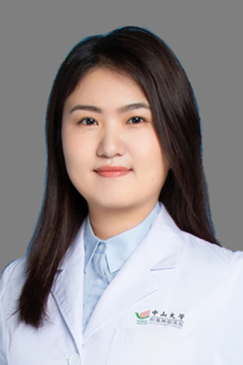

<!-- AUTO-GENERATED-BY: work/generate_obsidian_profiles.py -->

# 刘睿奇

## 基础信息

| 字段 | 内容 |
|---|---|
| 医院 | 中山大学肿瘤防治中心 |
| 姓名 | 刘睿奇 |
| 科室 | 放疗科 |
| 职称/身份 | 副主任医师，博士 |
| 重点优先级 | 高 |
| 来源类型 | 医院官网 |
| 来源链接 | [官网原文](https://www.sysucc.org.cn/node/6216) |
| 采集日期 | 2026-08-10 |
| 复核状态 | 待人工复核 |
| 异常提示 |  |

## 简介/擅长

泌尿男生殖系统肿瘤的放疗及多学科综合治疗 基本情况：中山大学肿瘤防治中心，放疗科，副主任医师，博士 学习及工作经历：2018年毕业于复旦大学上海医学院临床医学专业（八年制），取得肿瘤学博士学位。2018年入职中山大学肿瘤防治中心放疗科，现任放疗科主治医师。 专业特长：泌尿男生殖系统肿瘤的放疗及多学科综合治疗。共发表学术论文12篇，其中以第一作者及共同第一作者身份发表SCI论文6篇，代表作发表在：Journal for immunotherapy of cancer、Cancer Letter、Cellular Physiology and Biochemistry等杂志上。主持国自然青年基金1项。 加载更多 基本情况：中山大学肿瘤防治中心，放疗科，副主任医师，博士 学习及工作经历：2018年毕业于复旦大学上海医学院临床医学专业（八年制），取得肿瘤学博士学位。2018年入职中山大学肿瘤防治中心放疗科，现任放疗科主治医师。 专业特长：泌尿男生殖系统肿瘤的放疗及多学科综合治疗。共发表学术论文12篇，其中以第一作者及共同第一作者身份发表SCI论文6篇，代表作发表在：Journal for immunotherapy of ca...

## 详情正文摘录

临床专家 面包屑 首页 / 临床科室 / 放疗系列 / 放疗科 / 临床专家 刘睿奇 职称：副主任医师，博士 专长 泌尿男生殖系统肿瘤的放疗及多学科综合治疗 基本情况：中山大学肿瘤防治中心，放疗科，副主任医师，博士 学习及工作经历：2018年毕业于复旦大学上海医学院临床医学专业（八年制），取得肿瘤学博士学位。2018年入职中山大学肿瘤防治中心放疗科，现任放疗科主治医师。 专业特长：泌尿男生殖系统肿瘤的放疗及多学科综合治疗。共发表学术论文12篇，其中以第一作者及共同第一作者身份发表SCI论文6篇，代表作发表在：Journal for immunotherapy of cancer、Cancer Letter、Cellular Physiology and Biochemistry等杂志上。主持国自然青年基金1项。 加载更多 基本情况：中山大学肿瘤防治中心，放疗科，副主任医师，博士 学习及工作经历：2018年毕业于复旦大学上海医学院临床医学专业（八年制），取得肿瘤学博士学位。2018年入职中山大学肿瘤防治中心放疗科，现任放疗科主治医师。 专业特长：泌尿男生殖系统肿瘤的放疗及多学科综合治疗。共发表学术论文12篇，其中以第一作者及共同第一作者身份发表SCI论文6篇，代表作发表在：Journal for immunotherapy of cancer、Cancer Letter、Cellular Physiology and Biochemistry等杂志上。主持国自然青年基金1项。 更新时间：2023年5月15日

## 重点关注范围

- 肿瘤
- 生殖疾病
- 疑难重症

## 重点疾病标签

- 肿瘤
- 放疗
- 生殖
- 多学科

## 亮眼经历线索

- 副主任医师，博士 泌尿男生殖系统肿瘤的放疗及多学科综合治疗 基本情况：中山大学肿瘤防治中心，放疗科，副主任医师，博士 学习及工作经历：2018年毕业于复旦大学上海医学院临床医学专业（八年制），取得肿瘤学博士学位。
- 专业特长：泌尿男生殖系统肿瘤的放疗及多学科综合治疗。
- 共发表学术论文12篇，其中以第一作者及共同第一作者身份发表SCI论文6篇，代表作发表在：Journal for immunotherapy of cancer、Cancer Letter、Cellular Physiology and Biochemistry等杂志上。

## 异常提示

## 合规边界

- 本画像仅整理统一总底表中的医院官网公开字段。
- 不包含患者评价、排名、第三方来源内容或疗效承诺。
- 官网未展示的信息保持空白，后续如需补充须回到底表官方来源字段。
