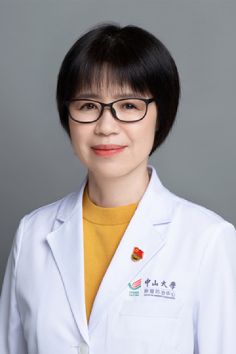

<!-- AUTO-GENERATED-BY: work/generate_obsidian_profiles.py -->

<!-- TEMPLATE: D:\workspace\信息收集整理\医生画像仓库\模板\医生画像模板.md -->

# 刘继红

## 基础信息

| 字段 | 内容 |
|---|---|
| 姓名 | 刘继红 |
| 医院 | 中山大学肿瘤防治中心 |
| 科室 | 妇科 |
| 职称/身份 | 科主任导师 职称：主任医师、教授、博士生导师、宫颈癌首席专家 |
| 来源链接 | [官网原文](https://www.sysucc.org.cn/node/3691) |
| 采集日期 | 2026-08-10 |

## 简介/擅长

妇科肿瘤的诊断与治疗

## 教育与进修经历

- 1984年7月毕业于中山医科大学医学系，在该校附属肿瘤医院妇科从事临床医疗工作至今。
- 1993年在中山医科大学获医学硕士学位, 2004年在澳大利亚悉尼大学获博士学位。
- 在国外留学期间，主要进行了宫颈癌及其癌前病变病因学的分子流行病学研究，对人乳头状瘤病毒（HPV）感染与宫颈癌的关系进行了深入的研究，并系统了解了国外妇科肿瘤的临床诊治现状。

## 科研项目与成果

- 1997年10月起任妇科副主任，2004年10月至2008年10月任中山大学肿瘤医院副院长，主管科研和信息工作。
- 主要学术团体任职和社会兼职：中华医学会妇科肿瘤学分会（CGOG）副主任委员，中国抗癌协会妇科肿瘤专业委员会副主任委员，中国抗癌协会家族遗传性肿瘤协作组副主任委员，中国优生科学协会阴道镜和宫颈病理学分会（CSCCP）副主任委员，广东省医学会妇产科学分会主任委员、妇科肿瘤学组组长，广东省抗癌协会妇科肿瘤专业委员会首届主任委员、常务副主任委员，广东省医院协会肿瘤防治管理分会妇科肿瘤专业委员会主任委员，卫生部癌症早诊早治项目专家委员会子宫颈癌专家组成员，卫生部重大公共卫生服务项目妇幼卫生项目管理专家组成员，中国医师协会妇…

## 论文与学术产出

- 发表的第一作者和通讯作者文章（近5年）： 1.Feng Y, He F, Yan S, Huang H, Huang Q, Deng T, Wu H, Gao B, Liu J（*）. The Role of GOLPH3L in the Prognosis and NACT response in Cervical Cancer. J Cancer. 2017 Feb 10;

## 可包装亮点

- 科主任导师 职称：主任医师、教授、博士生导师、宫颈癌首席专家 刘继红 职务：科主任导师 职称：主任医师、教授、博士生导师、宫颈癌首席专家 专长 妇科肿瘤的诊断与治疗 一、基本情况 职称：主任医师、教授、博士生导师、宫颈癌首席专家 职务：妇科 科主任导师 专家门诊时间：周一下午、周三上午 专业特长：擅长对早期妇科恶性肿瘤保留生育功能的治疗和对晚期及复发性妇科…
- 二、学习及工作经历： 1979年—1984年：中山医科大学就读 1990年—1993年：中山医科大学附属肿瘤医院就读硕士研究生 2001年—2004年：悉尼大学就读博士研究生 1984年至今：中山大学附属肿瘤医院工作 现任中山大学（原中山医科大学）肿瘤防治中心妇科主任导师、宫颈癌诊治单病种管理首席专家。
- 2006年11月起兼任妇科主任。

## 重点疾病/人群标签

- 慢性病：
- 肿瘤：肿瘤、癌、瘤、卵巢、感染
- 生殖疾病：肿瘤、癌、瘤、卵巢、感染
- 免疫/风湿：肿瘤、癌、瘤、卵巢、感染
- 术后恢复/康复：
- 疑难重症：

## 证据摘录

> 只摘录官网公开信息中的短句或关键字段，不复制大段原文。

- 官网身份字段：科主任导师 职称：主任医师、教授、博士生导师、宫颈癌首席专家
- 官网简介/擅长：妇科肿瘤的诊断与治疗
- 官网亮眼经历线索：科主任导师 职称：主任医师、教授、博士生导师、宫颈癌首席专家 刘继红 职务：科主任导师 职称：主任医师、教授、博士生导师、宫颈癌首席专家 专长 妇科肿瘤的诊断与治疗 一、基本情况 职称：主任医师、教授、博士生导师、宫颈癌首席专家 职务：妇科 科主任导师 专家门诊时间：周一下午、周三上午 专业特长：擅长对早期妇科恶性肿瘤保留生育功能的治疗和对晚期及复发性妇科 恶性肿瘤的诊治。 二、学习及工作经历： 1979年—1984年：中山医科大学就…
- 异常提示：亮眼经历含导航文本，已清洗
- 来源链接：https://www.sysucc.org.cn/node/3691

## BD 画像摘要

刘继红医生可作为肿瘤、生殖疾病、免疫/风湿/感染方向的基础画像候选。后续 BD 使用应继续以官网来源和人工复核为准，不添加疗效承诺或无来源包装。

## 合规边界

- 仅使用医院官网、官方公众号、官方小程序等公开渠道。
- 不采集私人电话、私人微信、家庭住址、患者隐私或非公开排班信息。
- 不写“保证治愈”“疗效第一”“包治疑难杂症”等无法由官网证明的表述。
