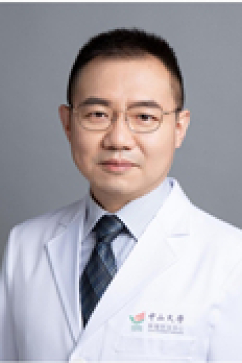

<!-- AUTO-GENERATED-BY: work/generate_obsidian_profiles.py -->

<!-- TEMPLATE: D:\workspace\信息收集整理\医生画像仓库\模板\医生画像模板.md -->

# 刘隆忠

## 基础信息

| 字段 | 内容 |
|---|---|
| 姓名 | 刘隆忠 |
| 医院 | 中山大学肿瘤防治中心 |
| 科室 | 超声科 |
| 职称/身份 | 主任医师，博士生导师 |
| 来源链接 | [官网原文](https://www.sysucc.org.cn/node/3898) |
| 采集日期 | 2026-08-10 |

## 简介/擅长

擅长甲状腺癌及其颈部淋巴结转移的术前诊断与术后复发的超声诊断及介入诊断治疗。

## 教育与进修经历

- 二、教育及工作经历 2002年获中山大学影像医学与核医学硕士学位 2008年获中山大学临床医学博士学位 2008.8-2009.7 日本东京医科大学附属医院访问学者 2002年起，中山大学肿瘤防治中心超声科工作 三、学术兼职 广东省抗癌协会甲状腺专委会 常委 广东省健康管理学会甲状腺专委会 常委 四、主持科研项目 目前主持在研国家自然科学基金面上项目一项（2023年），广东省自然科学基金面上项目2项（2021年、2023年），基金研究内容均属甲状腺领域。

## 科研项目与成果

- 二、教育及工作经历 2002年获中山大学影像医学与核医学硕士学位 2008年获中山大学临床医学博士学位 2008.8-2009.7 日本东京医科大学附属医院访问学者 2002年起，中山大学肿瘤防治中心超声科工作 三、学术兼职 广东省抗癌协会甲状腺专委会 常委 广东省健康管理学会甲状腺专委会 常委 四、主持科研项目 目前主持在研国家自然科学基金面上项目一项（2023年），广东省自然科学基金面上项目2项（2021年、2023年），基金研究内容均属甲状腺领域。

## 论文与学术产出

- 五、代表性论著 近五年来，以第一作者/通讯作者（含共同）发表SCI论文15篇，包括Radiology, Lancet Digital Health，Thyroid等中科院1区Top杂志。
- 其中，2023年4月关于示卓安超声造影评估甲状腺癌侧颈小淋巴结转移的前瞻性研究发表于Radiology；
- 2021年3月基于甲状腺超声图像构建AI诊断模型Thynet，并结合Thynet和ACR TI-RADS指南构建的AI辅助决策模型一文发表于Lancet Digital Health；
- 2018年8月发表影像组学与TI-RADS分类评估甲状腺癌的比较研究一文于美国甲状腺协会会刊Thyroid杂志。

## 可包装亮点

- 主任医师，博士生导师 刘隆忠 职称：主任医师，博士生导师 专长 擅长甲状腺癌及其颈部淋巴结转移的术前诊断与术后复发的超声诊断及介入诊断治疗。
- 二、教育及工作经历 2002年获中山大学影像医学与核医学硕士学位 2008年获中山大学临床医学博士学位 2008.8-2009.7 日本东京医科大学附属医院访问学者 2002年起，中山大学肿瘤防治中心超声科工作 三、学术兼职 广东省抗癌协会甲状腺专委会 常委 广东省健康管理学会甲状腺专委会 常委 四、主持科研项目 目前主持在研国家自然科学基金面上项目一项（…
- 五、代表性论著 近五年来，以第一作者/通讯作者（含共同）发表SCI论文15篇，包括Radiology, Lancet Digital Health，Thy...

## 重点疾病/人群标签

- 慢性病：
- 肿瘤：肿瘤、癌、术后
- 生殖疾病：
- 免疫/风湿：
- 术后恢复/康复：肿瘤、癌、术后
- 疑难重症：

## 证据摘录

> 只摘录官网公开信息中的短句或关键字段，不复制大段原文。

- 官网身份字段：主任医师，博士生导师
- 官网简介/擅长：擅长甲状腺癌及其颈部淋巴结转移的术前诊断与术后复发的超声诊断及介入诊断治疗。
- 官网亮眼经历线索：主任医师，博士生导师 刘隆忠 职称：主任医师，博士生导师 专长 擅长甲状腺癌及其颈部淋巴结转移的术前诊断与术后复发的超声诊断及介入诊断治疗。 二、教育及工作经历 2002年获中山大学影像医学与核医学硕士学位 2008年获中山大学临床医学博士学位 2008.8-2009.7 日本东京医科大学附属医院访问学者 2002年起，中山大学肿瘤防治中心超声科工作 三、学术兼职 广东省抗癌协会甲状腺专委会 常委 广东省健康管理学会甲状腺专委会 常委…
- 异常提示：亮眼经历含导航文本，已清洗
- 来源链接：https://www.sysucc.org.cn/node/3898

## BD 画像摘要

刘隆忠医生可作为肿瘤、术后恢复/康复方向的基础画像候选。后续 BD 使用应继续以官网来源和人工复核为准，不添加疗效承诺或无来源包装。

## 合规边界

- 仅使用医院官网、官方公众号、官方小程序等公开渠道。
- 不采集私人电话、私人微信、家庭住址、患者隐私或非公开排班信息。
- 不写“保证治愈”“疗效第一”“包治疑难杂症”等无法由官网证明的表述。
