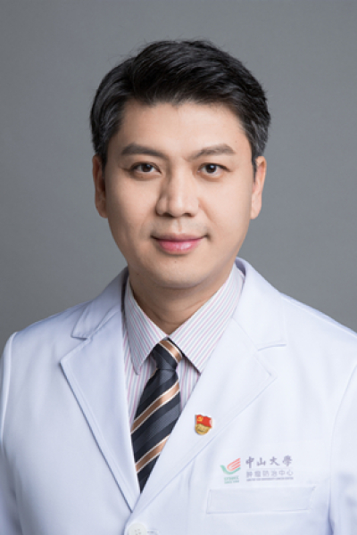

<!-- AUTO-GENERATED-BY: work/generate_obsidian_profiles.py -->

<!-- TEMPLATE: D:\workspace\信息收集整理\医生画像仓库\模板\医生画像模板.md -->

# 卢震海

## 基础信息

| 字段 | 内容 |
|---|---|
| 姓名 | 卢震海 |
| 医院 | 中山大学肿瘤防治中心 |
| 科室 | 结直肠科 |
| 职称/身份 | 党支部书记 职称：主任医师、博士研究生导师 |
| 来源链接 | [官网原文](https://www.sysucc.org.cn/node/3681) |
| 采集日期 | 2026-08-10 |

## 简介/擅长

擅长结直肠癌的手术治疗，尤其是结直肠肿瘤的腹腔镜微创治疗以及结直肠癌的综合治疗，包括结直肠癌的早期诊断、分期、治疗及预后的研究，结直肠癌肝转移的转化研究以及综合治疗、多学科治疗。局部进展期直肠癌的综合治疗，包括直肠癌新辅助治疗方案的选择、手术治疗以及术后辅助治疗。遗传性大肠癌的基础和临床研究，胃肠道间质瘤的临床研究。

## 教育与进修经历

- 周五上午（越秀） 二、学习及工作经历 2007-03 至今 中山大学附属肿瘤医院腹科（现为结直肠科） 党支部书记 2020-03 至今 中山大学附属肿瘤医院结直肠科 主任医师 2019-09至2020-02 香港大学玛丽医院 进修 2016-12至2019-08 中山大学附属肿瘤医院结直肠科 主任医师 2011-12至2016-11 中山大学附属肿瘤医院结直肠科 副主任医师 2009-11至2011-11 中山大学附属肿瘤医院腹科 主治医师 2009-07至2009-10 莫纳什大学Sourthen Health…

## 科研项目与成果

- 四、主持科研项目 1. 中山大学，5010临床研究项目，优化中低位直肠癌新辅助放化疗方案的前瞻性研究，2013-08至2023-08 2. 临床研究 XELOX和单药卡培他滨交替化疗联合术前调强放疗的三明治方案治疗pMMR局部进展期直肠癌的单臂Ⅱ期临床试验 2021-06至今 3. 临床研究 结直肠癌肝转移后线治疗药物筛选与获得性耐药分子机制探索性研究 2021-07至今 4. 临床研究 基于高通量测序技术探索血浆 cfDNA 在结直肠癌 患者早期筛查中的应用价值 2022-08 至今 更新日期：2022年10月…

## 可包装亮点

- 党支部书记 职称：主任医师、博士研究生导师 擅长结直肠癌的手术治疗，尤其是结直肠肿瘤的腹腔镜微创治疗以及结直肠癌的综合治疗，包括结直肠癌的早期诊断、分期、治疗及预后的研究，结直肠癌肝转移的转化研究以及综合治疗、多学科治疗。
- 卢震海 职务：党支部书记 职称：主任医师、博士研究生导师 专长 擅长结直肠癌的手术治疗，尤其是结直肠肿瘤的腹腔镜微创治疗以及结直肠癌的综合治疗，包括结直肠癌的早期诊断、分期、治疗及预后的研究，结直肠癌肝转移的转化研究以及综合治疗、多学科治疗。
- 职务： 党支部书记 职称： 主任医师、博士研究生导师 专长： 擅长结直肠癌的手术治疗，尤其是结直肠肿瘤的腹腔镜微创治疗以及结直肠癌的综合治疗，包括结直肠癌的早期诊断、分期、治疗及预后的研究，结直肠癌肝转移的转化研究以及综合治疗、多学科治疗。

## 重点疾病/人群标签

- 慢性病：
- 肿瘤：肿瘤、癌、瘤、放疗、化疗、肠癌、术后、康复、多学科
- 生殖疾病：
- 免疫/风湿：
- 术后恢复/康复：肿瘤、癌、瘤、放疗、化疗、肠癌、术后、康复、多学科
- 疑难重症：肿瘤、癌、瘤、放疗、化疗、肠癌、术后、康复、多学科

## 证据摘录

> 只摘录官网公开信息中的短句或关键字段，不复制大段原文。

- 官网身份字段：党支部书记 职称：主任医师、博士研究生导师
- 官网简介/擅长：擅长结直肠癌的手术治疗，尤其是结直肠肿瘤的腹腔镜微创治疗以及结直肠癌的综合治疗，包括结直肠癌的早期诊断、分期、治疗及预后的研究，结直肠癌肝转移的转化研究以及综合治疗、多学科治疗。局部进展期直肠癌的综合治疗，包括直肠癌新辅助治疗方案的选择、手术治疗以及术后辅助治疗。遗传性大肠癌的基础和临床研究，胃肠道间质瘤的临床研究。
- 官网亮眼经历线索：党支部书记 职称：主任医师、博士研究生导师 擅长结直肠癌的手术治疗，尤其是结直肠肿瘤的腹腔镜微创治疗以及结直肠癌的综合治疗，包括结直肠癌的早期诊断、分期、治疗及预后的研究，结直肠癌肝转移的转化研究以及综合治疗、多学科治疗。 卢震海 职务：党支部书记 职称：主任医师、博士研究生导师 专长 擅长结直肠癌的手术治疗，尤其是结直肠肿瘤的腹腔镜微创治疗以及结直肠癌的综合治疗，包括结直肠癌的早期诊断、分期、治疗及预后的研究，结直肠癌肝转移的转化研…
- 异常提示：亮眼经历含导航文本，已清洗
- 来源链接：https://www.sysucc.org.cn/node/3681

## BD 画像摘要

卢震海医生可作为肿瘤、术后恢复/康复、疑难重症方向的基础画像候选。后续 BD 使用应继续以官网来源和人工复核为准，不添加疗效承诺或无来源包装。

## 合规边界

- 仅使用医院官网、官方公众号、官方小程序等公开渠道。
- 不采集私人电话、私人微信、家庭住址、患者隐私或非公开排班信息。
- 不写“保证治愈”“疗效第一”“包治疑难杂症”等无法由官网证明的表述。
