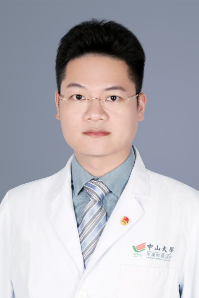

<!-- AUTO-GENERATED-BY: work/generate_obsidian_profiles.py -->

<!-- TEMPLATE: D:\workspace\信息收集整理\医生画像仓库\模板\医生画像模板.md -->

# 危文素

## 基础信息

| 字段 | 内容 |
|---|---|
| 姓名 | 危文素 |
| 医院 | 中山大学肿瘤防治中心 |
| 科室 | 泌尿外科 |
| 职称/身份 | 副主任医师、临床医学博士后、硕士生导师 |
| 来源链接 | [官网原文](https://www.sysucc.org.cn/node/8772) |
| 采集日期 | 2026-08-10 |

## 简介/擅长

熟练掌握各种泌尿系肿瘤的诊治，包括肾癌、膀胱癌、前列腺癌、肾上腺腺瘤、肾上腺嗜铬细胞瘤、睾丸癌等外科手术治疗。

## 教育与进修经历

- 职称：副主任医师、临床医学博士后、硕士生导师 专长 熟练掌握各种泌尿系肿瘤的诊治，包括肾癌、膀胱癌、前列腺癌、肾上腺腺瘤、肾上腺嗜铬细胞瘤、睾丸癌等外科手术治疗。
- 二、教育及工作经历 2008.09-2013.06 湖南师范大学 临床医学 | 本科 2013.09-2016.07 中南大学湘雅三医院 泌尿外科 导师：何乐业教授 外科学 | 硕士 2016.09-2019.07 中山大学肿瘤防治中心泌尿科 导师：周芳坚教授 肿瘤学 | 博士 2019.07-2022.06 中山大学肿瘤防治中心 合作导师：谢丹教授 临床博士后 | 助理研究员 2022.01-2023.12 中山大学肿瘤防治中心 泌尿外科 主治医师 | 助理研究员 2024.01至今 中山大学肿瘤防治中心 泌尿…

## 可包装亮点

- 副主任医师、临床医学博士后、硕士生导师 危文素 职称：副主任医师、临床医学博士后、硕士生导师 专长 熟练掌握各种泌尿系肿瘤的诊治，包括肾癌、膀胱癌、前列腺癌、肾上腺腺瘤、肾上腺嗜铬细胞瘤、睾丸癌等外科手术治疗。
- 一、基本情况 职称： 副主任医师、硕士生导师 专家门诊时间： 周二上午（黄埔院区） 专业特长： 各种泌尿系肿瘤的诊治，包括肾癌、膀胱癌、前列腺癌、肾上腺腺瘤、肾上腺嗜铬细胞瘤、睾丸癌等外科手术治疗。

## 重点疾病/人群标签

- 慢性病：
- 肿瘤：肿瘤、癌、瘤、高危
- 生殖疾病：
- 免疫/风湿：
- 术后恢复/康复：
- 疑难重症：肿瘤、癌、瘤、高危

## 证据摘录

> 只摘录官网公开信息中的短句或关键字段，不复制大段原文。

- 官网身份字段：副主任医师、临床医学博士后、硕士生导师
- 官网简介/擅长：熟练掌握各种泌尿系肿瘤的诊治，包括肾癌、膀胱癌、前列腺癌、肾上腺腺瘤、肾上腺嗜铬细胞瘤、睾丸癌等外科手术治疗。
- 官网亮眼经历线索：副主任医师、临床医学博士后、硕士生导师 危文素 职称：副主任医师、临床医学博士后、硕士生导师 专长 熟练掌握各种泌尿系肿瘤的诊治，包括肾癌、膀胱癌、前列腺癌、肾上腺腺瘤、肾上腺嗜铬细胞瘤、睾丸癌等外科手术治疗。 一、基本情况 职称： 副主任医师、硕士生导师 专家门诊时间： 周二上午（黄埔院区） 专业特长： 各种泌尿系肿瘤的诊治，包括肾癌、膀胱癌、前列腺癌、肾上腺腺瘤、肾上腺嗜铬细胞瘤、睾丸癌等外科手术治疗。
- 异常提示：亮眼经历含导航文本，已清洗
- 来源链接：https://www.sysucc.org.cn/node/8772

## BD 画像摘要

危文素医生可作为肿瘤、疑难重症方向的基础画像候选。后续 BD 使用应继续以官网来源和人工复核为准，不添加疗效承诺或无来源包装。

## 合规边界

- 仅使用医院官网、官方公众号、官方小程序等公开渠道。
- 不采集私人电话、私人微信、家庭住址、患者隐私或非公开排班信息。
- 不写“保证治愈”“疗效第一”“包治疑难杂症”等无法由官网证明的表述。
