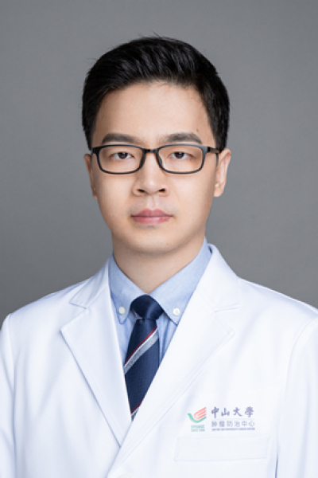

<!-- AUTO-GENERATED-BY: work/generate_obsidian_profiles.py -->

<!-- TEMPLATE: D:\workspace\信息收集整理\医生画像仓库\模板\医生画像模板.md -->

# 双泽宇

## 基础信息

| 字段 | 内容 |
|---|---|
| 姓名 | 双泽宇 |
| 医院 | 中山大学肿瘤防治中心 |
| 科室 | 乳腺科 |
| 职称/身份 | 副主任医师，硕士生导师，肿瘤学博士 |
| 来源链接 | [官网原文](https://www.sysucc.org.cn/node/3746) |
| 采集日期 | 2026-08-10 |

## 简介/擅长

1、乳腺癌各种手术，包括改良根治术、保乳术、前哨淋巴结活检术、乳房重建等， 有完成超过两千台乳腺癌的手术经验，早期乳腺癌治愈率超过90%。 2、乳腺癌经腋窝隐蔽切口：单孔腔镜下保留乳头乳晕皮下腺体全切联合假体重建，单孔腔 镜下保乳等新技术，实现乳腺癌手术的微创化、无痕化。 3、乳腺癌综合治疗，包括化疗、内分泌、靶向、免疫治疗等，制订个体化治疗方案及全程 不良反应管理。 4、乳腺良、恶性疾病的诊治，精通乳腺肿瘤的微创旋切及活检等。 二、社会兼职 中国抗癌协会肿瘤微创治疗专委会乳腺学组委员，中国早期乳腺癌辅助内分泌治疗生活质量协作组青年委员，广东省精准医学应用学会乳腺肿瘤分会常务委员，广东省肿瘤性疾病医疗质量控制中心乳腺癌专家委员会委员，中山大学肿瘤防治中心乳腺癌MDT团队成员，于汕头市中心医院下沉帮扶半年，挂职乳腺疾病诊疗中心副主任。 三、学术成果 主持及参与国家自然科学基金4项，广东省自然科学基金2项，发表国际期刊SCI论文二十余篇，担任多个SCI杂志编委和审稿。 更新日期：2024.02.28

## 教育与进修经历

- 一、基本情况 职称：副主任医师，硕士生导师，肿瘤学博士 博士毕业于中山大学。

## 科研项目与成果

- 三、学术成果 主持及参与国家自然科学基金4项，广东省自然科学基金2项，发表国际期刊SCI论文二十余篇，担任多个SCI杂志编委和审稿。

## 论文与学术产出

- 三、学术成果 主持及参与国家自然科学基金4项，广东省自然科学基金2项，发表国际期刊SCI论文二十余篇，担任多个SCI杂志编委和审稿。

## 可包装亮点

- 副主任医师，硕士生导师，肿瘤学博士 二、社会兼职 中国抗癌协会肿瘤微创治疗专委会乳腺学组委员，中国早期乳腺癌辅助内分泌治疗生活质量协作组青年委员，广东省精准医学应用学会乳腺肿瘤分会常务委员，广东省肿瘤性疾病医疗质量控制中心乳腺癌专家委员会委员，中山大学肿瘤防治中心乳腺癌MDT团队成员，于汕头市中心医院下沉帮扶半年，挂职乳腺疾病诊疗中心副主任。
- 三、学术成果 主持及参与国家自然科学基金4项，广东省自然科学基金2项，发表国际期刊SCI论文二十余篇，担任多个SCI杂志编委和审稿。
- 双泽宇 职称：副主任医师，硕士生导师，肿瘤学博士 专长 乳腺癌外科治疗，腔镜微创手术，包括根治术、保乳保腋窝、腔镜重建、腔镜保乳、乳房整形修复等，完成超两千台手术；

## 重点疾病/人群标签

- 慢性病：
- 肿瘤：肿瘤、癌、化疗、靶向、乳腺癌、免疫、MDT
- 生殖疾病：
- 免疫/风湿：肿瘤、癌、化疗、靶向、乳腺癌、免疫、MDT
- 术后恢复/康复：
- 疑难重症：肿瘤、癌、化疗、靶向、乳腺癌、免疫、MDT

## 证据摘录

> 只摘录官网公开信息中的短句或关键字段，不复制大段原文。

- 官网身份字段：副主任医师，硕士生导师，肿瘤学博士
- 官网简介/擅长：1、乳腺癌各种手术，包括改良根治术、保乳术、前哨淋巴结活检术、乳房重建等， 有完成超过两千台乳腺癌的手术经验，早期乳腺癌治愈率超过90%。 2、乳腺癌经腋窝隐蔽切口：单孔腔镜下保留乳头乳晕皮下腺体全切联合假体重建，单孔腔 镜下保乳等新技术，实现乳腺癌手术的微创化、无痕化。 3、乳腺癌综合治疗，包括化疗、内分泌、靶向、免疫治疗等，制订个体化治疗方案及全程 不良反应管理。 4、乳腺良、恶性疾病的诊治，精通乳腺肿瘤的微创旋切及活检等。 二…
- 官网亮眼经历线索：副主任医师，硕士生导师，肿瘤学博士 二、社会兼职 中国抗癌协会肿瘤微创治疗专委会乳腺学组委员，中国早期乳腺癌辅助内分泌治疗生活质量协作组青年委员，广东省精准医学应用学会乳腺肿瘤分会常务委员，广东省肿瘤性疾病医疗质量控制中心乳腺癌专家委员会委员，中山大学肿瘤防治中心乳腺癌MDT团队成员，于汕头市中心医院下沉帮扶半年，挂职乳腺疾病诊疗中心副主任。 三、学术成果 主持及参与国家自然科学基金4项，广东省自然科学基金2项，发表国际期刊SCI论文…
- 异常提示：亮眼经历含导航文本，已清洗
- 来源链接：https://www.sysucc.org.cn/node/3746

## BD 画像摘要

双泽宇医生可作为肿瘤、免疫/风湿/感染、疑难重症方向的基础画像候选。后续 BD 使用应继续以官网来源和人工复核为准，不添加疗效承诺或无来源包装。

## 合规边界

- 仅使用医院官网、官方公众号、官方小程序等公开渠道。
- 不采集私人电话、私人微信、家庭住址、患者隐私或非公开排班信息。
- 不写“保证治愈”“疗效第一”“包治疑难杂症”等无法由官网证明的表述。
