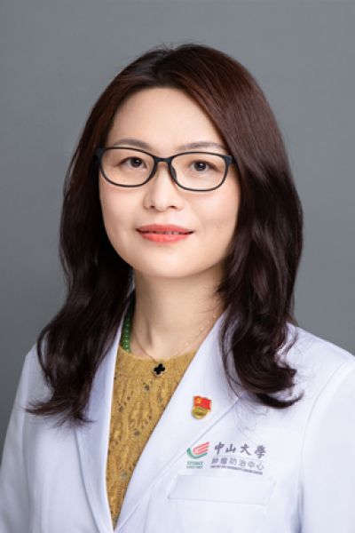

<!-- AUTO-GENERATED-BY: work/generate_obsidian_profiles.py -->

# 史艳侠

## 基础信息

| 字段 | 内容 |
|---|---|
| 医院 | 中山大学肿瘤防治中心 |
| 姓名 | 史艳侠 |
| 科室 | 内科 |
| 职称/身份 | 科副主任 职称：教授、主任医师、医学博士、博士生导师 |
| 重点优先级 | 高 |
| 来源类型 | 医院官网 |
| 来源链接 | [官网原文](https://www.sysucc.org.cn/node/1477) |
| 采集日期 | 2026-08-10 |
| 复核状态 | 待人工复核 |
| 异常提示 |  |

## 简介/擅长

乳腺癌及泌尿生殖系统肿瘤的内科治疗 2004 年毕业于中山大学，获肿瘤学博士学位。2011/06－2011/10在哈佛医学院 Dana-Farber Cancer Institute 乳腺内科学习。2012/02 －2014/02在MD Anderson Cancer Center Genomic Medicine学习。 近五年作为课题负责人承担了科研基金共10项，包括国家重点研发计划、国家自然科学基金2项，参与省部级等科技项目7项。在PNAS,Cancer Research等高水平杂志上发表论文30余篇。2014年获美国国家癌症基金-美中抗癌协会转化医学奖，获 2020年“羊城好医生”,2019年“中国肿瘤内科名医”,2018年 “广东省杰出青年医学人才”称号。 主要工作经历情况： 2001 年9月-2004年7月： 中山大学肿瘤学专业 博士学位 2004 年12月-2007年12月： 中山大学肿瘤防治中心主治医师 2008 年1月-2014年12月： 中山大学肿瘤防治中心副主任医师 2014 年12月2018年7月：中山大学肿瘤防治中心主任医师 2018 年7月至今：中山大学肿瘤防治中心教授、主任医师 2020 年...

## 详情正文摘录

职务：科副主任 职称：教授、主任医师、医学博士、博士生导师 专长 乳腺癌及泌尿生殖系统肿瘤的内科治疗 主要研究方向： 乳腺癌及泌尿生殖系统肿瘤的内科治疗 2004 年毕业于中山大学，获肿瘤学博士学位。2011/06－2011/10在哈佛医学院 Dana-Farber Cancer Institute 乳腺内科学习。2012/02 －2014/02在MD Anderson Cancer Center Genomic Medicine学习。 近五年作为课题负责人承担了科研基金共10项，包括国家重点研发计划、国家自然科学基金2项，参与省部级等科技项目7项。在PNAS,Cancer Research等高水平杂志上发表论文30余篇。2014年获美国国家癌症基金-美中抗癌协会转化医学奖，获 2020年“羊城好医生”,2019年“中国肿瘤内科名医”,2018年 “广东省杰出青年医学人才”称号。 主要工作经历情况： 2001 年9月-2004年7月： 中山大学肿瘤学专业 博士学位 2004 年12月-2007年12月： 中山大学肿瘤防治中心主治医师 2008 年1月-2014年12月： 中山大学肿瘤防治中心副主任医师 2014 年12月2018年7月：中山大学肿瘤防治中心主任医师 2018 年7月至今：中山大学肿瘤防治中心教授、主任医师 2020 年7月至今：中山大学肿瘤防治中心大内科副主任 主要社会兼职情况： 中国临床肿瘤肿瘤协会（CSCO）理事 中国抗癌协会青年常务理事 中国老年保健协会乳腺癌专业委员会主委 中国抗癌协会少见病及原发灶不明肿瘤专委会副主委 中国抗癌协会临床化疗专业委员会常委，青委会常务副主委 广东省医学会肿瘤内科分会主委 广东省临床医学学会泛家族遗传性肿瘤防控专业委员会主委 广东省抗癌协会多原发和不明原发肿瘤专业委员会主委 广东省胸部肿瘤防治研究会乳腺癌分会副主任委员 广东省女医师协会乳腺癌分会副主任委员 主持或参加科研项目（课题）及人才计划项目情况（按时间倒序排序）： 1 、 中…

## 重点关注范围

- 肿瘤
- 生殖疾病
- 免疫/风湿/感染

## 重点疾病标签

- 肿瘤
- 癌
- 化疗
- 乳腺癌
- 生殖
- 免疫

## 亮眼经历线索

- 科副主任 职称：教授、主任医师、医学博士、博士生导师 近五年作为课题负责人承担了科研基金共10项，包括国家重点研发计划、国家自然科学基金2项，参与省部级等科技项目7项。
- 在PNAS,Cancer Research等高水平杂志上发表论文30余篇。
- 2014年获美国国家癌症基金-美中抗癌协会转化医学奖，获 2020年“羊城好医生”,2019年“中国肿瘤内科名医”,2018年 “广东省杰出青年医学人才”称号。

## 异常提示

## 合规边界

- 本画像仅整理统一总底表中的医院官网公开字段。
- 不包含患者评价、排名、第三方来源内容或疗效承诺。
- 官网未展示的信息保持空白，后续如需补充须回到底表官方来源字段。
