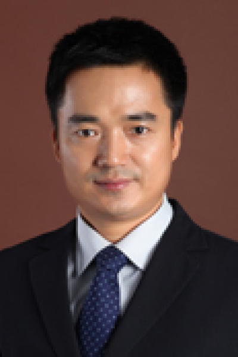

<!-- AUTO-GENERATED-BY: work/generate_obsidian_profiles.py -->

# 叶伟军

## 基础信息

| 字段 | 内容 |
|---|---|
| 医院 | 中山大学肿瘤防治中心 |
| 姓名 | 叶伟军 |
| 科室 | 放疗科 |
| 职称/身份 | 副主任医师，博士 |
| 重点优先级 | 高 |
| 来源类型 | 医院官网 |
| 来源链接 | [官网原文](https://www.sysucc.org.cn/node/1689) |
| 采集日期 | 2026-08-10 |
| 复核状态 | 待人工复核 |
| 异常提示 |  |

## 简介/擅长

肿瘤放射治疗，尤其是妇科肿瘤、鼻咽癌等的精确体外照射及影像引导的自适应近距离放疗（IGABT），化学治疗，生物治疗，中医药治疗及对症支持治疗等。 受教育经历： 1986年9月—1992年7月 广州中山医科大学，医疗系，学士 1997年9月—2000年7月 广州中山医科大学，肿瘤学，硕士 2002年9月—2006年7月 广州中山大学，肿瘤学，博士 工作经历： 1992年8月—1997年8月 广州市第一人民医院，CT/MRI室，住院医师 2000年8月—至今 广州中山大学肿瘤防治中心，放射治疗科，主治医师，副主任医师 ，妇科肿瘤岗主诊教授。 2011年08月—2013年01月 新疆医科大学肿瘤医院，妇瘤放射治疗二病区，援疆干部，挂职科副主任（主持工作）。 加载更多 受教育经历： 1986年9月—1992年7月 广州中山医科大学，医疗系，学士 1997年9月—2000年7月 广州中山医科大学，肿瘤学，硕士 2002年9月—2006年7月 广州中山大学，肿瘤学，博士 工作经历： 1992年8月—1997年8月 广州市第一人民医院，CT/MRI室，住院医师 2000年8月—至今 中山大学肿瘤防治中心，放射治疗科，主治医师，副主任...

## 详情正文摘录

职称：副主任医师，博士 专长 肿瘤放射治疗，尤其是妇科肿瘤、鼻咽癌等的精确体外照射及影像引导的自适应近距离放疗（IGABT），化学治疗，生物治疗，中医药治疗及对症支持治疗等。 受教育经历： 1986年9月—1992年7月 广州中山医科大学，医疗系，学士 1997年9月—2000年7月 广州中山医科大学，肿瘤学，硕士 2002年9月—2006年7月 广州中山大学，肿瘤学，博士 工作经历： 1992年8月—1997年8月 广州市第一人民医院，CT/MRI室，住院医师 2000年8月—至今 广州中山大学肿瘤防治中心，放射治疗科，主治医师，副主任医师 ，妇科肿瘤岗主诊教授。 2011年08月—2013年01月 新疆医科大学肿瘤医院，妇瘤放射治疗二病区，援疆干部，挂职科副主任（主持工作）。 加载更多 受教育经历： 1986年9月—1992年7月 广州中山医科大学，医疗系，学士 1997年9月—2000年7月 广州中山医科大学，肿瘤学，硕士 2002年9月—2006年7月 广州中山大学，肿瘤学，博士 工作经历： 1992年8月—1997年8月 广州市第一人民医院，CT/MRI室，住院医师 2000年8月—至今 中山大学肿瘤防治中心，放射治疗科，主治医师，副主任医师 ，妇科肿瘤岗主诊教授。 2011年08月—2013年01月 新疆医科大学肿瘤医院，妇瘤放射治疗二病区，援疆干部，挂职科副主任（主持工作）。 社会兼职： 广州市抗癌协会放疗专业委员会常务委员，广东省医院管理协会肿瘤防治委员会常务委员。 研究课题： 1.新疆维吾尔自治区自治区科技支疆项目：宫颈癌自适应放疗时机选择及剂量学研究，区外第一承担人，20万元。 2.新疆维吾尔自治区自然科学基面上项目（201233146-16）：食道癌腔内后装施源器的研制、实验研究和临床应用，第1承担人，7万元。 3.2012新疆医科大学创新基金，弥散加权磁共振成像对中晚期宫颈癌盆腔及腹主动脉旁淋巴结转移的诊断研究（XJC201152），第2承担人，2万元。 4.…

## 重点关注范围

- 肿瘤
- 术后恢复/康复

## 重点疾病标签

- 肿瘤
- 癌
- 瘤
- 放疗
- 化疗
- 靶向
- 鼻咽癌
- 术后
- 康复

## 亮眼经历线索

- 副主任医师，博士 受教育经历： 1986年9月—1992年7月 广州中山医科大学，医疗系，学士 1997年9月—2000年7月 广州中山医科大学，肿瘤学，硕士 2002年9月—2006年7月 广州中山大学，肿瘤学，博士 工作经历： 1992年8月—1997年8月 广州市第一人民医院，CT/MRI室，住院医师 2000年8月—至今 广州中山大学肿瘤防治中心…
- 加载更多 受教育经历： 1986年9月—1992年7月 广州中山医科大学，医疗系，学士 1997年9月—2000年7月 广州中山医科大学，肿瘤学，硕士 2002年9月—2006年7月 广州中山大学，肿瘤学，博士 工作经历： 1992年8月—1997年8月 广州市第一人民医院，CT/MRI室，住院医师 2000年8月—至今 中山大学肿瘤防治中心，放射治疗科…
- 社会兼职： 广...

## 异常提示

## 合规边界

- 本画像仅整理统一总底表中的医院官网公开字段。
- 不包含患者评价、排名、第三方来源内容或疗效承诺。
- 官网未展示的信息保持空白，后续如需补充须回到底表官方来源字段。
