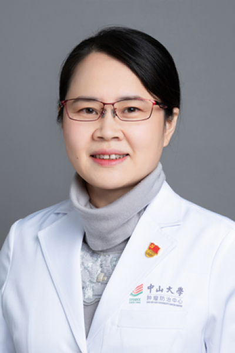

<!-- AUTO-GENERATED-BY: work/generate_obsidian_profiles.py -->

# 向燕群

## 基础信息

| 字段 | 内容 |
|---|---|
| 医院 | 中山大学肿瘤防治中心 |
| 姓名 | 向燕群 |
| 科室 | 鼻咽科 |
| 职称/身份 | 科副主任 职称：教授、主任医师 |
| 重点优先级 | 高 |
| 来源类型 | 医院官网 |
| 来源链接 | [官网原文](https://www.sysucc.org.cn/node/1530) |
| 采集日期 | 2026-08-10 |
| 复核状态 | 待人工复核 |
| 异常提示 |  |

## 简介/擅长

鼻咽癌诊治 1992.9-1999.6 湖南医科大学临床医学七年制 医学学士及医学硕士学位 1999.7-2001.8 中山大学第二附属医院肿瘤科 住院医生 2001.9-2004.6 中山大学肿瘤医院鼻咽癌科 攻读博士学位并获医学博士学位 2004.7-2008.12 中山大学肿瘤医院鼻咽癌科 主治医师 2009.1-2015.12 中山大学肿瘤医院鼻咽癌科 副主任医师 2016.1- 中山大学肿瘤医院鼻咽癌科 教授、主任医师 加载更多 1992.9-1999.6 湖南医科大学临床医学七年制 医学学士及医学硕士学位 1999.7-2001.8 中山大学第二附属医院肿瘤科 住院医生 2001.9-2004.6 中山大学肿瘤医院鼻咽癌科 攻读博士学位并获医学博士学位 2004.7-2008.12 中山大学肿瘤医院鼻咽癌科 主治医师 2009.1-2015.12 中山大学肿瘤医院鼻咽癌科 副主任医师 2016.1- 中山大学肿瘤医院鼻咽癌科 教授 、主任医师 学习经历： 2009．5-7 美国Texas A&M University 学习进修 2009．8 美国University Texas MD Anderson Ca...

## 详情正文摘录

临床专家 面包屑 首页 / 临床科室 / 放疗系列 / 鼻咽科 / 临床专家 向燕群 职务：科副主任 职称：教授、主任医师 专长 鼻咽癌诊治 1992.9-1999.6 湖南医科大学临床医学七年制 医学学士及医学硕士学位 1999.7-2001.8 中山大学第二附属医院肿瘤科 住院医生 2001.9-2004.6 中山大学肿瘤医院鼻咽癌科 攻读博士学位并获医学博士学位 2004.7-2008.12 中山大学肿瘤医院鼻咽癌科 主治医师 2009.1-2015.12 中山大学肿瘤医院鼻咽癌科 副主任医师 2016.1- 中山大学肿瘤医院鼻咽癌科 教授、主任医师 加载更多 1992.9-1999.6 湖南医科大学临床医学七年制 医学学士及医学硕士学位 1999.7-2001.8 中山大学第二附属医院肿瘤科 住院医生 2001.9-2004.6 中山大学肿瘤医院鼻咽癌科 攻读博士学位并获医学博士学位 2004.7-2008.12 中山大学肿瘤医院鼻咽癌科 主治医师 2009.1-2015.12 中山大学肿瘤医院鼻咽癌科 副主任医师 2016.1- 中山大学肿瘤医院鼻咽癌科 教授 、主任医师 学习经历： 2009．5-7 美国Texas A&M University 学习进修 2009．8 美国University Texas MD Anderson Cancer Center学习进修 主要论著： 1. Xiang Y, Yao H, Wang S, Hong M, He J, Cao S, Min H, Song E, Guo X。Prognostic value of Survivin and Livin in nasopharyngeal carcinoma. Laryngoscope, 2006, 116（1）:126-130 2. 向燕群等。TH P、ADM和VP-16诱导CNE-2鼻咽癌细胞凋亡的研究。中山大学学报(医学科学版) 2005，26（3S）：70-72 3. 向燕群等。拓扑异构酶Ⅱ抑制剂诱导SUNE-1鼻咽癌细胞凋亡的研究。中国肿瘤临床2005， 32（…

## 重点关注范围

- 肿瘤

## 重点疾病标签

- 肿瘤
- 癌
- 瘤
- 放疗
- 化疗
- 鼻咽癌
- 肺癌
- 乳腺癌

## 亮眼经历线索

- 科副主任 职称：教授、主任医师 鼻咽癌诊治 1992.9-1999.6 湖南医科大学临床医学七年制 医学学士及医学硕士学位 1999.7-2001.8 中山大学第二附属医院肿瘤科 住院医生 2001.9-2004.6 中山大学肿瘤医院鼻咽癌科 攻读博士学位并获医学博士学位 2004.7-2008.12 中山大学肿瘤医院鼻咽癌科 主治医师 2009.1-20…

## 异常提示

## 合规边界

- 本画像仅整理统一总底表中的医院官网公开字段。
- 不包含患者评价、排名、第三方来源内容或疗效承诺。
- 官网未展示的信息保持空白，后续如需补充须回到底表官方来源字段。
