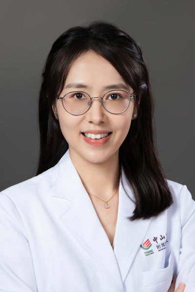

<!-- AUTO-GENERATED-BY: work/generate_obsidian_profiles.py -->

<!-- TEMPLATE: D:\workspace\信息收集整理\医生画像仓库\模板\医生画像模板.md -->

# 吕佳蔚

## 基础信息

| 字段 | 内容 |
|---|---|
| 姓名 | 吕佳蔚 |
| 医院 | 中山大学肿瘤防治中心 |
| 科室 | 放疗科 |
| 职称/身份 | 副主任医师、副研究员 |
| 来源链接 | [官网原文](https://www.sysucc.org.cn/node/9637) |
| 采集日期 | 2026-08-10 |

## 简介/擅长

鼻咽癌及其他头颈部肿瘤（舌癌、牙龈癌、扁桃体癌、喉癌等）的精准放射治疗。

## 教育与进修经历

- 一、教育及工作经历 2021/08–2024/10 | 中山大学肿瘤防治中心 博士后 2018/09–2021/06 | 中山大学肿瘤防治中心 博士 2015/09–2018/06 | 中山大学肿瘤防治中心 硕士 2010/09–2015/06 | 武汉大学临床医学 本科 二、获奖及荣誉 获得金山茶花人民好医生、美国临床肿瘤学会Merit Award等奖励 更新时间：2026.2.26

## 可包装亮点

- 副主任医师、副研究员 鼻咽癌及其他头颈部肿瘤（舌癌、牙龈癌、扁桃体癌、喉癌等）的精准放射治疗。
- 吕佳蔚 职称：副主任医师、副研究员 专长 鼻咽癌及其他头颈部肿瘤（舌癌、牙龈癌、扁桃体癌、喉癌等）的精准放射治疗。
- 一、教育及工作经历 2021/08–2024/10 | 中山大学肿瘤防治中心 博士后 2018/09–2021/06 | 中山大学肿瘤防治中心 博士 2015/09–2018/06 | 中山大学肿瘤防治中心 硕士 2010/09–2015/06 | 武汉大学临床医学 本科 二、获奖及荣誉 获得金山茶花人民好医生、美国临床肿瘤学会Merit Award等奖励…

## 重点疾病/人群标签

- 慢性病：
- 肿瘤：肿瘤、癌、放疗、鼻咽癌
- 生殖疾病：
- 免疫/风湿：
- 术后恢复/康复：
- 疑难重症：

## 证据摘录

> 只摘录官网公开信息中的短句或关键字段，不复制大段原文。

- 官网身份字段：副主任医师、副研究员
- 官网简介/擅长：鼻咽癌及其他头颈部肿瘤（舌癌、牙龈癌、扁桃体癌、喉癌等）的精准放射治疗。
- 官网亮眼经历线索：副主任医师、副研究员 鼻咽癌及其他头颈部肿瘤（舌癌、牙龈癌、扁桃体癌、喉癌等）的精准放射治疗。 吕佳蔚 职称：副主任医师、副研究员 专长 鼻咽癌及其他头颈部肿瘤（舌癌、牙龈癌、扁桃体癌、喉癌等）的精准放射治疗。 一、教育及工作经历 2021/08–2024/10 | 中山大学肿瘤防治中心 博士后 2018/09–2021/06 | 中山大学肿瘤防治中心 博士 2015/09–2018/06 | 中山大学肿瘤防治中心 硕士 2010/0…
- 异常提示：亮眼经历含导航文本，已清洗
- 来源链接：https://www.sysucc.org.cn/node/9637

## BD 画像摘要

吕佳蔚医生可作为肿瘤方向的基础画像候选。后续 BD 使用应继续以官网来源和人工复核为准，不添加疗效承诺或无来源包装。

## 合规边界

- 仅使用医院官网、官方公众号、官方小程序等公开渠道。
- 不采集私人电话、私人微信、家庭住址、患者隐私或非公开排班信息。
- 不写“保证治愈”“疗效第一”“包治疑难杂症”等无法由官网证明的表述。
