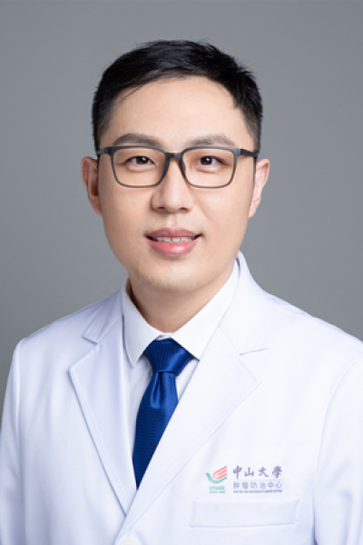

<!-- AUTO-GENERATED-BY: work/generate_obsidian_profiles.py -->

<!-- TEMPLATE: D:\workspace\信息收集整理\医生画像仓库\模板\医生画像模板.md -->

# 吕宁

## 基础信息

| 字段 | 内容 |
|---|---|
| 姓名 | 吕宁 |
| 医院 | 中山大学肿瘤防治中心 |
| 科室 | 微创介入治疗科 |
| 职称/身份 | 主任医师 |
| 来源链接 | [官网原文](https://www.sysucc.org.cn/node/3759) |
| 采集日期 | 2026-08-10 |

## 简介/擅长

肝癌介入肝动脉灌注和栓塞治疗，癌症消融治疗，全身免疫靶向治疗。

## 科研项目与成果

- 学术成绩： 在肿瘤多学科综合诊疗MDT理念下，开展肝癌微创介入治疗临床和转化研究，主要创新性成果介入肝动脉灌注化疗HAIC技术被国家卫健委官方指南《原发性肝癌诊疗指南CNLC》及中国抗癌协会CACA、中国临床肿瘤学会CSCO等推荐在临床一线治疗中应用；
- 主持国家自然科学基金2项；

## 论文与学术产出

- 以实际第一或通讯作者发表论文多篇，主要包括JCO、Nat Commun、Gut、J Hepatol等，其中ESI高被引论文3篇。
- 40(5):468-480.（ESI高被引论文） 2. He M, Liu Y, Chen S, Deng H, Feng C, Qiao S, Chen Q, Hu Y, Chen H, Wang X, Jiang X, Xia X, Zhao M, Lyu N(最后通讯) . Serum amyloid A promotes glycolysis of neutrophils during PD-1 blockade resistance in hepatocellular carcinoma. Nature…
- 15(1):1754.（ESI高被引论文） 3. Lyu N(第一作者) , Kong Y, Mu L, Lin Y, Li J, Liu Y, Zhang Z, Zheng L, Deng H, Li S, Xie Q, Guo R, Shi M, Xu L, Cai X, Wu P, Zhao M. Hepatic arterial infusion of oxaliplatin plus f...

## 可包装亮点

- 主任医师 吕宁 职称：主任医师 专长 肝癌介入肝动脉灌注和栓塞治疗，癌症消融治疗，全身免疫靶向治疗。
- 一、基本情况 主任医师、医学博士、硕士生导师 门诊时间： 越秀院区：周二上午 专业特长： 擅长肝癌微创介入治疗、免疫靶向治疗等综合治疗，主要开展肝动脉灌注化疗HAIC、栓塞化疗TACE、消融等局部治疗，及局部联合免疫靶向全身治疗。
- 学术成绩： 在肿瘤多学科综合诊疗MDT理念下，开展肝癌微创介入治疗临床和转化研究，主要创新性成果介入肝动脉灌注化疗HAIC技术被国家卫健委官方指南《原发性肝癌诊疗指南CNLC》及中国抗癌协会CACA、中国临床肿瘤学会CSCO等推荐在临床一线治疗中应用；

## 重点疾病/人群标签

- 慢性病：
- 肿瘤：肿瘤、癌、化疗、靶向、肝癌、免疫、多学科、MDT
- 生殖疾病：
- 免疫/风湿：肿瘤、癌、化疗、靶向、肝癌、免疫、多学科、MDT
- 术后恢复/康复：
- 疑难重症：肿瘤、癌、化疗、靶向、肝癌、免疫、多学科、MDT

## 证据摘录

> 只摘录官网公开信息中的短句或关键字段，不复制大段原文。

- 官网身份字段：主任医师
- 官网简介/擅长：肝癌介入肝动脉灌注和栓塞治疗，癌症消融治疗，全身免疫靶向治疗。
- 官网亮眼经历线索：主任医师 吕宁 职称：主任医师 专长 肝癌介入肝动脉灌注和栓塞治疗，癌症消融治疗，全身免疫靶向治疗。 一、基本情况 主任医师、医学博士、硕士生导师 门诊时间： 越秀院区：周二上午 专业特长： 擅长肝癌微创介入治疗、免疫靶向治疗等综合治疗，主要开展肝动脉灌注化疗HAIC、栓塞化疗TACE、消融等局部治疗，及局部联合免疫靶向全身治疗。 学术成绩： 在肿瘤多学科综合诊疗MDT理念下，开展肝癌微创介入治疗临床和转化研究，主要创新性成果介入肝动…
- 异常提示：亮眼经历含导航文本，已清洗
- 来源链接：https://www.sysucc.org.cn/node/3759

## BD 画像摘要

吕宁医生可作为肿瘤、免疫/风湿/感染、疑难重症方向的基础画像候选。后续 BD 使用应继续以官网来源和人工复核为准，不添加疗效承诺或无来源包装。

## 合规边界

- 仅使用医院官网、官方公众号、官方小程序等公开渠道。
- 不采集私人电话、私人微信、家庭住址、患者隐私或非公开排班信息。
- 不写“保证治愈”“疗效第一”“包治疑难杂症”等无法由官网证明的表述。
