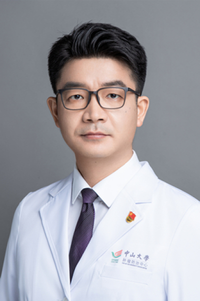

<!-- AUTO-GENERATED-BY: work/generate_obsidian_profiles.py -->

# 吕星

## 基础信息

| 字段 | 内容 |
|---|---|
| 医院 | 中山大学肿瘤防治中心 |
| 姓名 | 吕星 |
| 科室 | 鼻咽科 |
| 职称/身份 | 中山大学肿瘤防治中心鼻咽科师生第二党支部书记，中山大学肿瘤防治中心人工智能实验室特聘临床专家，院职代会常设委员会委员。 职称：主任医师 |
| 重点优先级 | 高 |
| 来源类型 | 医院官网 |
| 来源链接 | [官网原文](https://www.sysucc.org.cn/node/1642) |
| 采集日期 | 2026-08-10 |
| 复核状态 | 待人工复核 |
| 异常提示 |  |

## 简介/擅长

鼻咽癌的个体化综合治疗及人工智能辅助诊断、治疗鼻咽癌 研究工作经历 2006～2011 中山大学 肿瘤学 硕博连读 2011～2012 住院医师 中山大学肿瘤防治中心 2012～2017 主治医师 中山大学肿瘤防治中心 2015~ 2021 科室秘书 中山大学肿瘤防治中心 2018～2022 副主任医师 中山大学肿瘤防治中心 2022/12至今，主任医师 中山大学肿瘤防治中心 学术兼职 中国医师协会放疗专业委员会 青年委员 中国抗癌协会肿瘤微环境专业委员会 青年委员 广东省抗癌协会放疗专业委员会青委会 副主任委员 广东省抗癌协会鼻咽癌专业委员会 青年委员 广东省医疗行业协会耳鼻喉头颈外科管理委员会 常委委员 广东省器官医学与技术学会肿瘤放疗专业委员会 副主任委员 广州市荔湾区医疗保健专家 顾问 加载更多 职务：中山大学肿瘤防治中心鼻咽科师生第二党支部书记，中山大学肿瘤防治中心人工智能实验室特聘临床专家，院职代会常设委员会委员。 职称：副主任医师 专长：鼻咽癌的个体化综合治疗及人工智能辅助诊断、治疗鼻咽癌 研究工作经历 2006～2011 中山大学 肿瘤学 硕博连读 2011～2012 住院医师 中山大学肿瘤防治中心 2...

## 详情正文摘录

临床专家 面包屑 首页 / 临床科室 / 放疗系列 / 鼻咽科 / 临床专家 吕星 职务：中山大学肿瘤防治中心鼻咽科师生第二党支部书记，中山大学肿瘤防治中心人工智能实验室特聘临床专家，院职代会常设委员会委员。 职称：主任医师 专长 鼻咽癌的个体化综合治疗 职务：中山大学肿瘤防治中心鼻咽科师生第二党支部书记，中山大学肿瘤防治中心人工智能实验室特聘临床专家，院职代会常设委员会委员。 职称：主任医师 专长：鼻咽癌的个体化综合治疗及人工智能辅助诊断、治疗鼻咽癌 研究工作经历 2006～2011 中山大学 肿瘤学 硕博连读 2011～2012 住院医师 中山大学肿瘤防治中心 2012～2017 主治医师 中山大学肿瘤防治中心 2015~ 2021 科室秘书 中山大学肿瘤防治中心 2018～2022 副主任医师 中山大学肿瘤防治中心 2022/12至今，主任医师 中山大学肿瘤防治中心 学术兼职 中国医师协会放疗专业委员会 青年委员 中国抗癌协会肿瘤微环境专业委员会 青年委员 广东省抗癌协会放疗专业委员会青委会 副主任委员 广东省抗癌协会鼻咽癌专业委员会 青年委员 广东省医疗行业协会耳鼻喉头颈外科管理委员会 常委委员 广东省器官医学与技术学会肿瘤放疗专业委员会 副主任委员 广州市荔湾区医疗保健专家 顾问 加载更多 职务：中山大学肿瘤防治中心鼻咽科师生第二党支部书记，中山大学肿瘤防治中心人工智能实验室特聘临床专家，院职代会常设委员会委员。 职称：副主任医师 专长：鼻咽癌的个体化综合治疗及人工智能辅助诊断、治疗鼻咽癌 研究工作经历 2006～2011 中山大学 肿瘤学 硕博连读 2011～2012 住院医师 中山大学肿瘤防治中心 2012～2017 主治医师 中山大学肿瘤防治中心 2015~ 2021 科室秘书 中山大学肿瘤防治中心 2018～2022 副主任医师 中山大学肿瘤防治中心 2022/06至今，主任医师 中山大学肿瘤防治中心 学术兼职 中国医师协会放疗专业委员会 青年委员 中国抗癌协会肿瘤微环境专业委员会 青年委员 广东省抗癌协会放疗专业委员会青委会 副主任委员 广东省抗癌…

## 重点关注范围

- 肿瘤
- 免疫/风湿/感染

## 重点疾病标签

- 肿瘤
- 癌
- 放疗
- 化疗
- 鼻咽癌
- 免疫

## 亮眼经历线索

- 中山大学肿瘤防治中心鼻咽科师生第二党支部书记，中山大学肿瘤防治中心人工智能实验室特聘临床专家，院职代会常设委员会委员。
- 职称：主任医师 鼻咽癌的个体化综合治疗及人工智能辅助诊断、治疗鼻咽癌 研究工作经历 2006～2011 中山大学 肿瘤学 硕博连读 2011～2012 住院医师 中山大学肿瘤防治中心 2012～2017 主治医师 中山大学肿瘤防治中心 2015~ 2021 科室秘书 中山大学肿瘤防治中心 2018～2022 副主任医师 中山大学肿瘤防治中心 2022/12…

## 异常提示

## 合规边界

- 本画像仅整理统一总底表中的医院官网公开字段。
- 不包含患者评价、排名、第三方来源内容或疗效承诺。
- 官网未展示的信息保持空白，后续如需补充须回到底表官方来源字段。
