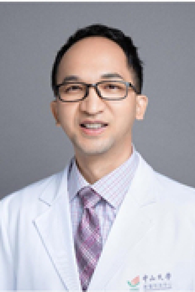

<!-- AUTO-GENERATED-BY: work/generate_obsidian_profiles.py -->

# 吴志明

## 基础信息

| 字段 | 内容 |
|---|---|
| 医院 | 中山大学肿瘤防治中心 |
| 姓名 | 吴志明 |
| 科室 | 泌尿外科 |
| 职称/身份 | 主任医师、硕士生导师、美国斯隆凯特琳癌症中心（MSKCC）、美国纽约大学Langone医学中心访问学者 |
| 重点优先级 | 高 |
| 来源类型 | 医院官网 |
| 来源链接 | [官网原文](https://www.sysucc.org.cn/node/3730) |
| 采集日期 | 2026-08-10 |
| 复核状态 | 待人工复核 |
| 异常提示 |  |

## 简介/擅长

膀胱癌、前列腺癌、肾盂输尿管癌、睾丸癌以及阴茎癌等复杂高难度泌尿生殖系肿瘤的外科治疗及综合诊疗。 为中国抗癌协会广东省分会泌尿分会青年委员；广东省医院协会肿瘤防治管理分会委员会委员；广东省肿瘤生物治疗专业委员会委员；中山大学肿瘤医院前列腺癌专家组成员；前列腺癌的多学科综合治疗专家组成员。从事泌尿男性生殖系肿瘤的诊断和治疗工作15年，完成手术超过5000余例，具备深厚的专业理论基础及丰富实践经验，对膀胱癌、前列腺癌、肾盂输尿管癌、肾癌、肾上腺肿瘤、睾丸癌以及阴茎癌等复杂、高难度的泌尿男性生殖系肿瘤的外科治疗以及综合诊治具有丰富的经验。擅长膀胱癌、中晚期前列腺癌的多学科综合诊治、前列腺精准靶向穿刺，其穿刺活检阳性率全国领先，PSA升高鉴别诊断、良性前列腺增生的外科手术治疗以及药物治疗，前列腺癌微创根治术、高危前列腺癌的开放根治术和淋巴结扩大清扫等手术；经尿道膀胱肿瘤电切手术，经尿道前列腺电切手术。 擅长全膀胱切除+尿流改道、盆腔肿瘤切除、肾盂输尿管癌、睾丸癌、阴茎癌、盆腔以及腹股沟淋巴结清扫等微创治疗手术。 以通讯作者（含共同通讯），第一作者以及共同第一作者发表SCI 文章以及中文文章20余篇；主持以及参与10余项国家级，...

## 详情正文摘录

职称：主任医师、硕士生导师、美国斯隆凯特琳癌症中心（MSKCC）、美国纽约大学Langone医学中心访问学者 专长 膀胱癌、前列腺癌、肾盂输尿管癌、睾丸癌以及阴茎癌等复杂高难度泌尿生殖系肿瘤的外科治疗及综合诊疗。 吴志明主任医师（正高）、硕士生导师、美国斯隆凯特琳癌症中心（MSKCC）以及美国纽约大学Langone医学中心访问学者 擅长：膀胱癌、前列腺癌、肾盂输尿管癌、睾丸癌以及阴茎癌等复杂高难度泌尿生殖系肿瘤的外科治疗及综合诊疗。 为中国抗癌协会广东省分会泌尿分会青年委员；广东省医院协会肿瘤防治管理分会委员会委员；广东省肿瘤生物治疗专业委员会委员；中山大学肿瘤医院前列腺癌专家组成员；前列腺癌的多学科综合治疗专家组成员。从事泌尿男性生殖系肿瘤的诊断和治疗工作15年，完成手术超过5000余例，具备深厚的专业理论基础及丰富实践经验，对膀胱癌、前列腺癌、肾盂输尿管癌、肾癌、肾上腺肿瘤、睾丸癌以及阴茎癌等复杂、高难度的泌尿男性生殖系肿瘤的外科治疗以及综合诊治具有丰富的经验。擅长膀胱癌、中晚期前列腺癌的多学科综合诊治、前列腺精准靶向穿刺，其穿刺活检阳性率全国领先，PSA升高鉴别诊断、良性前列腺增生的外科手术治疗以及药物治疗，前列腺癌微创根治术、高危前列腺癌的开放根治术和淋巴结扩大清扫等手术；经尿道膀胱肿瘤电切手术，经尿道前列腺电切手术。 擅长全膀胱切除+尿流改道、盆腔肿瘤切除、肾盂输尿管癌、睾丸癌、阴茎癌、盆腔以及腹股沟淋巴结清扫等微创治疗手术。 以通讯作者（含共同通讯），第一作者以及共同第一作者发表SCI 文章以及中文文章20余篇；主持以及参与10余项国家级，省部级课题，经费累计超过300万；作为总主编，主编编写医学相关书籍10余本。 二、学习及工作经历 2001年—2006年： 同济大学医学院 本 科 2006年—2008年： 浙江大学医学院 硕 士 2008年—2011年： 复旦大学医学院 博 士 2011年—2013年： 中山大学附属肿瘤医院 泌尿外科 住院医师 2013年—2018…

## 重点关注范围

- 肿瘤
- 生殖疾病
- 疑难重症

## 重点疾病标签

- 肿瘤
- 癌
- 靶向
- 生殖
- 复杂
- 多学科
- 高危

## 亮眼经历线索

- 主任医师、硕士生导师、美国斯隆凯特琳癌症中心（MSKCC）、美国纽约大学Langone医学中心访问学者 为中国抗癌协会广东省分会泌尿分会青年委员；
- 广东省医院协会肿瘤防治管理分会委员会委员；
- 广东省肿瘤生物治疗专业委员会委员；

## 异常提示

## 合规边界

- 本画像仅整理统一总底表中的医院官网公开字段。
- 不包含患者评价、排名、第三方来源内容或疗效承诺。
- 官网未展示的信息保持空白，后续如需补充须回到底表官方来源字段。
