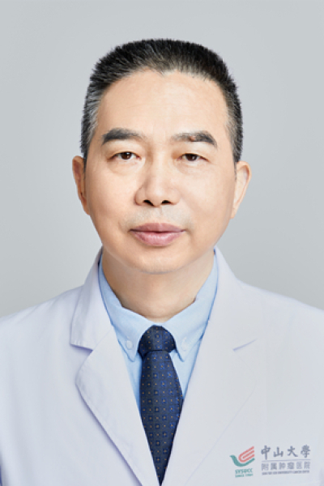

<!-- AUTO-GENERATED-BY: work/generate_obsidian_profiles.py -->

# 吴秉毅

## 基础信息

| 字段 | 内容 |
|---|---|
| 医院 | 中山大学肿瘤防治中心 |
| 姓名 | 吴秉毅 |
| 科室 | 血液肿瘤科 |
| 职称/身份 | 主任医师，博士生导师 |
| 重点优先级 | 高 |
| 来源类型 | 医院官网 |
| 来源链接 | [官网原文](https://www.sysucc.org.cn/node/3793) |
| 采集日期 | 2026-08-10 |
| 复核状态 | 待人工复核 |
| 异常提示 |  |

## 简介/擅长

擅长造血干细胞移植，在干细胞移植方面具有丰富的经验。专业白血病，多发性骨髓瘤，淋巴瘤，再生障碍性贫血，地中海贫血治疗 教育背景： 1980.9－1985.7 安徽皖南医学院医疗系大学本科读书。 1988.5－1988.5 安徽师范大学师资培训中心脱产英语学习。 1989.9－1992.7 第二军医大学长征医院内科学硕士研究生 2003.7－ 南方医科大学在职博士研究生 工作经历： 1985.8-1989.8 安徽皖南医学院附属弋矶山医院内科住院医师 1992.7-2000.7 第一军医大学珠江医院血液科主治医师、讲师 2000.7-2007.8 第一军医大学珠江医院血液科副主任医师、副教授 2007.9-2011.12 南方医科大学珠江医院血液科主任医师，血液科副主任 2012.1-2017.7 南方医科大学珠江医院血液科主任医师、副主任/博士研究生导师 2017.8- 2020.12 南方医科大学顺德医院血液科主任，主任医师/博士研究生导师 2021.1- 中山大学肿瘤防治中心血液肿瘤科，主任医师 科研成就： 主持课题 （1）HLA半相合干细胞移植慢性移植物抗宿主病防治研究 广东省医学科学基金。（A200193，20...

## 详情正文摘录

临床专家 面包屑 首页 / 临床科室 / 内科系列 / 血液肿瘤科 / 临床专家 吴秉毅 职称：主任医师，博士生导师 专长 擅长造血干细胞移植，在干细胞移植方面具有丰富的经验。专业白血病，多发性骨髓瘤，淋巴瘤，再生障碍性贫血，地中海贫血治疗 教育背景： 1980.9－1985.7 安徽皖南医学院医疗系大学本科读书。 1988.5－1988.5 安徽师范大学师资培训中心脱产英语学习。 1989.9－1992.7 第二军医大学长征医院内科学硕士研究生 2003.7－ 南方医科大学在职博士研究生 工作经历： 1985.8-1989.8 安徽皖南医学院附属弋矶山医院内科住院医师 1992.7-2000.7 第一军医大学珠江医院血液科主治医师、讲师 2000.7-2007.8 第一军医大学珠江医院血液科副主任医师、副教授 2007.9-2011.12 南方医科大学珠江医院血液科主任医师，血液科副主任 2012.1-2017.7 南方医科大学珠江医院血液科主任医师、副主任/博士研究生导师 2017.8- 2020.12 南方医科大学顺德医院血液科主任，主任医师/博士研究生导师 2021.1- 中山大学肿瘤防治中心血液肿瘤科，主任医师 科研成就： 主持课题 （1）HLA半相合干细胞移植慢性移植物抗宿主病防治研究 广东省医学科学基金。（A200193，2001年-2003年，已结题）。 （2）供者NK细胞降低HLA半相合干细胞移植移植物抗宿主病 广东省医学科学基金。（A2005418，2005年-2007年，已结题） （3）建立HLA半相合的造血干细胞嵌合移植模式治疗DMD的临床研究 广东省省科技计划临床重点专项。（ 2011A030400006，2012年-2016年，已结题）。 （4）遗传指导下的工程化HLA单倍体相合干细胞移植治疗难治性白血病临床研究广州市科技重大专项。（2011Y1-00033-7，2012年-2015年 已结题） （5）HLA单倍体相合异基因造血干细胞移植预处理优化方案的双盲、随机、开放、多中心、前瞻性研究 南方医科大学高水平建设临床重点专项 （ LC201…

## 重点关注范围

- 慢性病
- 肿瘤
- 免疫/风湿/感染
- 疑难重症

## 重点疾病标签

- 慢性
- 肿瘤
- 癌
- 瘤
- 淋巴瘤
- 白血病
- 化疗
- 免疫
- 难治
- 罕见

## 亮眼经历线索

- 主任医师，博士生导师 1989.9－1992.7 第二军医大学长征医院内科学硕士研究生 2003.7－ 南方医科大学在职博士研究生 工作经历： 1985.8-1989.8 安徽皖南医学院附属弋矶山医院内科住院医师 1992.7-2000.7 第一军医大学珠江医院血液科主治医师、讲师 2000.7-2007.8 第一军医大学珠江医院血液科副主任医师、副教授…
- （2011Y1-00033-7，2012年-2015年 已结...

## 异常提示

## 合规边界

- 本画像仅整理统一总底表中的医院官网公开字段。
- 不包含患者评价、排名、第三方来源内容或疗效承诺。
- 官网未展示的信息保持空白，后续如需补充须回到底表官方来源字段。
