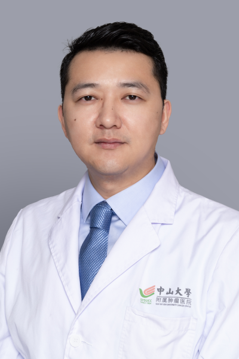

<!-- AUTO-GENERATED-BY: work/generate_obsidian_profiles.py -->

<!-- TEMPLATE: D:\workspace\信息收集整理\医生画像仓库\模板\医生画像模板.md -->

# 吴迪

## 基础信息

| 字段 | 内容 |
|---|---|
| 姓名 | 吴迪 |
| 医院 | 中山大学肿瘤防治中心 |
| 科室 | 头颈科 |
| 职称/身份 | 副主任医师 |
| 来源链接 | [官网原文](https://www.sysucc.org.cn/node/8172) |
| 采集日期 | 2026-08-10 |

## 简介/擅长

甲状腺开放及腔镜手术，鼻腔鼻窦、口腔、喉咽等头颈肿瘤的诊治。

## 科研项目与成果

- 一、教育及工作经历 1. 南昌大学 本科 2006-2011 医学本科 2. 中山大学肿瘤防治中心 硕士 2012-2015 肿瘤学硕士 3. 广州医科大学附属肿瘤医院 头颈科 2015-2018 医师 4. 中山大学肿瘤防治中心 博士 2018-2021 肿瘤学博士 二、学术兼职 1、广东省临床医学学会咽喉肿瘤专业委员会 秘书 2、广东省医学会机器人外科学分会 头颈组秘书 3、广东省抗癌协会肿瘤整形外科专业委员会 委员 4、中国抗癌协会肿瘤外科整形专业委员会 青年委员 三、主持科研项目 主持了一项广东省自然科学…

## 论文与学术产出

- 四、代表性论著 作为第一作者/通讯作者在Nature Communications 、Clinical Cancer Research、Theranostics等杂志共发表SCI论文14篇。

## 可包装亮点

- 副主任医师 吴迪 职称：副主任医师 专长 甲状腺开放及腔镜手术，鼻腔鼻窦、口腔、喉咽等头颈肿瘤的诊治。
- 一、教育及工作经历 1. 南昌大学 本科 2006-2011 医学本科 2. 中山大学肿瘤防治中心 硕士 2012-2015 肿瘤学硕士 3. 广州医科大学附属肿瘤医院 头颈科 2015-2018 医师 4. 中山大学肿瘤防治中心 博士 2018-2021 肿瘤学博士 二、学术兼职 1、广东省临床医学学会咽喉肿瘤专业委员会 秘书 2、广东省医学会机器人外科…

## 重点疾病/人群标签

- 慢性病：
- 肿瘤：肿瘤、癌
- 生殖疾病：
- 免疫/风湿：
- 术后恢复/康复：
- 疑难重症：

## 证据摘录

> 只摘录官网公开信息中的短句或关键字段，不复制大段原文。

- 官网身份字段：副主任医师
- 官网简介/擅长：甲状腺开放及腔镜手术，鼻腔鼻窦、口腔、喉咽等头颈肿瘤的诊治。
- 官网亮眼经历线索：副主任医师 吴迪 职称：副主任医师 专长 甲状腺开放及腔镜手术，鼻腔鼻窦、口腔、喉咽等头颈肿瘤的诊治。 一、教育及工作经历 1. 南昌大学 本科 2006-2011 医学本科 2. 中山大学肿瘤防治中心 硕士 2012-2015 肿瘤学硕士 3. 广州医科大学附属肿瘤医院 头颈科 2015-2018 医师 4. 中山大学肿瘤防治中心 博士 2018-2021 肿瘤学博士 二、学术兼职 1、广东省临床医学学会咽喉肿瘤专业委员会 秘书 2…
- 异常提示：亮眼经历含导航文本，已清洗
- 来源链接：https://www.sysucc.org.cn/node/8172

## BD 画像摘要

吴迪医生可作为肿瘤方向的基础画像候选。后续 BD 使用应继续以官网来源和人工复核为准，不添加疗效承诺或无来源包装。

## 合规边界

- 仅使用医院官网、官方公众号、官方小程序等公开渠道。
- 不采集私人电话、私人微信、家庭住址、患者隐私或非公开排班信息。
- 不写“保证治愈”“疗效第一”“包治疑难杂症”等无法由官网证明的表述。
