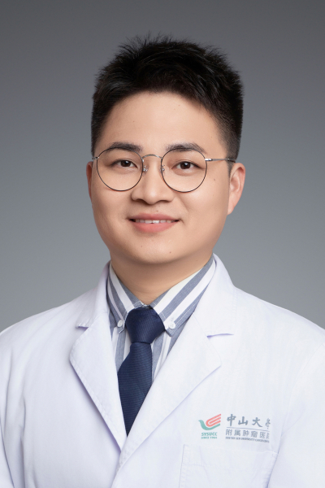

<!-- AUTO-GENERATED-BY: work/generate_obsidian_profiles.py -->

<!-- TEMPLATE: D:\workspace\信息收集整理\医生画像仓库\模板\医生画像模板.md -->

# 吴锡文

## 基础信息

| 字段 | 内容 |
|---|---|
| 姓名 | 吴锡文 |
| 医院 | 中山大学肿瘤防治中心 |
| 科室 | 临床营养科 |
| 职称/身份 | 副主任医师 |
| 来源链接 | [官网原文](https://www.sysucc.org.cn/node/12740) |
| 采集日期 | 2026-08-10 |

## 简介/擅长

肿瘤患者围手术期及放化疗期间营养支持治疗与膳食指导。

## 教育与进修经历

- 一、基本情况 医学博士，博士后，副主任医师。

## 科研项目与成果

- 主持国自然青年科学基金项目1项，参与国自然面上项目多项。
- 四、主持科研项目 主持国自然青年科学基金项目1项，参与国自然面上项目多项。

## 论文与学术产出

- 五、代表性论著 发表sci论文多篇。

## 可包装亮点

- 副主任医师 吴锡文 职称：副主任医师 专长 肿瘤患者围手术期及放化疗期间营养支持治疗与膳食指导。
- 一、基本情况 医学博士，博士后，副主任医师。
- 二、教育及工作经历 2010.09-2015.06：中山大学中山医学院 学士 2015.08-2018.06：中山大学肿瘤防治中心 硕士 2018.09-2021.06：中山大学附属第一医院 博士 2021.07-2024.12：中山大学肿瘤防治中心 住院医师 2024.12-2025.12：中山大学肿瘤防治中心 主治医师 2025.12-至今：中山大学肿…

## 重点疾病/人群标签

- 慢性病：代谢、肿瘤、化疗、康复、营养
- 肿瘤：代谢、肿瘤、化疗、康复、营养
- 生殖疾病：
- 免疫/风湿：
- 术后恢复/康复：代谢、肿瘤、化疗、康复、营养
- 疑难重症：

## 证据摘录

> 只摘录官网公开信息中的短句或关键字段，不复制大段原文。

- 官网身份字段：副主任医师
- 官网简介/擅长：肿瘤患者围手术期及放化疗期间营养支持治疗与膳食指导。
- 官网亮眼经历线索：副主任医师 吴锡文 职称：副主任医师 专长 肿瘤患者围手术期及放化疗期间营养支持治疗与膳食指导。 一、基本情况 医学博士，博士后，副主任医师。 二、教育及工作经历 2010.09-2015.06：中山大学中山医学院 学士 2015.08-2018.06：中山大学肿瘤防治中心 硕士 2018.09-2021.06：中山大学附属第一医院 博士 2021.07-2024.12：中山大学肿瘤防治中心 住院医师 2024.12-2025.12：…
- 异常提示：亮眼经历含导航文本，已清洗
- 来源链接：https://www.sysucc.org.cn/node/12740

## BD 画像摘要

吴锡文医生可作为慢性病、肿瘤、术后恢复/康复方向的基础画像候选。后续 BD 使用应继续以官网来源和人工复核为准，不添加疗效承诺或无来源包装。

## 合规边界

- 仅使用医院官网、官方公众号、官方小程序等公开渠道。
- 不采集私人电话、私人微信、家庭住址、患者隐私或非公开排班信息。
- 不写“保证治愈”“疗效第一”“包治疑难杂症”等无法由官网证明的表述。
