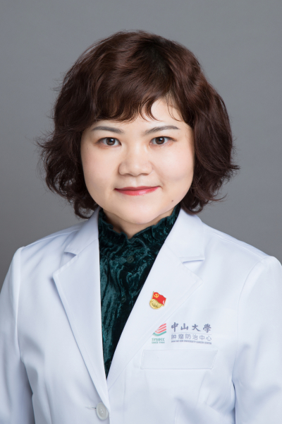

<!-- AUTO-GENERATED-BY: work/generate_obsidian_profiles.py -->

<!-- TEMPLATE: D:\workspace\信息收集整理\医生画像仓库\模板\医生画像模板.md -->

# 周冠群

## 基础信息

| 字段 | 内容 |
|---|---|
| 姓名 | 周冠群 |
| 医院 | 中山大学肿瘤防治中心 |
| 科室 | 放疗科 |
| 职称/身份 | 主任医师 |
| 来源链接 | [官网原文](https://www.sysucc.org.cn/node/1718) |
| 采集日期 | 2026-08-10 |

## 简介/擅长

擅长鼻咽癌、喉癌、下咽癌等头颈部恶性肿瘤的放疗 擅长鼻咽癌、喉癌、下咽癌等头颈部恶性肿瘤的放疗 主要研究方向为鼻咽癌的个体化治疗和正常组织损伤 第一或共同第一作者发表高水平论文20余篇 主持国家自然科学基金青年项目和广东省自然科学基金委各1项 获得2014年“中华医学科技奖一等奖”，2014年“广东省科技进步一等奖”和2014年“教育部科学技术进步一等奖” 加载更多 擅长鼻咽癌、喉癌、下咽癌等头颈部恶性肿瘤的放疗 主要研究方向为鼻咽癌的个体化治疗和正常组织损伤 第一或共同第一作者发表高水平论文20余篇 主持国家自然科学基金青年项目和广东省自然科学基金委各1项 获得2014年“中华医学科技奖一等奖”，2014年“广东省科技进步一等奖”和2014年“教育部科学技术进步一等奖” 更新日期：2023年10月25日

## 科研项目与成果

- 临床专家 面包屑 首页 / 临床科室 / 放疗系列 / 放疗科 / 临床专家 周冠群 职称：主任医师 专长 擅长鼻咽癌、喉癌、下咽癌等头颈部恶性肿瘤的放疗 擅长鼻咽癌、喉癌、下咽癌等头颈部恶性肿瘤的放疗 主要研究方向为鼻咽癌的个体化治疗和正常组织损伤 第一或共同第一作者发表高水平论文20余篇 主持国家自然科学基金青年项目和广东省自然科学基金委各1项 获得2014年“中华医学科技奖一等奖”，2014年“广东省科技进步一等奖”和2014年“教育部科学技术进步一等奖” 加载更多 擅长鼻咽癌、喉癌、下咽癌等头颈部恶性肿瘤…

## 论文与学术产出

- 临床专家 面包屑 首页 / 临床科室 / 放疗系列 / 放疗科 / 临床专家 周冠群 职称：主任医师 专长 擅长鼻咽癌、喉癌、下咽癌等头颈部恶性肿瘤的放疗 擅长鼻咽癌、喉癌、下咽癌等头颈部恶性肿瘤的放疗 主要研究方向为鼻咽癌的个体化治疗和正常组织损伤 第一或共同第一作者发表高水平论文20余篇 主持国家自然科学基金青年项目和广东省自然科学基金委各1项 获得2014年“中华医学科技奖一等奖”，2014年“广东省科技进步一等奖”和2014年“教育部科学技术进步一等奖” 加载更多 擅长鼻咽癌、喉癌、下咽癌等头颈部恶性肿瘤…

## 可包装亮点

- 主任医师 擅长鼻咽癌、喉癌、下咽癌等头颈部恶性肿瘤的放疗 擅长鼻咽癌、喉癌、下咽癌等头颈部恶性肿瘤的放疗 主要研究方向为鼻咽癌的个体化治疗和正常组织损伤 第一或共同第一作者发表高水平论文20余篇 主持国家自然科学基金青年项目和广东省自然科学基金委各1项 获得2014年“中华医学科技奖一等奖”，2014年“广东省科技进步一等奖”和2014年“教育部科学技术进…

## 重点疾病/人群标签

- 慢性病：
- 肿瘤：肿瘤、癌、放疗、鼻咽癌
- 生殖疾病：
- 免疫/风湿：
- 术后恢复/康复：
- 疑难重症：

## 证据摘录

> 只摘录官网公开信息中的短句或关键字段，不复制大段原文。

- 官网身份字段：主任医师
- 官网简介/擅长：擅长鼻咽癌、喉癌、下咽癌等头颈部恶性肿瘤的放疗 擅长鼻咽癌、喉癌、下咽癌等头颈部恶性肿瘤的放疗 主要研究方向为鼻咽癌的个体化治疗和正常组织损伤 第一或共同第一作者发表高水平论文20余篇 主持国家自然科学基金青年项目和广东省自然科学基金委各1项 获得2014年“中华医学科技奖一等奖”，2014年“广东省科技进步一等奖”和2014年“教育部科学技术进步一等奖” 加载更多 擅长鼻咽癌、喉癌、下咽癌等头颈部恶性肿瘤的放疗 主要研究方向为鼻咽癌…
- 官网亮眼经历线索：主任医师 擅长鼻咽癌、喉癌、下咽癌等头颈部恶性肿瘤的放疗 擅长鼻咽癌、喉癌、下咽癌等头颈部恶性肿瘤的放疗 主要研究方向为鼻咽癌的个体化治疗和正常组织损伤 第一或共同第一作者发表高水平论文20余篇 主持国家自然科学基金青年项目和广东省自然科学基金委各1项 获得2014年“中华医学科技奖一等奖”，2014年“广东省科技进步一等奖”和2014年“教育部科学技术进步一等奖” 擅长鼻咽癌、喉癌、下咽癌等头颈部恶性肿瘤的放疗 主要研究方向为鼻咽癌…
- 异常提示：亮眼经历含导航文本，已清洗
- 来源链接：https://www.sysucc.org.cn/node/1718

## BD 画像摘要

周冠群医生可作为肿瘤方向的基础画像候选。后续 BD 使用应继续以官网来源和人工复核为准，不添加疗效承诺或无来源包装。

## 合规边界

- 仅使用医院官网、官方公众号、官方小程序等公开渠道。
- 不采集私人电话、私人微信、家庭住址、患者隐私或非公开排班信息。
- 不写“保证治愈”“疗效第一”“包治疑难杂症”等无法由官网证明的表述。
