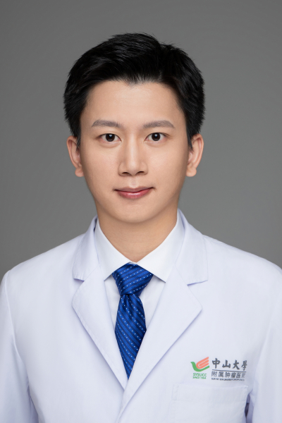

<!-- AUTO-GENERATED-BY: work/generate_obsidian_profiles.py -->

<!-- TEMPLATE: D:\workspace\信息收集整理\医生画像仓库\模板\医生画像模板.md -->

# 周华强

## 基础信息

| 字段 | 内容 |
|---|---|
| 姓名 | 周华强 |
| 医院 | 中山大学肿瘤防治中心 |
| 科室 | 内科 |
| 职称/身份 | 科秘书 职称：副主任医师、医学博士 |
| 来源链接 | [官网原文](https://www.sysucc.org.cn/node/8018) |
| 采集日期 | 2026-08-10 |

## 简介/擅长

肺癌、鼻咽癌内科治疗和新药临床研究。

## 教育与进修经历

- 一、基本情况 周华强，内科副主任医师、科秘书，中山大学医学博士（八年制）、肿瘤学博士后，师从张力教授，中心优秀青年提升计划入选者。
- 主持国家自然科学基金青年项目、博士后面上项目和广州市科技项目各1项。
- 出诊时间： 周三、周五下午（具体以挂号系统为准） 二、教育及工作经历 2012-09 至 2020-06, 中山大学，临床医学八年制，博士 2020-08 至 2022-08, 中山大学，肿瘤防治中心，博士后 2020-07 至 2023-12, 中山大学，肿瘤防治中心，医师 2024-01 至 2024-12, 中山大学，肿瘤防治中心，主治医师 2025-01 至 今, 中山大学，肿瘤防治中心，副主任医师 三、学术兼职 中国抗癌协会整合肿瘤学分会青委会委员 中国南方肿瘤临床研究协会肺癌专业委员会委员 广州抗癌协…

## 科研项目与成果

- 主持国家自然科学基金青年项目、博士后面上项目和广州市科技项目各1项。
- 代表性成果发表在国际知名杂志如《临床肿瘤学》（Journal of Clinical Oncology）、《胸部肿瘤杂志》（Journal of Thoracic Oncology，国际肺癌研究协会官方期刊）、《信号转导与靶向治疗》（Signal Transduction and Targeted Therapy）、《自然-通讯》(Nature Communications)、《分子癌症》(Molecular Cancer)等。
- 团队研究成果《晚期肺癌精准化治疗的创新与策略》荣获2022年广东省科技进步奖一等奖。

## 论文与学术产出

- 代表性成果发表在国际知名杂志如《临床肿瘤学》（Journal of Clinical Oncology）、《胸部肿瘤杂志》（Journal of Thoracic Oncology，国际肺癌研究协会官方期刊）、《信号转导与靶向治疗》（Signal Transduction and Targeted Therapy）、《自然-通讯》(Nature Communications)、《分子癌症》(Molecular Cancer)等。
- 参编专著《肿瘤免疫治疗思路及用药安全》。

## 可包装亮点

- 科秘书 职称：副主任医师、医学博士 周华强 职务：科秘书 职称：副主任医师、医学博士 专长 肺癌、鼻咽癌内科治疗和新药临床研究。
- 一、基本情况 周华强，内科副主任医师、科秘书，中山大学医学博士（八年制）、肿瘤学博士后，师从张力教授，中心优秀青年提升计划入选者。
- 主持国家自然科学基金青年项目、博士后面上项目和广州市科技项目各1项。

## 重点疾病/人群标签

- 慢性病：
- 肿瘤：肿瘤、癌、化疗、靶向、鼻咽癌、肺癌、免疫
- 生殖疾病：
- 免疫/风湿：肿瘤、癌、化疗、靶向、鼻咽癌、肺癌、免疫
- 术后恢复/康复：
- 疑难重症：

## 证据摘录

> 只摘录官网公开信息中的短句或关键字段，不复制大段原文。

- 官网身份字段：科秘书 职称：副主任医师、医学博士
- 官网简介/擅长：肺癌、鼻咽癌内科治疗和新药临床研究。
- 官网亮眼经历线索：科秘书 职称：副主任医师、医学博士 周华强 职务：科秘书 职称：副主任医师、医学博士 专长 肺癌、鼻咽癌内科治疗和新药临床研究。 一、基本情况 周华强，内科副主任医师、科秘书，中山大学医学博士（八年制）、肿瘤学博士后，师从张力教授，中心优秀青年提升计划入选者。 主持国家自然科学基金青年项目、博士后面上项目和广州市科技项目各1项。
- 异常提示：亮眼经历含导航文本，已清洗
- 来源链接：https://www.sysucc.org.cn/node/8018

## BD 画像摘要

周华强医生可作为肿瘤、免疫/风湿/感染方向的基础画像候选。后续 BD 使用应继续以官网来源和人工复核为准，不添加疗效承诺或无来源包装。

## 合规边界

- 仅使用医院官网、官方公众号、官方小程序等公开渠道。
- 不采集私人电话、私人微信、家庭住址、患者隐私或非公开排班信息。
- 不写“保证治愈”“疗效第一”“包治疑难杂症”等无法由官网证明的表述。
